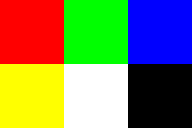
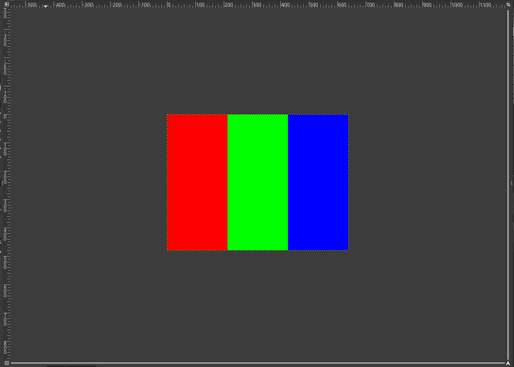

# Design Log Week 12

## Status: 

I am not currently stuck or blocked.

## Work Completed

### Create Image from Pixel Data

- Most direct file type between pixel data and image is Portable Pixmap Format file (PPM)
- stores image as uncompressed RGB values where position is determined by location in the file
- upper left pixel is first RGB data listed
- pixels move right then down

- PPM Example:
```
P3 # ASCII text (P6 for binary)
# from https://en.wikipedia.org/wiki/Netpbm
3 2 # image width and height
255 # max rgb value for each color
255   0   0
  0 255   0
  0   0 255
255 255   0
255 255 255
  0   0   0
```


### Converting Image Frame to PPM

- Resolution is 640x480
- Image frame is a single 921,600 float array (640x480x3)
- RGB values with positional encoding for locaion in image
- createPPM -> takes image frame and converts into a ppm file
- expecting image frame to hold RGB values as floats from 0 to 1 
- PPM file will store RGB values from 0 to 255
- fixed resolution but can be adjusted

```
void createPPMFile(char* fileName, float (*pixels)){
    FILE* file = fopen(fileName, "w");

    if (!file) {
        perror("fopen");
        return;
    }
    
    fputs("P3\n", file);
    fputs("640 480\n", file);
    fputs("255\n", file);

    char R[4], G[4], B[4];

    for(int i = 0; i < 480; i++){     // Top to Bottom
        for(int j = 0; j < 640; j++){ // Left to Right
            int idx = 1920 * i + 3 * j;
                sprintf(R, "%d", (int)(pixels[idx + 0] * 255));
                sprintf(G, "%d", (int)(pixels[idx + 1] * 255));
                sprintf(B, "%d", (int)(pixels[idx + 2] * 255));
                fputs(R, file);
                fputs(" ", file);
                fputs(G, file);
                fputs(" ", file);
                fputs(B, file);
                fputs("\n", file);
        }
    }
    fclose(file);
}
```

- example output at 640x480:

