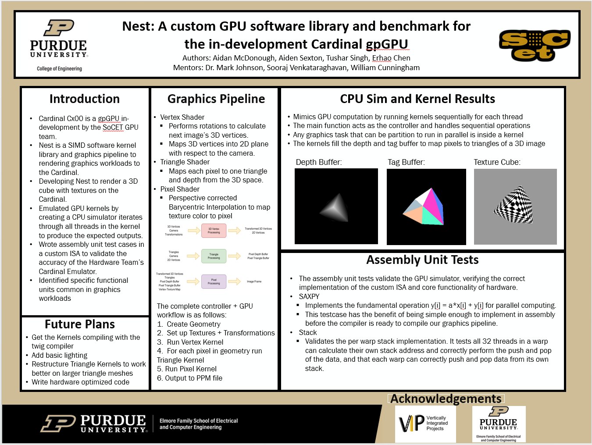

# Design Log Week 13

## Status: 

I am not currently stuck or blocked.

## Work Completed

### Poster Presentation

 - created poster
 - presented at research symposium

 

### Design and Code Review

- created presentation for both
    - design review presentation was created based on improved slides from the code review
- presented code review and design review

### Compiling Vertex Kernel

- was able to get vertex kernel to compile on custom compiler 
- still working to allow vertex kernel to compile by both gcc and custom compiler with same file setup

### Next steps before end of semester

- Finish vertex kernel and other kernels
- Final report over break
- Software Optimization
- Run kernels on emulator

