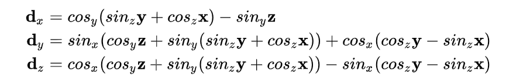
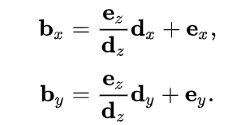

# Design Log Week 9

## Status: 

I am not currently stuck or blocked.

## Work Completed

### Began writing Kernels

#### Vertex Shader
- Began testing vertexShader on CPUSIM
- Matrix Mul -> 3D transformation 
    ```
    for(int j = 0; j < 3; j++)
    {
        for(int k = 0; k < 3; k++)
        {
            args->threeDVertTrans[i*3 + j] += args->threeDVert[i*3 + k] * args->trans[k*3 + j]; 
        }
    }
    ```
- Perspective projection -> 3D to 2D camera view
    - camera transform -> find a 3D vector, d, to represent original 3d vector,a, with repect to camera as the origin -> a-c then rotate by -theta (orientation of the camera)
    
    from [wikipedia](https://en.wikipedia.org/wiki/3D_projection) Note: $cos(θ_α)$ = $cos_α$ and $sin(θ_α)$ = $sin_α $
    ```
    float c0 = cosf(args->theta[0]), s0 = sinf(args->theta[0]);
    float c1 = cosf(args->theta[1]), s1 = sinf(args->theta[1]);
    float c2 = cosf(args->theta[2]), s2 = sinf(args->theta[2]);

    float X = args->threeDVert[3*i] - args->camera[0];
    float Y = args->threeDVert[3*i + 1] - args->camera[1];
    float Z = args->threeDVert[3*i + 2] - args->camera[2];

    // d_x
    d[0] = c1 * (s2 * Y + c2 * X) - s1 * Z;

    // d_y
    d[1] = (s0 * (c1 * Z + s1 * (s2 * Y + c2 * X))) + (c0 * (c2 * Y - s2 * X));

    // d_z
    d[2] = (c0 * (c1 * Z + s1 * (s2 * Y + c2 * X))) - (s0 * (c2 * Y - s2 * X));
    ```
    - Project d onto 2D plane, b -> e = distance of the camera from the display surface

        

        from [wikipedia](https://en.wikipedia.org/wiki/3D_projection)

        ```
        args->twoDVert[2*i] = (args->dsToCamera[2] / d[2]) * d[0] + args->dsToCamera[0];
        args->twoDVert[2*i+1] = (args->dsToCamera[2] / d[2]) * d[1] + args->dsToCamera[1];
        args->twoDVert[2*i+2] = 1.0f / d[2];
        ```


### ToDo
- Kernels: 
    - verify Vertex Shader
    - create triangle and fragment shaders
- Graphics Library: 
    - will just be a testbench so layout c++ functions to run in testbench
- Memory map

