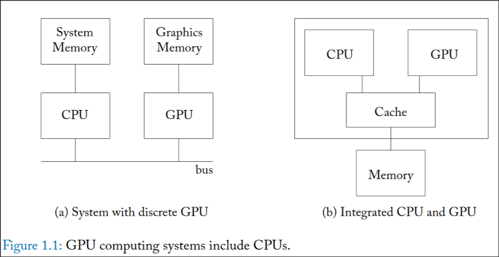
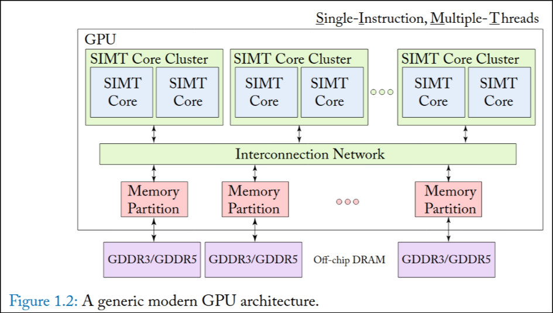

State: I am not stuck with anything, don't need help right now. 

# Progress:

## 1: Introduction
* GPUs started with a focus on real-time frame rendering (for games), but are now present across most modern electronic devices
* Applications in Graphics and Machine Learning (growing rapidly)

### 1.1 - THE LANDSCAPE OF COMPUTATION ACCELERATORS
* Since 2005, transistors failed to follow [Dennard scalling](https://en.wikipedia.org/wiki/Dennard_scaling), meaning that clock frequency improve much slower as devices become smaller. Performance improvements therefore must be found through more efficent architecture
  * Dennard Scalling - "as transistors get smaller, their power density stays constant, so that the power use stays in proportion with area" (from wikipedia)
* By using __Hardware Specilization__, you can get significant energy efficiency (up to 500x)
  * Moving to vector hardware (found in GPUs) reduces instruction processing overhead - 10x energy efficency
  * Minimizing data movement through complex operations
* Current architects need to balance gains in efficency from specialized hardware, while keeping hardware flexable enough to run a variety of programs
  * Not always the case, see Google's TPU
* GPUs are Turing complete, making them flexible hardware for many operations, while magnitudes faster than a CPU for the right software

### 1.2 - GPU HARDWARE BASICS
* Currently CPUs act as a support to CPUs, either on the same chip (integrated) or as a added card (off-chip)
* CPU is responsible for starting all computation on the GPU
  * This is due to limits in existing I/O tech for GPUs, with most I/O access being CPU dependent
  * Most software related to I/O and OS related programs lack the mass parrallelism required to take advantage of a GPU
* Integrated Graphics systems share a common DRAM memory system with the CPU (accessed through a standard such as LPDDR), while discrete GPUs have seperate DRAM memory (GPU uses GDDR and CPU uses DDR).
  * __LDDR__ -> Optimized for low power systems
  * __GDDR__ -> Higher Latency, Higher throughput
  * __DDR__ -> Lower Latency, Lower Throughput

* Older discrete architectures required the CPU to manually move data into GPU memory, while newer architectures have software and hardware to move data automaticlly
* On Integrated GPUs, the main concern is cache coherency between CPUs and GPUs, which must be handled by hardware
* To initiate the GPU, a GPU computing application must specify which code will run on the GPU
  * This code is called the __Kernel__
* A modern GPU has many cores, each executing a Single-Instruction Multiple-Thread (SIMT) program
  * __Streaming Multiprocessors__ - Nvidia
  * __Compute Units__ - AMD
  * Contain first level instruction and data caches
  * Use around 1000 threads, which help hide latency when data is not found in the first level caches. If one thread group caches misses, a core can switch to another thread group while the original waits

* Multiple memory channels are used to balance the high computational throughput
* When trying to increase energy efficency, its important to keep in mind that memory access of large structures consumes the same, or more energy than actual computation

### 1.3 - A BRIEF HISTORY OF GPUS
* 1960s - some early projects
* 1980s - early video cards used for film animation as well as game rendering
* 2001 - Nividia GeForce 3 introduced programability in the form of vertex shaders and pixel shaders, which were soon used by researchers for linear algebra
* Nvidia GeForce 8 series introduces non gaming specific programming interfaces

## 2: Programming Model
* Modern GPUs use wide SIMD hardware to exploit data-level parrallism, which is hidden behind APIs such as CUDA or openCL for programmers
  * Operate on a MIMD model, allowing programmers to launch arrays of scalar threads (across multiple GPU cores)
  * each scalar thread can follow its own execution path
* At runtime, GPU hardware executes groups of scalar threads (warps - Nvidia, wavefronts - AMD) in lockstep (SIMT)

### 2.1 - EXECUTION MODEL
1. (Discrete only) CPU allocates memory on the GPU
2. (Discrete only) Initiate data transfer
3. Launch a computation kernal on the GPU
* A computation kernel is normall composed of thousands of threads, each executing the same program, but following different control flows 
#### CUDA programming
* the main function will be ran on the CPU, as in normal C/C++
* Using the "\_\_global__" keyword distingushes a kernel function to be ran on the GPU
  * A compute kernel normall has thousands of threads, all starting from the same functions
  * When calling the funciton, a number of thread blocks, and number of threads per thread block, must be specified - <<<nblocks, nthreads>>>
  * A thread block (or CTA for AMD) is a group of warps/wavefronts running on 
* Need to make seperate calls to allocate and copy memory onto the CPU
* Threads within a thread block can share a form of local memory called the __scratchpad__ (local data store for AMD)
  * small, roughly 16-64 KB
  * allocated using keywords such as \_\_shared__ for CUDA
  * For data used frequently and in a predictable manner
* Threads within a thread block can syncronize using hardware-supported barrier instructions
  * different thread blocks can also do this using global memory but it is much slower

### 2.2 - GPU INSTRUCTION SET ARCHITECTURES

#### Nvidia
* Instruction set virulization was very common among the many GPU vendors in 2007, so Nvidia followed suit
  * When making __CUDA__, they introduced PTX, a high-level intruction set architecture, that is fully documented by them
  * Shares a similarity to simple RISC ISAs, while also sharing simularitys to Intermediate repersentations used by compilers (infintite virtual registers)
* Before running PTX it has to be compiled to the actual ISA, SASS, which is NOT fully documented
  * Means nividia doesn't have to keep the actual ISA backwards compatable, only PTX
  * There have existed efforts to decode SASS to help academic research
  * SASS has some key differences from PTX, such as a limited number of registers, as well as special "control instructions" used to remove explicit scoreboard dependency checking

#### AMD 
* AMD released a fully documented ISA with there 2012 Southern Islands Architecture
* This documentation has aided academic researchers in developing simulators at a low-level
* Also have a virtual instruction set architecture, call __HSAIL__
* The key distinciton in AMDs programming model is the use of scalar instructions, ran on a seperate scalar core