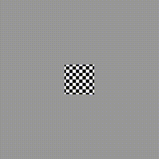

State: I am not stuck with anything

# Progress

## Work Completed:
* Completed pixel kernel
* Completed Graphics Library
* Completed cpu_sim main connecting kernel
* Rotating Cube!

## Progress

### Pixel Kernel
* Used a simpler method to do screenspace interpolation
  * While interpolating texel coordinates s and t is not linear in screenspace, s/z and t/z are linear
  * If you interpolate per-vertex s/z and then turn it back into s by diving by interpolated (1/z), you get interpolated s
* Currently uses basic nearest neigbor for getting textures
  * While this may be better for cache optimization, may produce bad results on low-res textures
  * Could be changed to other methods, but without a T$, will likely cause a large slowdown
* Code could have a large efficency increase
  * Currently, it is unlikely that there will be significant compiler optimizations
  * Many cases of repeated arrithmatic or memory fetches that while optimized out with gcc, will be harmful on twig
* Code still currently assumes infinite threads
  * need to adjust for the likely maximum set by hardware

### "Graphics Library"
* Implemented a basic library which includes a variety of different methods, types, and attributes
* Helps conjoin kernels and remoes repative code
* Still need to see how this will end up being compiled through ppci, might need to be restructured
* Types Provided:
  * vector_t -> basic 3 float vector
  * vertex_t -> a 3d point, contains texture mapping
  * triangle_t -> 3 indicies into a vertex list
  * texture_t -> contains a w/h and a pointer the to texture color
* functions - self explanatory
  * barycentric_coordinates(vector_t, vector_t[3]);
  * vector_t get_texture(texture_t, float, float);
  * matrix_inversion(const float*, float*);

### CPU_SIM Main
* Made a new large main for the CPU sim which stitches all of the completed kernels together
* Handles a mesh of triangles all mapped to a single texture
* Currently setup to create and the render a still image of a checkerboard cube
* Localy I've shown that a loop can be done to stitch loops this and generate numerous output frames
  * Currently I loop the entire main function, repeating numerous setup steps in an inefficent manner
  * Optimizing this can give a good framework for how we will manage our memory on the GPU to render numerous frames

### Cube!!!
* Lowkey just want to show off my cube this is the best thing I've ever done

### Future Work
* Get kernels compiling with ppci
* Update kernels to handle a max number of threads
* Optimize Kernels and analyze gpu-like performance metrics on CPU_SIM