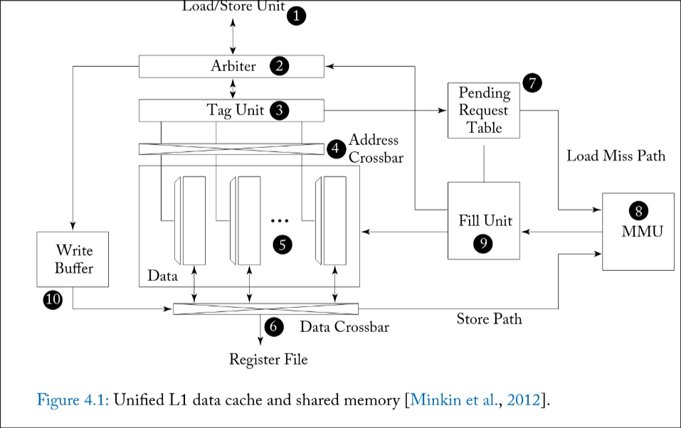

State: I am not stuck with anything

# Progress:

## 4: Memory System

* CPUs divide memory space into two: the register file, and the memory
* GPUs divide it further:
  * Register File
  * Local Memory - Private per thread, used for reg spilling
  * Global Memory - Used for data structures shared among multiple threads
  * Scratchpad - Used for threads which operate together in a CTA
    * This is useful when an application knows what data needs to be operated on, and it can all be stored there to overlap memory access times
    * Also has significantly lower power draw then accessing from off-chip

### 4.1 - FIRST-LEVEL MEMORY STRUCTURES
* First-level memory strucutres is the L1 cache, as well as the scratchpad ("shared memory")

#### 4.1.1 - SCRATCHPAD MEMORY AND L1 DATA CACHE
* In the CUDA programming model, "Shared memory" is a memory in which low-latency is expected and is accessable by all threads
  * Similar latency to a register files
* Shared memory is implemented as SRAM, and is multi-banked, with one per lane (each thread can access any bank)
  * Programmers must then be aware of bank conflicts as something to avoid where possible
* The L1 data cache maintains a copy of a piece of the global memory address space
  * Some architectures only allow memory not modifed by the Kernal to be present due to the lack of cache coherency
  * Programmers should aim for all threads to access data within the same memory block (coalesced access) to minimize the number of blocks the cache has to pull in from memory
* Example unified L1 cache and shared memory

  * (1) the load store unit in the instuction pipeline sends in all memory acess request with a memory address from each thread in a warp as well as the operation type
* For shared memory access
  * The arbiter determines if the request address's will cause bank conflicts, and if so, will split the request into two or more parts as needed. These additional requests are known as a "replay." 
    * Can be left in the instruction buffer to save area, but results in high cost due to acessing the register file again
    * A minimal mem access buffer in the load_store unit is a more power efficent option
  * The accepted addresses are looked-up inside the tag-unit (shared memory is direct-mapped) and deterimines which bank each access goes too
  * The arbitor schedules a writeback event to the register file, as non-conflicting access's are constant timed
  * The tag unit then directs address to the address crossbar, which gives each address to the correct bank
  * The data crossbar (6) then returns each piece of data to the relavent lane for register write bacl
* Cache read operations
  * The load/store unit breaks up memory access into seperate, coaleced, memory access requests
  * This is than fed to an arbiter, which may reject a request if resources are all used. If not rejected, the arbiter than procedes, scheduling a register writeback as if a cache hit will occur
  * The tag unit concurrently check if it is actually a hit or miss
    * If a hit, the memory is than accessed from the correct rows in the banks and written back
    * If there is a miss, it informs the arbiter the request must be repeated, while at the same creating an entry in the pending request table (PRT)
  * A GPU's L1 cache is both virtually indexed and tagged
    * Page based Memory virtualization is still useful in GPUs to simplfy memory alocation and reduce memory fragmentation
  * Once a memory request is allocated in the PRT, a request is forwarded to the MMU, translating virtual memory to physical,
  * once the data is returned to the MMU, it is passed to the fill-unit, which places the data in the SRAM banks, and looks up the data's PRT entry, which is than used to reschedule the look-up in the arbitor
* Cache Write Operations
  * Can handle both write-back as well as write-through operations, giving multiple ways to handle writing
    * Low temperoal locality often found at the end of kernels dumping memory makes write-through without write-allocate appealing
    * Local memory writes for register spilling however show good temperoral locality, making the case for a write back with write-allocate policy
  * Data to be written is first placed on the write data buffer (WDB).
  * If the data is present in the cache, the data-crossbar can be used to access. If the data is not present, the block must than be pulled from the L2/DRAM
  * NOTE: This architecture does not support cache coherence
    * Nivida's GPUs for this reason only allowed local memory register spills or global memory reads to be cahced
#### 4.1.2 L1 TEXTURE CACHE
* The following are the key differences between a normal L1 cache and a L1 texture cache
  * The Tag array and Data array are seperated by a FIFO buffer to hide the latency of missed requests that may need to pull from DRAM
    * This is optimized for asusming that cache misses will be frequent
    * To fit with this, the Tag array is kept ahead of the data array, repersenting what the data array will look like in the future
    * Increases throughput, while making cache misses and hits have similar latency

#### 4.1.3 UNIFIED TEXTURE AND DATA CACHE
* Some recent (2018) GPU architectures combined the L1 data caches and the texture cache to save area.
* The most straight forward way to acomplish this is to only store data that is 100% read only in the cache
  * Then, the texture cache arcitecture can be used almost identiclly, except with minor addressing logic changes

### 4.2 - ON-CHIP INTERCONNECTION NETWORK
* To satisfy the high memory bandwith, high-performance GPUs connect to multiple DRAM chips in parralell via memory patition units
* Traffic is distributed across the units using address interleaving
* Nvidia GPUs are described as using crossbars, while AMD uses "ring networks"

### 4.3 - MEMORY PARTITION UNIT
#### 4.3.1 L2 CACHE
* The L2 cache inside each memory partition is composed of two slices
    * each contains seperate tag and data arrays
    * process incoming requests in order
* To match the atomic size of GDDR5 (32 bytes) each cache line in a slice has four 32-byte sectors
  * A cache line is allocated for use in either a load or store instruction
* To optimize throughput on common case of a mass write to memory, when a coalecsed write miss occurs, no data is then read into memory
* uncoalesced writes could be handled by storing byte-level valid bits, or bypassing the L2 entirely
* Data being written to memory is buffered in the L2 cache while awaiting scheduling the memory access scheduler
#### 4.3.2 ATOMIC OPERATIONS
* The ROP unit includes function units for atomic ad reduction operations, which when accessing the same memory location repeatedly, can be cached
* These operations can be used for syncronization across threads in differant thread blocks
#### 4.3.3 MEMORY ACCESS SCHEDULER
* To aid in storing large amounts of data, GPUs use special dynamic memory, like GDDR5 gdd
* DRAM stores individual bits in small capacitors and reaidng from a row of bits (page) requires reading first into a row buffer
  * This row buffer must be pre-charged to an intermediate value, and is then pulled slightly up or down from charge in the storage cell.
  * This adds significant delay in the memory access
* Multi-banked DRAM is used to hide latencies, but this still has issues of bank-conflicts
* Special memory access schedulers are used to reorder acesses to minimize the delay caused by moving data between row-buffers and dram cells