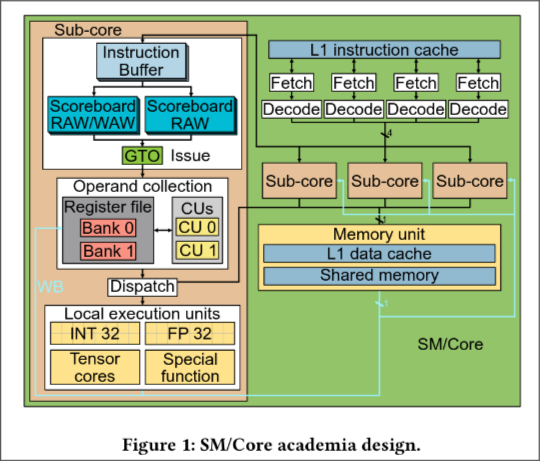
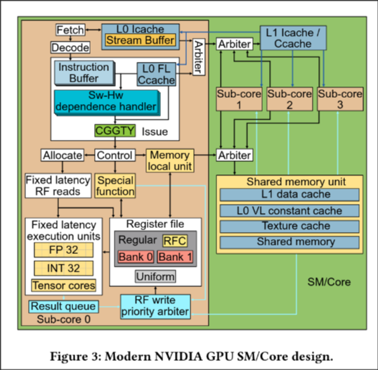

# Progress:

## 5: Crosscutting Research on GPU Computing Architectures

### 5.1 THREAD SCHEDULING
* Three primary ways threads are organized in GPUs
  * Assignment of threads to a warp - Threads are fused together in a lock-step group, a warp
  * Dynamic Assignment of thread blocks to cores - A thread block made up of many warps is assigned to a individual GPU core, which only services that threadblock until all threads complete
  * Cycle-by-Cycle scheduling decisions - Fine grained hardware which selects which warps in a thread block to fetch instructions, issue instructions, and read/write from memory (three schedling loops)
  * Scheduling Multiple Kernels - Thread-block level as well as cycle-by-cycle scheduling can both be done across multiple kernels on newer GPUs

#### 5.1.1 - RESEARCH ON ASSIGNMENT OF THREADBLOCKS TO CORES
* A GPU wide schedling mechanism assigns threadblocks to one of the SIMT Cores
  * Each core has a limtited amount of scratchpad memory, number of registers, and warp_slots, and slots for threadblocks - These are all known at kernel launch and can be used for scheduling 
* Throttling at the Threadblock Level
  * Use an algorithm, which limits the number of initial assigned threadblocks to half of each cores max
  * The Idle and memory cycle delays are then monitored and used to determine which cores have the least time spent in memory delay, and add additional threadblocks there
  * limits memory system interference and improves overall application performance
* Dynamically Tuning GPU Resources
  * Use Equalizer, a hardware runtime system which scales the frequency and number of threads based on:
    * The number of active warps in a SM
    * The number of warps waiting for data from memory
    * The number of warps ready to execute an arithmatic instrucion
    * The number of warps ready to execute a memory instruction
  * Has two key modes of operation
    * energy-savings mode - Saves energy by scaling back under-used resources
    * performance-enhancing mode - Gives additional recourses to the bottle-neck recourses
  * Charecterize a set of workloads as one of the below, and to save energy, reduces frequency of the un-utilized resources
    * Compute intensive
    * Memory intensive
    * Cache sensitive
    * Unsaturated
  * Makes decisions on an interval basis, using monitor hardware added to each SIMT core to determine the correct optimizations

#### 5.1.2 RESEARCH ON CYCLE-BY-CYCLE SCHEDULING DECISIONS
* Early Characterizations of Cycle-by-Cycle Scheduling
  * Showed that a fairness-based scheduling policy for both Warps and DRAM worked best, when used on balanced workloads
* Two-level scheduling
  * Divides warps into warps that are being considered or not considered for scheduling
  * A warps enters the inactive pool upon encountering a memory dependency and is transfered back in on a round-robin basis
  * Another two-level scheduler proposed scheduling such that groups of threads would reach the same long-latency instructions at the same time
* Cache-Conscious Warp Scheduling
  * Categorizes memory locality in kernels as being:
    * intra-warp - A warp loads and then references its own data -> Most common in cache-sensitive work loads
    * inter-warp - A warp shares its data with other warps
  * By Throttling warps whose workload is thrashing (constantly updating) the cache, the cache can be more effectivly used and increase overall performance
  * Introduces a lost-locality detection mechanism based on replacement of victim tags in the L1 data cache
    * On every cache eviction, The victim's tag is written to a per-warp array
    * On every cache miss, this array is checked, and if the tag is found, some intra-warp locality was lost
    * This loss is sent to the system scheduler, which uses a scoring system to reduce warps as needed
  * Divergence-Aware Warp Scheduling (DAWS) is an extension which pre-emptivly throttles the number of warps in loops
* Prefetching-Aware Warp Scheduling
  * Forms fetch groups from non-consecutive warps
  * Increases bank-level parallelism
* CTA-Aware Scheduling
  * Builds on a two-level scheduler to form fetch groups based on combing CTAs
  * Use throttling on the number of warps in a core
  * Also use inter-CTA locality, based on consecutive CTAs using similar dram banks, splitting them up to avoid conflicts
* Impact of Scheduling on Branch Divergence Mitigation Techniques
  * Dynamic Warp Subdivision splits warps when some lanes have cache misses and others dont. Allow threads to get other cache misses ahead of time, improving performance of thos left behind
  * Different warp scheduiling policies can help or hurt the effectivness of dynamic warp formation policies
  * Thread block compactation (TBC) had three thread block prioritization scheduling methods developed for it
* Scheduling and Cache Re-Execution
  * Sethia et al. [2015] introduced Mascar, which is designed to better overlap computation and memory use for memory-intensive workloads
    * Uses a memory aware warp scheduler to focus on single warp execution when memory is backed-up, getting it to computation quicker and increasing overlap
    * A cache access re-execution method, which avoids thrashing by allowing hits-under-misses
  * Switches between two modes:
    * Equal Priotity - default mode
    * Memory Access Priority - Mode for when memory structures are nearing full
  * Priotizes compute warps in MAP mode, to increase overlap

#### 5.1.3 RESEARCH ON SCHEDULING MULTIPLE KERNELS
* Supporting Pre-emption on GPUs
  * Attempts to support pre-emptive multitasking on GPUs
  * Detects whether execution has [Idempotence](https://en.wikipedia.org/wiki/Idempotence)
  * Three approaches for a full context switch for each threadblock. Dynammicly selected
    * A full context save/store
    * Waiting until the threadblock is finished
    * Stopping a thread block w/o a save due to detected Idempotence
  * Each of the above methods have differnt switch latency and system throughput tradeoffs

#### 5.1.4 FINE-GRAIN SYNCHRONIZATION AWARE SCHEDULING
* Significant overhead threads spin waiting for locks
  * However, backing off the execution of these threads may slow progress of threads holding the lock in the warp
* Propsed hardware structure to dynamicly identify threads in the spin lock
  * Can reduce priotity of warps when they execute the backwards branch of a spin loop AFTER threads in the warp have released locks

## [Analyzing Modern NVIDIA GPU cores](https://arxiv.org/pdf/2503.20481)

### Abstract
* GPUs are the main platform for HPC (high-performance computing) workloads
* This paper focuses on reverse engineering modern NVIDIA GPU cores
  * Focuses on issue logic, such as the issue scheduling, register file and cache structure
* Also look at the software based scheduling mechanism used by Nvidia, and how it out-competes a hardware (scoreboard based) mechanism

### Introduction
* GPU's massive parallelism is of use for modern applications in bioinfomatics, physics, chemisty, and more
* Recently there have been major innovations in GPU microarchitecture, interconnections, and communication frameworks
  * Allow for the creation of modern LLMs
* Modern GPU research relies on the 2006 Tesla microarchitecture as the baseline
  * Will effects the results of research studies

### Background and motivation
* Most GPU research relies on microarchitecture that GPGPU-simulator employs
  * Only recently added the sub-cores used in Nvidia's Volta architecture (first product announced 2017)
* General SM architecture

  * Fetch stage - Round robin scheduler selects a warp whose next instruction is in the L1 icahce and has empty slots in its instruction buffer (one for each warp)
  * Issue stage - A "Greedy Then Oldest" scheduler selects a warp if not waiting on a barrier and its oldest instruction does not have a data dependence on any current inflight instructions (uses two scoreboards)
    * One to mark pending writes for RAW and WAW hazards
    * One to mark pending reads for WAR hazards
      * While normally the in-order execution of GPUs would prevent this, the out-of-order operand collecter can still cause issues
  * Once issued, an instruction is placed in a collector units, and waits for all its registers to be retrieved
    * Each sub-core has its own register file with multiple read-ports and an arbiter to handle back conflicts
  * Dispatch Stage - Once ready, the instruction is sent to the proper execution unit, each with there own variable latencies
  * Write-back Stage - Writes back data to the register file
* The above model is largely the older Tesla architecture, with some modern features added

### Reverse Engineering Methodology
* This section focuses on the approach used on Ampere GPUs to discover the microarchitecture
* Based on writing small microbenchmarks, with only a few instructions (normally handwritten SASS), and mesuring execution time
  * The elapsed cycles are obtained by a surrounding region of code which save the CLOCK counter to reg, and later writes to memory
* Use the test and number of cycles to confirm or deny a particular hypothesis about the microarchitecutre
* Use third party tools to modify/write SASS code, as no Nvidia one exists

### Control Bits in Modern NVIDIA GPU Architectures
* The ISA of modern Nvidia architectures use control bits and info used by compilers to maintain correctness
* Modern Nvidia GPU architectures use these bits in place of hardware to handle register data dependencies
  * Contained in all assembly instructions
  * Increase performance and energy consumption

#### The control bits
* A compiler indicates when an instruction will be ready in the control bits
  * To handle producer consumer dependincies, each warp has a ___Stall counter___, which only allows a warp to execute instructions when it is at 0
  * Any "producers," instructions which write to a regsiter, must mark the stall counter to block next instructions
* Also use **seperate dependence counters**, with fixed increments on instruction issue, and decrement on instruction writeback, to handle data dependency
  * A ___Dependence counter mask___ is used to indicated which dependence counters must be 0 for an instruction to execute
* A ___reuse bit___ indicates if a register file read should be cached for more efficent future access

### GPU cores Microarchitecture

#### Issue Scheduler
* Warp Readiness
  * A warp is considered ready for issuing its oldest instruction when certian conditions are met. These may be conditions of pervious instructions, or the larger core's state
  * The warp must have an instruction in its instruction buffer
  * The oldest instruction must not have data-dependence on any in-progress instructions from the same warp (use control bits described above)
  * All needed recourses must be gaurnteed to be avaiable before issueing
    * This includes the execution units, which must has a latch which indicates if it is in use
  * Instructions with a source opperand in the constant cache must perform tag-lookup, and can only be issued if no miss occurs
    * the scheduler will switch to a new warp if the cache miss can't be resolved within 4 cycles
  * Instruction issuer doesn't check read-port availability, however an alternative model (that is "mostly accurate") involves two stages between issue and reading register
    * Control - common for fixed and variable latency instructions. Increases dependence counters and reads CLOCK counter as needed
      * Indicates the two instructions need at least one cycle seperation to use dependence counters
    * Allocate - Only for fixed latency. Checks register file read-port avaiability, and instructions only pass when read-port availability is confirmed
      * The fixed-latency instructions get priority over the read-ports to maintain there fixed latency
* Scheduling Policy
  * The warp scheduler uses a Greedy policy that selects an instruction from the same warp if it meets the eligibility requirements
    * When switching warps, the youngest warp which meets the requirements is selected
  * ___Compiler Guided Greedy Then Youngest___ scheduling
  * Has a yield instruction, allowing a warp to give up its current control

#### Front End
* SMs have four different subcores and warps are evenly distributed amongst them using round-robin
* Each sub-core has a private L0 icache connected to a shared L1 cache
  * Each L0 cache has an instruction pre-fetcher
  * Has a policy similar to the issue policy
* Relativly little times of finding no valid instruction in the instruction buffer
  * Implies existance of a the prefetcher
  * Also indicated that each sub-core can fetch and decode one instruction per cyclte
* Will always fetch an instruction for its current warp, unless the buffer is filled (or about to be filled by previous requests)
  * If full, it instead switches to the youngest warps buffer, filling from there

#### Register File
* Modern Nvidia GPUs have a wide range of register files, presented below
  * Regular
    * 65536 32-bit registers per SM, placed in groups of 32 (one for each thread), giving 2048 warp registers
    * Evenly distributed between sub-cores, where they are organized into two banks
    * The number of register for a warp varies from 1-256, and is determined at compile time. -> The more registers per warp, the less warps can share an SM
  * Uniform
    * 64 private 32-bit registers per warp
    * Store values shared by all threads in a warp
  * Predicate
    * 8 32-bit registers, each used by a different thread of the warp
    * Used to store the execution masks for control flow
  * Uniform Predicate
    * 8 1-bit register
    * A predicate shared by all threads in a warp
  * SB Registers
    * Six registers used to track data dependence
    * "Dependence counters"
  * B Registers
    * 16 registers
    * Used to manage control flow reconvergence
  * Special Registers
    * Store special values such as thread or block-id
* Modern Nvidia GPUs don't use an opperand collector
  * Would add variable time between instruction issue and write-back, removing fixed-latency instructions
* Each register file bank has a 1024-bit write port
* Will delay variable-latency instructions for fixed-latency ones on write back, however two fixed-latency instructions appear to write concurrently
  * Implies the use of a result que
* Read bandwith of 1028-bits per bank
* Register File Cache
  * Used to relieve contention on register read ports, and save energy
  * Believed to follow a cpurely ompiler controlled design
  * Has one entry for each of the two register file banks per sub-core, each storing 3 1024-bit values
  * For instructions with 2 read registers, they come from different banks and are stored in the corresponding caches

### Memory Pipeline
* Has initial stages local to each subcore, with final stages being shared by each sub-core due to the shared data cache and shared memory
* Each sub-core can buffer up to 5 consecutive memory instructions without stalling, global structures can recieve a memory request every two cycles, and address calculation in each sub-core has a throuput over one every 4-cycles
* Memory queue in each subcore has a size of 4
* Global memory access's are faster if they use uniform registers for address calculations
  * Not the case for WAR latency

## Modeling
* The authors designed a new model of the accel-sim framework, modifying everything to match the new discoveries regarding Nvidia microarchitecture
* Extended the tracer tool, giving the identity and dump of all regsiter types

## Validation
* Verify the model accuracy by comparing to the metrics on the hardware counterparts, using 4 different ampere GPUs
* Used a wide variety of benchmarks from different suites
* Comparing the model to the normal accel-sim shows significant increase in accuracy, mesured using mean percentage abolute error.
* While the results were focused on the Ampere architecture, there is still minor increase in accuracy in performance with the Turing architecture
