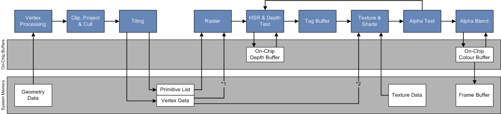
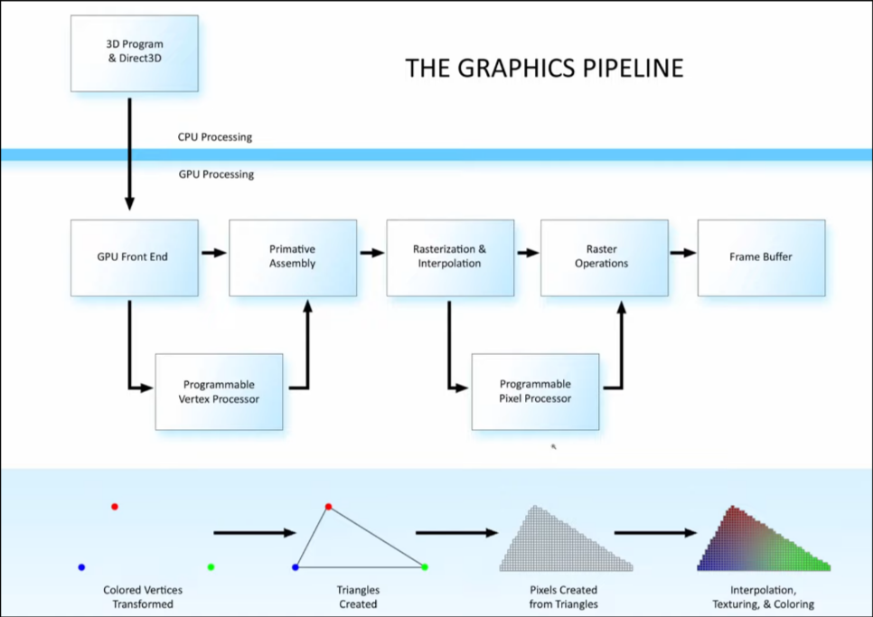

State: I am not stuck with anything

# Progress

## Base hardware requirements
The requirements of software identified so far, communicated to hardware and software as needed. 

Current train of thought is focus on the minimum required hardware, at least minimizing graphics specific functionality, to lighten the load on the hardware team.
* Function Units
  * INT32
  * FP32
  * LD/ST
  * TRIG (sin/cos)
  * Texture cache?
* Control and status registers
  * Warp ID
  * Thread ID

## Need to clarify
* Need to discuss with hardware and compilers how we intend on loading data and programs to teh GPU
* Is the GPU going to have its own memory?

## Graphics pipeline framework (current)
1. Load in relavent data into the GPU memory space
   * This will include vector data, color data, and texture data
2. Per vector processes
   * First, load in 3D vectors and run all relavent transformations (such as rotating)
   * Second, project 3D vectors into 2D vectors.
     * This may be where some key 3D->2D transformation data will be stored, for later use in finding texture info
3. Per Triangle processing
   * Clipping and culling of triangles
   * Should look at this furter. Does this need its own stage?
4. Per Pixel Processing
   * Will find which "2D" triangle each point lies in and use that to identify the correct texture.
   * Will then use non-linear interpolation, using the transformation data of each point (stored in the per vertex processes) to perform the equivalent of 3D linear Interpolation
     * If this seems vague, its because more research is needed on my part to fully grasp

## Personal Research Notes
### Basic graphics flow sent by Jing

[Source](https://docs.imgtec.com/starter-guides/powervr-architecture/html/topics/tile-based-deferred-rendering-index.html)
* Looking at the above workflow, the one section we can likely skip is the alpha related code
  * Purely used for transparency, not needed for current goal
* Hope to do the bulk of the logic using general programability, to avoid extra hardware complexity

## "The Graphics Pipeline - Shader Graph Basics - Episode 2" ->[link](https://www.youtube.com/watch?v=ZEXVQgbWxQY&list=PL78XDi0TS4lEBWa2Hpzg2SRC5njCcKydl&index=3)

* General workflow
  1. 3d Program sends vertex data to graphics drive, which passes the data to the GPU front end
      * Need to comunicate with compilers and hardware how this is being done. What hardware, and what protocol
      * How are we getting across program data like number of threadblocks and warps
  2. Programable Vertex Process
      * Transforms 3D vectors into 2D (u,v) points to be displayed on screen
      * Can also transform vectors, "bend vertex normals" (?), and calculate basic lighting
      * Used to be where the bulk of the work was done -> likely where we will do the bulk of the work
      * Any work that can be done here is best, as its per vertex, not per pixel
  3. Primative assembly
      * Uses Vertex Process output to make 2D triangles, i.e. in screen project space
  4. Rasterization and Interpolation
      * R -> Converts 2D triangles into pixels
      * I -> Interpolates between points to do color and texture
  5. Programmable pixel processor
      * Does final per pixel operations
      * For us, this will likely also perform step 4, instead of a sperate hardware step
  6. Frame buffer
      * Stores output data, for us this will likely be sending data back to a CPU or leaving it in shared memory

Simplified version of flow, broken down into our program steps:
1. Load 3D vertex data -> must be easily accessible
   * GPU memory or shared memory system?
   * Store in format convient for future operations
   * must contain color data as well
2. Vector process -> Runs one thread per vector.
   * Can perform all transformations - rotation in our case
   * Will transform each 3D vector into a 2D coordinate - relative to camera
     * Not pixel data...
3. triangle process -> One thread per triangle (?)
   * Connect 3D vectors into defined triangles
   * Most cconfusion for me here. Triangle data should be given alongside vector data know, and we can't draw until we get pixels? Is this just clipping?
   * removing non-visible triangles, clipping edge triangles
   * How to parrallelize?
4. Pixel process -> One thread per pixel
   * Performs interpolation to get pixel color, either with interpolation of vertexs, or use of textures