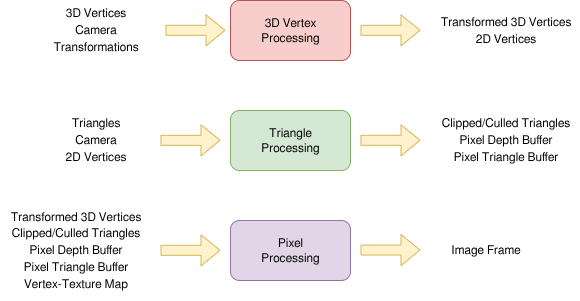

State: I am not stuck with anything

# Progress

## How to map a pixel to the perspective-corrected texture
* Basic inputs needed:
  * Current pixel
  * Per Pixel data buffer -> For each pixel, has: (found during Triangle Processing)
    * 1/z, the inverse depth of the equivalent 3D pixel
      * Found with barycentric interpolation in the 2D dimension of triangles
    * The matching triangle
   * Triangle data
     * Part of the initial data, clipped/culled during Triangle Processing
   * Vertex->texture map
     * Part of the initial data
* Expected Outputs:
  * A color value for the pizel
* Steps:
  1. Find the given 3D point matched to the pixel, using its stored 1/z data
     * Involves finding the inverse projection of that point
  2. Find the pixel's texture coordinate
     * Shift 3D pixel vertex and its matching triangle into a shared 2D plane
     * Use barycentric Interpolation on the pixel, between the three triangle vertex points, to get its texture coordinates
  3. Find the color of the pixel
     * Map the known texture coordinates onto the texture accosiated with the known triangle

## Hard to formalize exact math in markdown, see example progams for reference:

Inverse projection code
* NOTE: this code was developed for CS334, although was done before needed, using knowldge from GPU team's research
```
int PPC::InverseProject(V3 PP, V3& P) {
	int ret = 1;

	V3 q;

	q[2] = 1.0f / PP[2];
	q[1] = PP[1] * q[2];
	q[0] = PP[1] * q[2];

	M33 M;
	M.SetCol(a, 0);
	M.SetCol(b, 1);
	M.SetCol(c, 2);

	P = M * q + C;

	if (q[2] <= 0.0f)
		return 0;
	return ret;
}
```

Finding a points barycentric coordinate (needed for barycentric interpolation)
* NOTE: Developed initialy for assignment 4 of CS334
```
int V3::FindBarycentricCoordinate(V3 x, V3 y, V3& l) {


	M33 M;
	M.SetRow(V3(1,1,1), 0);
	M.SetRow(x, 1);
	M.SetRow(y, 2);

	l = M.Inverted() * V3(1.0f, xyz[0], xyz[1]);

	if (l[0] < 0 || l[1] < 0 || l[2] < 0 || (l[0] + l[1] + l[2]) > 1.01) {
		return 1;
	}

	return 0;
}
```

## More specific Graphics flow - specifying how data moves:

Self developed diagram (draw.io)
* 3D Vertex Procesing
  * Inputs:
    * 3D Verticies -> Stored as <x, y, z>
    * Camera -> Stored as a 3D coordinate, and three 3D vectors
    * Transformations -> Input regarding what transformations are to be done to the matrix (format currently undefined)
  * Outputs:
    * Transformed 3D verticies -> Stored as <x, y, z>
    * 2D vertices (with relavent depth-like parameter) -> Stored as <x,y,1/z>
* Triangle Processing
  * Inputs:
    * Triangle Data -> stored as <v1, v2, v3>, the indicies of three verticies
    * Camera
    * 2D vertices -> from 3D Vertex Processing
   * Outputs:
     * Clipped/Culled Triangles -> Triangles with non-visible triangles removed and partial triangles clipped
     * Pixel Depth Buffer -> The accosiated 1/z value for each pixel, for mapping to 3D equibalent
     * Pixel Triangle Buffer -> The accosiated triangle that each pixel maps too
* Pixel Processing
  * Inputs:
    * Transformed 3D verticies -> from Vertex Processing
    * Cliiped/Culled Triangles -> From Triangle Processing
    * Pixel buffer -> From Triangle Processing
    * Vertex-Texture Map -> From initial input. Maps the vertex's to an accosiated texture map
  * Outputs:
    * Framebuffer
  * This stage's math principles can be seen in the pixel to perspective-corrected texture section above  