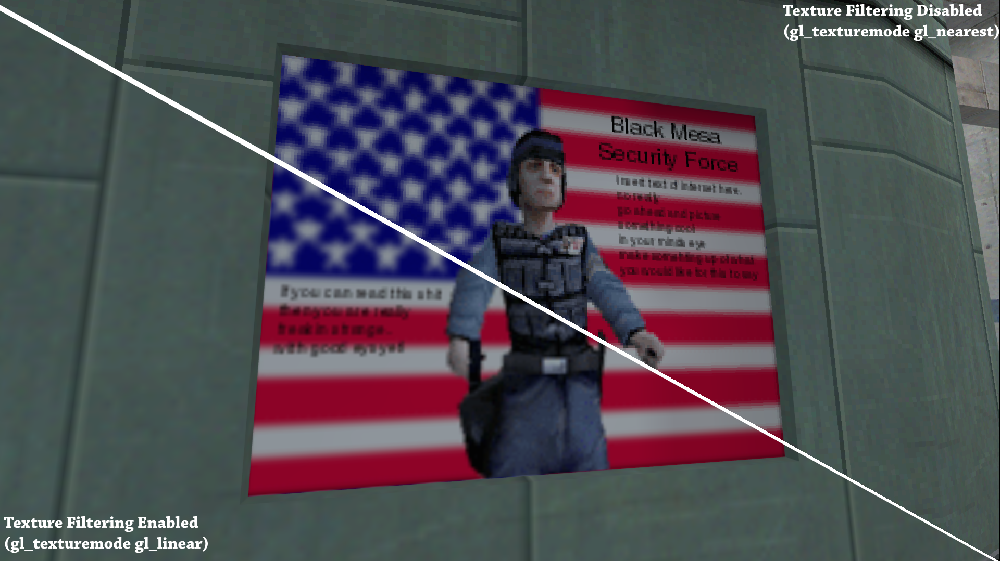
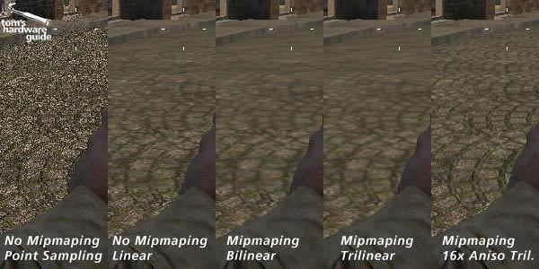

State: I am not stuck with anything

# Progress

## Results of discussions with Hardware Teams

### How is a kernel launched?
 * TODO: What bus will be used for all of this. AXI? Is someone implementing this, and do we have an existing system for communicating with it at a testbench level
 * Global status registers will exist to allow a CPU (or for this year, a testbench) to write critical information
   * Starting PC - The address where the GPU will start pulling instructions from
   * Thread Block Count
   * Thread Block Size
   * Agument Pointer - A pointer to shared memory which the GPU kernel can pull input arguments from
     * TODO: how is this accessed from the program? I don't believe either hardware or software are considering this currently
     * If a "return pointer" is needed, it can be specified as part of this
 * To start the program, the controller can write one bit to a start register on the GPU
 * GPU will send a 1-bit signal to controller to indicated completion
   * TODO: how will this work with whatever bus is chosen? Will it be seperate, or integrated into the bus?

### Per-Thread Control and Status Registers
 * TODO: need to check in with compilers on what they currently view this as...
   * Design review seemed to not match my current understanding described below
 * In software:
   * Reference threadID, blockID, blockDim
 * In Compilation:
   * Become special "CSR" instructions which read from a special function unit and place the values above in the needed registers
 * In Hardware:
   * Take in special instructions which access the per-thread CSR and write back to the register
 * **A Note on Thread Blocks:**
   * Threadblocks in general exist to distinguish to the programmer what threads have shared hardware (to divide workload evenly) and which threads have access to the same shared memory
     * noteably, neither of these are striclty needed for us, as we don't have sMem and are currently only implementing 1 SM
   * The current hardware plan is to handle multiple threadblocks, up to some max thread count
     * These will ALL run on the same SM, practiclly being the same threadblock
     * The threadblock framework is being implented such that future work can more easily integrate multiple SMs
   * TODO: Ensure that compilers is handling multiple threadblocks 

### Texture Cache:
 * Main function is performing specific memory access's that are optimzied for texture filtering
 * Graphics currently has no plan to implement texture filtering, as while it can improve graphics quality for high quality textures, for our basic workload it is not strictly needed
 * NOTE: mixed opinions on this. This may be something to have optionally in the python simulator, if time can be foind to add and test
   * This would need a software and compiler update, likely to significant of changes that late

Example of texture filtering **harming** the render quality - low quality texture


Example of texture filtering **hurting** the render quality - higher quality texture

   

### Square Root vs Inverse Square Root

 * In investigation of our graphics workload (using exist CS334 pipeline as an example), we have determined that SQRTs primary purpose is for vector normalization.
 * As a result, we have determined that inverse SQRT is the desired hardware functionality
 * This can likely be done with a hardware implementation of fast inverse SQRT from Quake III
   * See below
   * May need additional iterations to meet IEEE accuracy standards

Quake III Arena fast inverse SQRT (from wikipedia)
```
float Q_rsqrt( float number )
{
	long i;
	float x2, y;
	const float threehalfs = 1.5F;

	x2 = number * 0.5F;
	y  = number;
	i  = * ( long * ) &y;                       // evil floating point bit level hacking
	i  = 0x5f3759df - ( i >> 1 );               // what the fuck?
	y  = * ( float * ) &i;
	y  = y * ( threehalfs - ( x2 * y * y ) );   // 1st iteration
//	y  = y * ( threehalfs - ( x2 * y * y ) );   // 2nd iteration, this can be removed

	return y;
}
```

## Research into Existing Libraries
Following questions and comments by Jing during design review, we looked into possibly using an existing graphics library

### OpenGL
 * OpenGL is a specification, and the specific implentation of "drivers" is done per hardware (what we need to do)
 * Designing custom drivers, while not impossible, seems to have minimal documentation or previous attempts online
   * Indicates it is likely unreasonable
 * General Assessment:
   * To large of a project to learn the openGL driver requirments, and build the enitre driver stack for the interface
   * Possible future project

### OpenCL
 * A frontend *language*, not a *library*
 * Largely a front-end -> Compiles OpenCL code into an intermediate repersentaiton, **SPIR-V**
   * Same IR as Vulkan
 * All existing **SPIR-V** backend appear to use LLVM
   * Deemed by Sooraj to large and complex of a project to possibly do without a much larger compilers team
 * General Assessment:
   * Same as OpenGL -> To much work for current project, possible future project

### Current decision on porting a library -> To large of a project for the current team

## Future Priorities:
 * Need to look much closer at the triangle stage of the graphics pipeline
   * Current "thread per triangle" idea doesn't work -> Mass warp divergence
   * Possible change to one thread block per triangle?
 * Clarify final questions with compilers and hardware:
   * See TODOs throughout document