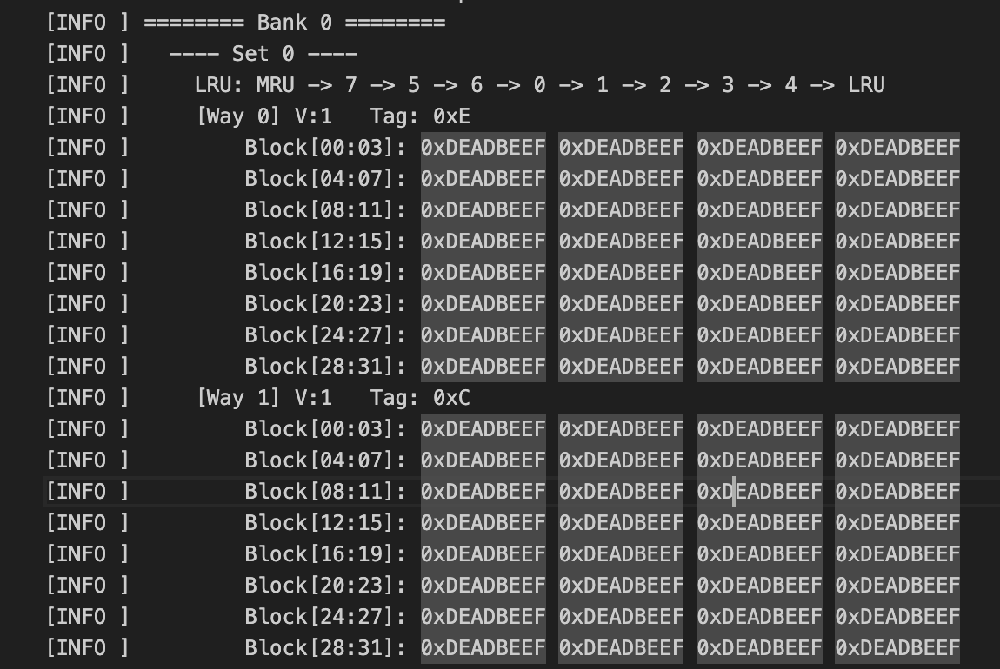
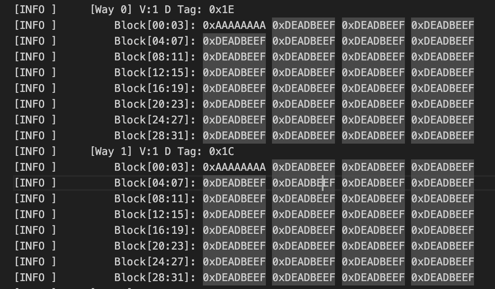
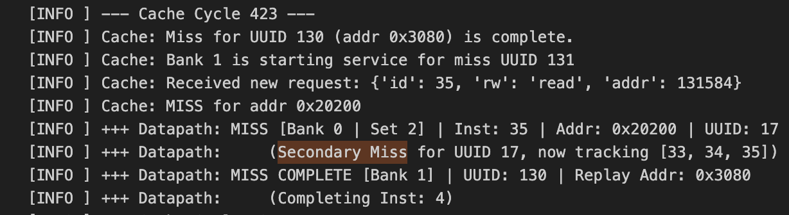
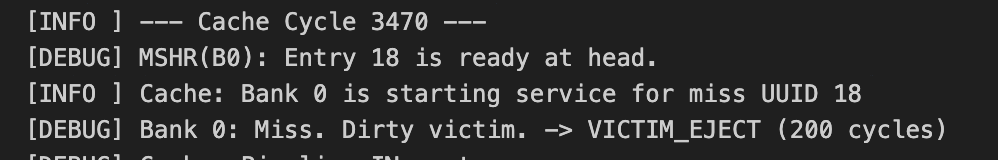
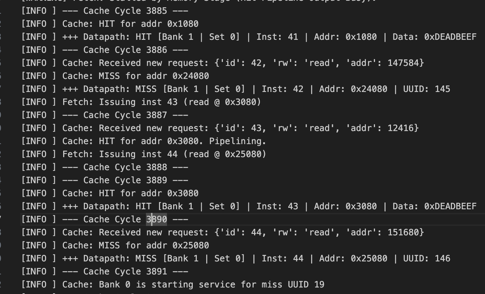
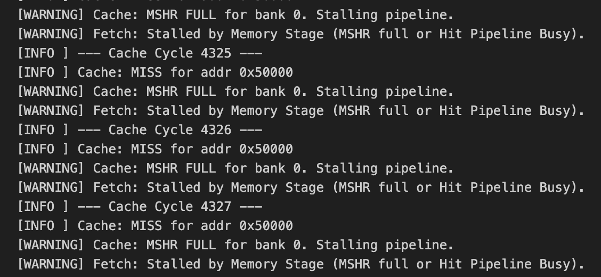

# Week 10
**State:** I don't need help right now

**Progress:**
- This week was mainly for testing the dcache simulator
- Made a test_dcache.py file where I would test:
    1. Reading into every way in set 0 of bank 1 and 2 (I have the parameter set to 2 banks for now)
    2. Writing one word into every way in set 0 of bank 1 and 2
    3. Test secondary misses (read after read -> Should only be one missed request) and (write-after-read -> Should merge the two missed requests)
    4. Tested victim ejection of a dirty victim 
    5. Tested a sequence of misses and hits to the same bank to see that the hits are returned while the misses are being served
    6. Tests stalling when MSHR buffe gets full
- Had a simulation_log.txt that contains what happens to the simulator every cycle and prints out the content of cache banks when all instructions have executed

- Image showing that the 0xDEADBEEF has been read into way 0 and 1 in set 0 of bank 0 (test case 1)

- Image showing that 0xAAAA_AAAA has been written to way 0 amd 1 in set 1 of bank 0 (test case 2)

- Image showing that 2 reqeuests have been categorized as secondary misses by the MSHR and is merged with the primary request

- Image showing that bank needs to eject a dirty victim by writing it back:

- Image showing that hits can be returned while the bank is also serving misses:

- Stalling due to full MSHR buffer

**Next week:**
- Need to integrate with the LSU
- Look into how to read from meminit.hex for data?
- I didn't implement interfaces because I was thinking that cache was part of the LSU and I could just make a cache object in the LSU function. Need to look more into the best way to integrate
- I have 437 and 573 exam and a presentation next week, so I won't be able to spend a lot of time until after 437...