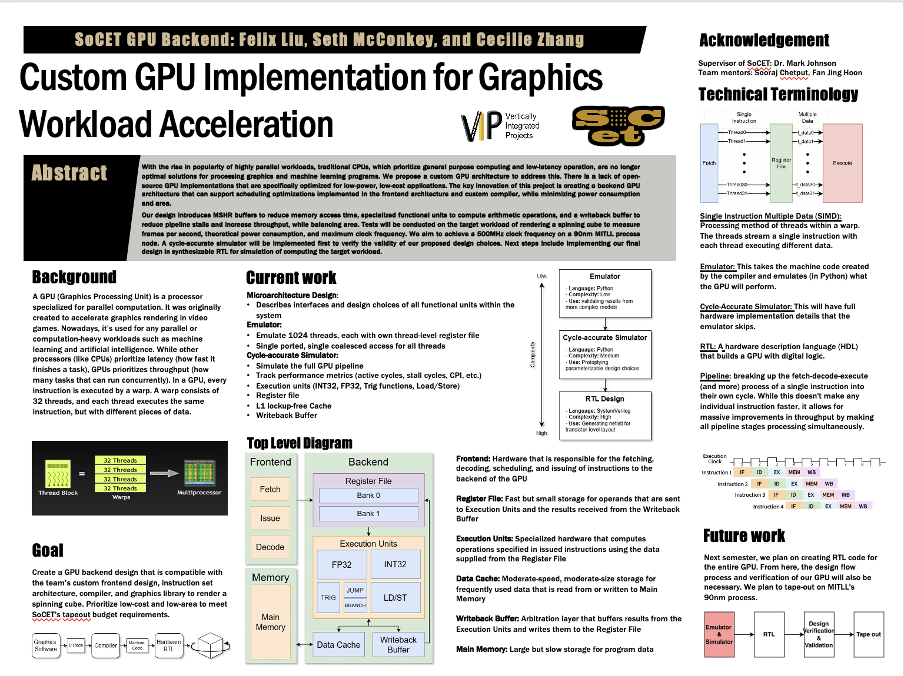
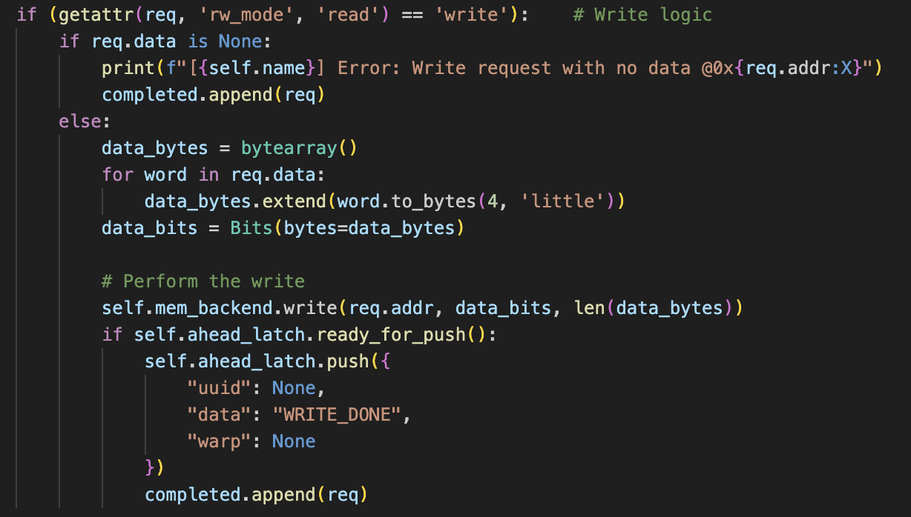
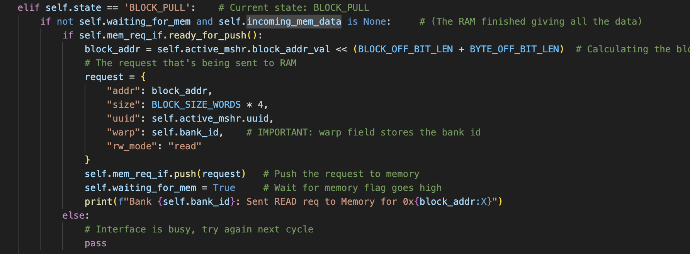
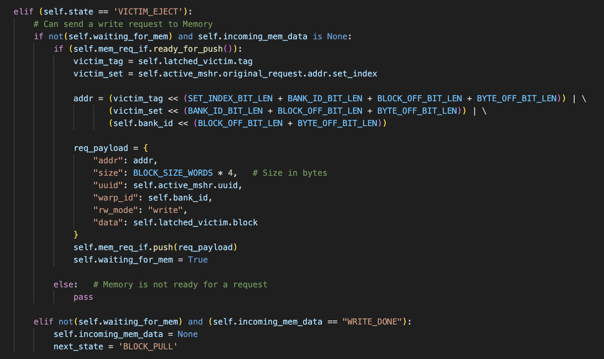

# Week 13
**State:** I don't need help right now

**Progress:**
**Sunday:**
- Code review presentations
    - Graphics: Went through their SAXBY code, graphics library, kernel
    - Compiler: Presented their compiler and IR generated from differnet code
    - Hardware:
        - Warp scheduler talked about a round robin schedule for deciding the active warps
        - Issue, Ibuffer and latchIF & ForwardIF: Talked about how the latches and "forwarding" works and included a video going through how each instruction is passed through the latches
        - Decode, Predicate, Icache, memory: Presented how the mentioned components were integratd together. Good for refernce.
        - Emulator: Presented how the emulator works and the main issue it's facing right now
        - The rest (me and seth about dcache and functional units) will present on hardware meeting on Thursday

- Tuesday (EXPO):
    - Our feedback on the poster was that there was too much text making it hard to follow. We added more diagrams and reduced the text to bulleet points to improve the readability
    - Had our poster presentation where we focused on the emulator and the backend part of the cycle-accurate simulator
    - More people than expected showed up and it was quiet fun to explain our project to them. Most people that showed up had very little experience and knew little about GPUs, so a lot of background info was given. There was one CS major that showed up and he had more experience with GPUs with the others and more in-depth explanation was given to him.

- Wednesday:
- Worked further on the interface parts of the dcache
- I'm reusing the memory.py that Yash created. Added write functionality to the MemStage object (acts like the memory controller)

The code basically first converts the received data to bytes and converts all that to binary. Then it calls mem_backend to write the data to the specified address. Once the data has been written to the memory (depends on the latency that's been set in memory), the MemStage will push the "WRITE_DONE" to the cache (Might want to add a done field and set the done high instead of using the data field. Might cause confusion down the road.)

- Modified the dcache_wip.py (pushed to the main branch on the GPU repo)
    - I removed the RAM_latency_countdown because this is now being handled by the MemStage and Mem (above). Added the self.waiting_for_mem and self.incoming_mem_data. This is initialized to False and none repsectively. 
    - Added a complete_mem_access where I'm setting the self.incoming_mem_data to the data from RAM and setting the self.waiting_for_mem to false
    - Added more logic to "BLOCK_POLL", "VICTIM_EJECT", and "FINISH". 

Block Pull:

First part of block pull added is if the RAM is available to accept a new request. The bank will issue a request to the RAM for its miss. Second part of block is to handle when the RAM has the data ready and the cache is filling an internal buffer with data from the RAM.

Victim Eject:

Biggest change to the Victim Eject state is that now the cache is sending a payload request to the RAM through the interface, self.mem_req_if.

- Made change to the compute method in of the LockUpFreeCache. If the data in the interface from the RAM to the cache is valid, then each bank will call its complete_mem_access method. 
- In addition to the changes to the dcache, I also added and modified some of the classes in the base.py file to accomodate for the dcache needs.
- I also started testing the dcache and memory integration in dcache_mem.py. So far, I've tested the a read miss, a read hit, and a write miss (which all seems to work). I need to test more thorough, but considering that the dcache logic hasn't change so much, I don't think testing the integration will take too long. 

**Thursday:**
- Had my code review in the hardware meeting

**Next steps:**
- Extensive testing of the dcache and mem integration. Ensure that memsim.hex is correct
- Implement halt support on the dcache
- Start the final report (im scared)
- Integrate all units together 