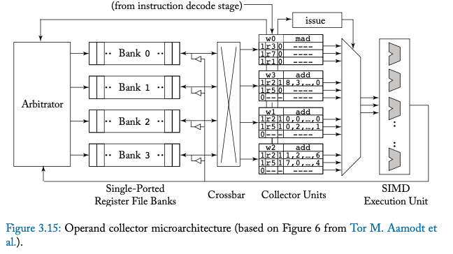

# Week 2 (Chapter 3)
Status: I have a feq questions regarding the reading
## Questons
- What are predications and what's the difference with the execution mask?
- I'm still confused about the stacklaess branch reconvergence
- What is used to detect dependencies between instructions in different warps?
- In two-loop approximation, how does the set of bit represent which registers are busy/or not

## MIT Videos: Performance Measures
- Latency: How much time it takes to one set of laundry (instruction)
- Throughput: How much laundry (instructions) can be done per minute (per time unit)
- A K-stage pipeline: An acyclic circuit having exactly K registers on every path from na input to an output
    - Latency: K * Period of system's clock
    - Throughput: Frequency of the clock
- Pipelined components can replace slow combinational component to decrease clock period
- tclk = tpi,reg + tpd of slowest pipeline stage + tsetup
- T (throughput) = 1/tclk 
- L (latency) = K/T = K*tclk

## Pipelining the Beta
- time/program = instructions/program * cycles/instruction * time/cycle
- 5-stage pipeline:
    1. Instruction Fetch stage
    2. Register File stage
    3. ALU stage
    4. Memory stage
    5. Write-back stage
- Pipeline hazard:
    - Data hazard: When the next isntruction depends on data from previous instruction
    - Control hazard: PC and branching
- Data hazard:
    1. Stall: Wait for the result to be available by freezing earlier pipeline stages. This can negatively affect instruction throughput and CPI
    2. Bypass (aka forwarding): Route data to the earlier pipeline stages once it's calculated. Bypass can take values from ALU, MEM, or WB. Bypasses are expecnsive due to lots of wiring and may affect clock cycle time. 
        - Doesn't work for load delays and have to stall until data is availble in memory
    - Compiler optimization can help rearrange the instructions to prevent stalling 
- Control hazards:
    - For BEQ/Bne and JMP, the Reg[RA] won't be available until RF stage. 
    1. Stall
        - If branch or jump in IF, stall IF for one cycle
    3. Speculate: Guess a value and continue, execute anways. When actual value is available: Guessed correctly -> nothing happnes. If not -> Restart calculation
    - Branch delay slot: Place the instruction so that teh instruction following a branch or a jump will always be executed
- When can excpetions happen?
    - Illeagel instrudction in RF
    - Arithmetic exception in ALU
    - Memory fault in IF and MEM
    Resolving:
        - Turn the exception instruction into BNE to save PC+4
        - Flush the pipeline

## Chapter 3: The SIMT Core: Instruction and Register Data Flow
- An SIMT core consist of three scheduling "loops" acting together (Look at Figure 3.1):
    1. **The instruction fetch loop**: consisting of Fetch, I-Cache, Decode, I-Buffer
    2. **The instruction issue loop**: I_Buffer, Scoreboard, Issue, and SIMT Stack
    3. **The register access scheduling loop**: Operand collector, ALU, and Memory
### 3.1: One-loop approximation
- With one single schedule: The unit of sheduling is a warp. The warp's program counter finds the next instruction to execute. Instruction is decoded and the operand registers are fetched from the register file. This happens at the same time as the SIMT execution mask values are determined
- The function units support different instructions. NVIDIA GPUs contain a special function unit, load/store unit, floating-point function, integer functon unit, etc. Usually, each function unit contains as many lanes as there are threads in a warp
- The SIMT execution model is achieved via a combination of traditional predications and a stack of predicate masks called **SIMT stack**
- The SIMT stack helps to handle nested control flow and skipping computations (Figure 3.4)
    - For nested control flow, the stack keeps track of which threads follows which paths in the. The stack has three entries: A reconvergence program counter (RPC), the address of the enxt instruction (Next PC), and an active mask. Every time the path diverges, entries are added to the stack
    - A reconvergence program is the location in which diverged threads can continue to execute in lock-step
    - It's recommended to put the entry with most active threads on the stack first and then the fewer active threads
- The stack-based implementation of SIMT can lead to "SIMT deadlock" (Some threads are blocked and can never reconverge with the other threads). NVIDIA came up with an new approach called **Independent Threaad Scheduling** to prevent **SIMT deadlock** (Look at Figure 3.5)
    - atomicCas(mutex, 0, 1) if mutex is 0, swap the value stored in mutex with 1. This is performed automaitcally by each thread. If several threads are doing atomicCas at the same time, several threads modify the Mux. There's one thread that will see mutex as 0 and get stuck in the while loop indefinitely while other threads have reached the reconvergence point
- Stackless branch reconvergence replaces stack with per warp convergence barrier (The point in which diverged threads rejoin)
    - The barrier pariticpation mask tracks which threads in a warp participate in a convergence barrier
    - The thread state tracks the state of the thread in the warp, whether if it's ready to execute, blocked, or yielded. The yielded state allows other threads to continue making progress preventing SIMT deadlock. The Thread rPC is the next address of the instruction to execute for threads that are not active
    - ADD instruction is used to intiialize the convergence barrier participation mask. After certains threads have diverged, the scheduler will chosse a set of threads having the same PC and enable the execution of these threads. This allows certain threads in a warp to continue even if others have a lock
    - A wait instruction is used to stop a warp split at a convergence barrier
- Schedule the warps in **"round robin"** order: The warps are given a fixed order and the scheduler gives the warps instructions in this order. This gives each warp the same amoutn of time to issue and instruction. If the number of warps in a core multiplied by the issue time exceeds the memory latenncy, that keeps the execution unit busy. Howeevr, increase numebr of warps also means increasing the chip area for register file storage. This usually means that as the number of warps in a core increases, the number of cores decreases because there's less room for execution units

### 3.2: Two-Loop Approximation
- In the one-loop approximation, the scheduler doesn't know if there exists and dependencies between current instruction and previous instruction. To improve this, GPUs have an instruction buffer where instructions are placed after fetching them from cache. Another scheduler is then responsible for which instructions should be issued. One way the instruction buffer is organized is by storing one or more instructions per warp
- In a CPU, **scoreboard and reservation stations** are used to detect dependences between instructions in the same warp
    - Reservation stations used for name dependendies (false dependencies where two instructions use the same memory location but the instructions can still be rearranged without consequences)
    - Scoreboards can be used for both in-order and out-of-order execution. A scorebiard for a sinlge threaded in-order CPU represents each register with one bit. If any instructions want to access a register that has a high bit, the scoreboard will stall the instruction until the bit is cleared. This simple scoreboard prevents WAR and RAW hazard
- Due to its simplicity, GPUs implement in-order scoreboard. However, there are some issues 
    - There are too many registers in a GPU which means the scoreboard needs to keep track of too many bits
    - In a multi-threaded processor, several warps might be waiting for an earlier instruction to complete. As a result, the scoreboard would need many read ports to accomodate this making it expensive
- To fix issues from above, (Coon et al.) each warp should have a small number of entries that has the identified of a register that has not finished its execution. The new scoreboard is accessed when an instruction is placed into the instruction buffer and when the isntruction writes its result into the register file. 
    - An instruction is fetched from icache and placed i the instruction buffer. The scoreboard entry for a specific warp is compared against the instruction operand and destination registers. The result is a bit vector where a bit is set if any of the entries matched any of the registers needed for the instruction. This bit vector is then placed along the instruction in the buffer. An instruction can only be issied once all the bits have been cleared
- **In the two-loop architecture, the outer loop is responsible for choosing a warp that has space in the instruction buffer, and uses its program counter for the next instruction. The inner loop chooses an instruction from the instruction buffer that has no dependencies**

### 3.3: Three-Loop Approximation
- A large register file contatining a physical register for each warp is necessary. The data for each operand needs to be accessed quickly. One way to do so is by using multiple banks of single-ported memories (Figure 3.12 & 3.13) or in some GPU structures known as **operand collector** which is the "third loop"
    - A problem with the naive banked register file (Figure 3.12&3.13) is that accessing registers on the same bank is time-consuming and many other banks are not used during that time
- **Operand Collector** (Figure 3.15): 
    - Each instruction is placed in teh collector unit. There are multiple operanc collectors which means that multiple banks will be accessed simulatenously increasing throughput and bank parallelism. Scheduling is used to tolerate bank conflicts. To reduce bank conflict, the idea is that put the same number of registers from different warps in different banks 
    - Because the operand collector doesn't specify the order in which different instructions are issued, WAR hazards might occur where the new value is read instead of the old. One way to prevent WAR hazards is by ensuring that instructions from the same warp leave the operand collector in the correct order

- Sructural hazards: GPU's don't stall younger instructions because that reduces throughput. Instead it replays the instruction that had structural hazard later 

### 3.6: Research DIrections on Register File Architecture
- GPUs generally implement register files through low-port count SRAM banks. Accessing these bigh register files consume a lot of energy and their big size consumes much power 
- **Hierarchical Register File**: The values produced by an instruction is rarely accessed more than once. As a result these, teh register file cache (RFC) was used to extend the main register file. The source operands are placed into RFC using FIFO and generally when a value is removed from the RFC it's placed back into the main register file. 
    - RFC combines with a two-level warp scheduler which only gives executions to a set of active warps from each core and only holds values from these active warps
    - Last Result File (LRF) which buffers the value produced by the last instruction for each active warp
- **Drowsy state Register File**: Tri-modal register file (ON, OFF, drowsy). ON is normal mode, OFF doesn't keep the value of the registers. Drowsy keeps the value of the registers, but must be turned to ON before access. Registers are put to drowsy mode immediately after being accessed
- **Register File Virtualization**: A lot of registers go unused. Reduce the size of physizal registers or double the number of concurrently executing threads to virtualize physical register (Warp's registers being mapped to the same physical register). Reduce the GPU register fule by spillign registers to memory which can increase execution time
- **Partitioned Register File**: Parititons the register file into a fast and a slow register file (FRF and SRF) FRF uses regular SRAM while SRF uses NTV SRAMs. NTV SRAMS has lower power consumption but they'r slower. FRF is used for access becuase SRF is much slower
- **Regless**: Elimianting the register file and replace it with an operand staging buffer. In a short time span, very few registers compared to total registers are accessed. RegLess uses a compiler alogirthm to divide the kernel execution into regions. a Capcity Manager determines which warps are eligible for scheduling. When a new region is executed, registers used for that region is brought into an Operand Staging Unit 
