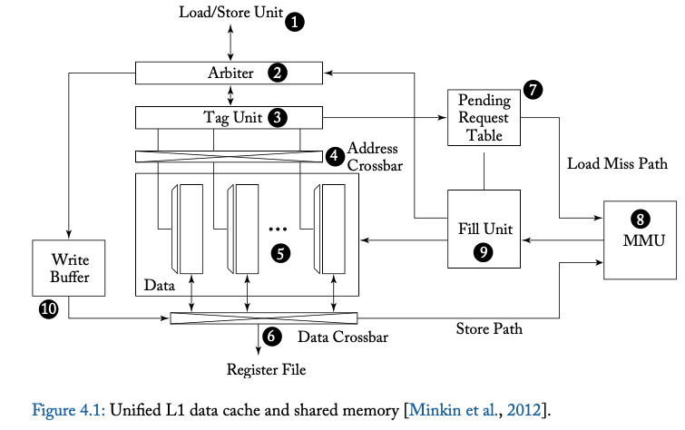

# Week 3: Research Poster & Chapter 4

Status: I'm not stuck with anything

**Progress**: Do research about exploiting uniform or affine variables in GPU and read chapter 4

- What are uniform or affine variables?
    - Uniform variable: A variable that has the same value across all threads
    - Affine variable: A variable that has a value that changes in a predictable way across all threads (Vi = x + iy)
- Uniform and affine variables can be stored in the register file with less bits. For example, because uniform variables have the same value across all threads, this value only needs to be stored in one register. This means that the extra storage can be used for more inflight warps (active warps) and increase memory latency. 

**Partial Register File Access**: 
- Focuses on how to optimize the register file by compressing the registers that are written back to the register file. 
- Compresses the register through the BDI compression (Base-Delta-Immediate)
    - Inside a register vector (32 registers for a warp), many of the values stores are similar or in a low dynamic range. Therefore, the values can be represented by a base value, and an array of differences (relative to the base) whos combined size is smaller than the original storage. Some values might differ the base+delta value by a small value. In those cases, an immediate value is incorporated into the encoding
    - Studies have shown that BDI imoproves performance for both single-core and multi-core by almost doublingthe cache size

- It's common to have two bases, one base being zero where the immediate can be thought of as an offset from the zero. The other base being randomly chosen. 

**What are the benefits of BDI**: 
1. High compression ratio: It can often compress some of teh frequently-observed patterns
2. Low decompression latency: To decompress the data, you only need a simple maksed vector addition
3. Relatively modest hardware overhead and impleemntation complexity: compression and decompression only need vector addition, subtraction and comparison operations

**What are some patterns that are observed across data?**
- Zeros: Zero is one of the most frequently observed value in application data. Zero is often used to initialize data, represent NULL pointers or false boolean values
- Repeated Values: A large contiguous region og memory that contains the same repeated value
- Narrow values: When a small value is stored using a large data type. E.g. storing a one-byte value in four-byte integer
- We notice that all of the patters observed above fall under what we call the low dynamic range (a set of values where the difference between the values is much smaller than the value itself)

**Why does BDI work?**
1. Simialr data values and types are often grouped together (often due to arrays)
2. Low dynamic range of the data

## Compression Algorithm
**Figure of how BDi works:**

Assume that you have a set of values that wants to be compressed, S:
- Observation 1: For compression to work, the number of bytes used to represent the delta needs to be strictly less than the number of bytes used to represent the data itself
- Observation 2: The base can be decided by computing the max or min of S. The optimal can be reached by either choosing max(S), min(S), or the value in the middle. However, this introduced compression latency. As a result, it's better to choose the first value from S as the base to avoid the added latency. This only reduces the average compression rate by 0.4%
## Decompression Algorithm
- The values can easily be recalculated by adding the delta to the base

### Why could multiple bases help?
- In a set of data, there might be severla different types of data, like pointers and 1-byte integer (high dynamic range). Obviously, one base won't work for this case

- Increasing the number of basees will increase the overhead (storage of the bases). Studes have shown that the optimal number of bases is 2. **Having two bases introduces the isseu of what the second arbitrary base should be**
- Most of the times when there are mixed data types, the cause is usually an aggregate data type (e.g. a struct). This means that there are wide values with low dynamic range and narrow values. That's why it's usually better to choose an arbitrary base to compress the wide values and zero as the second base to compress the narrow values. This is called the BDI

## BDI Design

- The 1-byte sign extension is extend the 1-byte to 4-bytes using the MSB. If the 4-byte value matches the delta, then the data can be compressed. Otherwise, the delta is too big to be represented by one byte

Bibliography:
- https://hal.science/hal-00396719v1/file/Collange_UniformAffineGPGPU_PPW09.pdf
- BDI: https://users.ece.cmu.edu/~omutlu/pub/bdi-compression_pact12.pdf 

***
## Chapter 4: Memory System
- Modern GPUs have a register file and memoyr. The memory is furter divided into local and global memory spaces. The local memory is only available to one thread while the global is shared among multiple threads
- Accessing data from on-chip memory yields higher performance and saves energy that transferring data from off-chip memory
### 4.1: First-level Memory Structures
Scratchpad memory and L1 data cache
- "Shared memory"/Scratchpad = Small memory space, low latency, accessible to all threads in a CTA
- An issue with shared memory is **bank conflict (when different threads are trying to access the same bank but different locations in the bank)**
- **Uncoalesced memory access**: When several threads are accessing different cache blocks (scattered addresses) and multiple memory addresses need to be generated

**GPU Cache organization:**

- 5: SRAM data array
- 1: Where the memory access requests come from. A memory request consists of a set of addresses, one for each thread in a warp

Shared Memory Access Operations:
- The arbiter evaluates if the memory request has a bank conflict. If yes, it splits the memory request into two parts. One part containing addresses with no bank conflict. The other part contains the addresses with nak conflict which is returned back to the instruction pipeline later (known as replay)
    - The accepted portion --> Bypasses Tag unit (Shared memory is direct mapped) --> Address crossbare (distributes different addresses to different banks) --> Accessing banks (32-bits wider with decoder to access different rows) --> Data crossbar (Data is reutnred to the specific thread's lane via storage in the register file)

Cache Read Operations:
- A subset of the global memory space is in the L1 cache. Access to the global memory is restricted to a single cache block per cycle. This is to reduce tag storage overhead relative to the amount of cached data
1. The load/store unit computes the memory address and if needed, part them into individual coalesced accesses
2. THe arbiter might reject the request if the caches are too busy
3. If the cache is not busy, the arbiter schedules instructions for writeback to register to the instruction pipeline for future when a cache hit is received. In parallel, the arbiter will also request teh tag unit to check if the access is a cahce hit or a miss. If it's a hit, the data is returned and written back to the register file. If it's a miss, the arbiter informs the load/store units to replay the request and sends the request information the pending request table
- The pending request table is very similar to the miss-status holding register (MSHR) in CPU cache memory. MSHR contains the block of address of cache miss with information on the block offset and registers that need to be written back once the block is filled into the cache 
- Once an entry is allocated int eh PRT, a memory request is tent to the memory management unit (MMU) for virtual to physical address translationn which eventually leads to the memory parition unit that contains the L2 cache.
- Once the memory request response has returedn, the load is returned from the MMU to the fill unit which uses the subid field in the PRT to look up information about the request. Once the load is back in one of the banks, it will use this information to communicate with the load/store for rescheduling of instruction
- The L1 data cahce is virutally indexed and virually tagged

Cache Write Operations:
- Data can be written to either shared memory or global memory. The data is first placed in the **write data buffer (WDB)**. If the block is present in the cache, data can be written directly through the data crossbar. If the block is not present, the block must be first read from L2 cache. Figure 4.1 does not support cache coherence 

L1 Texture cache
- Texture mapping is used in 3D graphics to make scenes as realistic as possible. First determine the coordinates samples in the texture image called texels. The coordinates are used to find the address containing the texels. The locality of texture addresses are exploited by cache

- In texture cache, the tag array and the data array are separated by a FIFO. The FIFO is used to hide the latency of miss requests from DRAM. The tag array runs ahead of the array meaning that the content of the tag array reflects the content of the data array after a time that's roughly the same of a miss reuqest to memory and back
1. Load/store send computer addresses for texel to tag array
2. If access hits, a pointer to the location of the data in the data array is placed in the FIFO
3. When the pointer has reached the top of the FIFO, a controller uses the pointer to look up the data and returns the data to the texture filter unit
4. If access miss, the tag array sends a memory request to teh miss request FIFO which sends a request to the lower level memory 
- In recent GPUs, caching of data and texture values is performed using a unified L1 cache structure. Only data tat are read-only can be cached in L1

### 4.2: On-Chip Interconnection Network
- GPUs are connected to multiple DRAM chips in parallel via memory partitions and address interlreaving is used to alleviate memory traffic. SIMT cores are connected to the memory paritions through on-chip interconnection network (crossbars)

### 4.3 Memory Partition Unit
- Each memory partition contains a portion of L2 cache with a memory access scheduler called "frame buffer" (FB), and a raster operation (ROP). The scheduler is used to reorder operations to reduce overhead for accessing DRAM. ROP is used mainly for graphics operations and supports atomic operations

L2 Cache:
- Includes several optimizations to improve throughput. Consists of two slices. Each slice has a tag and data array and processes incoming requests in order. Cache lines are allocatied for use either by store or load instructions. If the write completely overwrites a section, there's no need to read data from memory. This increases throughput. 
- For uncoaelsced writes (doesn't cover a sector), tehre are to potential solutions
    1. Byte-level valid bits
    2. Bypassing L2 entirely
- To reduce area of memory access scheduler, data that's supposed to be written are collected into whole cache lines to form more complete cache lines. 

Atomic operations:
- Sequences of atomic operations accessing the same memory location can be pipelines as the ROP inut has a local ROP cache

Memory Access Schedule:
- GPUs use special DRAM to store large amount of data. DRAM stores individual bits in small capacitors. To read from capacaitors, a page (row of bits) are read into a row buffer. The bitlines connecting them need to be charged to a voltage half way between 0 and the supply voltage. As the bitline conencts a capacitor and an access transistor, the voltage of the bitline is either pulled up or down. An amplifier is used to amplify this small change until a 1 or 0 is read. When reading the values into a row buffer, the values stores in the capacitors are refreshed. During precharge and activation operations, no data can be read or written to the DRAM. To mitigate this issue, the DRAM has several banks, but it's still challenging to hide the latency of switching between rows when accessing data. 
- The memory access scheduler reorders the memory requests to the DRAM to reduce the overall number of times in which data needs to be transferred to/from row buffers

### 4.4: Research Directions for GPU Memory Systems
Memory Access Scheduing and Interconnecton Network Design:
- Row-buffer locality: If two consecutive accesses hit the same row in the same bank (no need to precharge a new row)
- Each SM usually generates a sequence of requests with good row-buffer locality, but this locality is destroyed when the requests are mixed with other SM's requests are going to the same memory partition. 
- Modify the interconnection network to maintain row-buffer locality:
    - Prioritize similar row-bank addresses
    - Prioritize memory requests from the same SM
- Bakhoda et al. states that as the number of SMs increase, it must be necessary to employ "meshes"
    - GPU throughput is quiet insensitive to interconnect latency. "Half-routers" were proposed as a way to reduce the area cost of routers

Caching Effectiveness:
- Adding L1 and L2 for global memory access and some applications sped up while others slowed down
- Jia et al. tested the effectiveness of turning caches on and off, some applications benefited while other didn't
- Locality taxonomy:
    1. Within-warp locality: Threads from same warp access same cache line
    2. Within-block locality: Threads from different warps in the thread block
    3. Cross-insturctiomn: Same thread block issues instructions that hit the same cache line
- Uses this taxonomy to determien which load instructions benefited from caching and which didnt 

Memory Request Prioritization and Cacche Bypassing:
- Jia et al. proposed memory requst prioritization and cache bypassig techniques for GPUs
- In intra-warp, GPUs with low-associativity cahces relative to the number of threads, multiple memory requests from the same warp can be mapped to teh same cache set, knows as cache conflict
    - Proposed solution is if a misoccurs and cahcce set if fully reserved, the request will bypass the L1 cache
- Cross-warp contention: One warp evicts data brought in by another warp, reducing cache effectiveness
    - Proposecd solution Reorders memory requests before L1 to improve locality. Use warp ID as a signature to distribute requests into multiple FIFO queues. Serves FIFOs based ona  fied-pririty seme

Exploting Inter-Warp Heterogeneity
- Problem: GPUs can experience memory latency dvergence. Latency divergence means that some threads in a warp stall while waiting for memory accesses, reducing the overall warp throughput. 
- Solution: MeDiC (Memory Divergence Correction). Clasify warps based on their cache behavior:
    1. All-miss
    2. Mostly-miss
    3. Balanced
    4. Mostly-hit
    5. All-hit
- 4 components of MeDiC:
    1. Warp-type detection block 
    2. Requests all-mis and mostly-miss warps to bypass L2 cache to reduce queuing delays for all-hit warps
    3. Determine where returned DRAm requests are placed in the L2 cache. Mostly-miss warps are inserted ar LRU (where they're less liikely to evict useful data). Others are inserted at MRU
    4. There's two DRAM queus:
        - High priority: All-hit and mostly-hit warps
        - Low priority: Balanced, mostly-miss, all-miss warps

Coordinated Cache Bypassing:
- Problem: Cache bypassing can improve performance, but non-selective bypassing can reduce cache hit rates 
- Use profiling to classify each static load instruction by its memory access locality:
    - Good locality: frequently reuses data, should use L1
    - Poor locality: Rarely reused, always bypasses L1
    - Moderate locality: Handled adaptively
- For each thread block, all moderate-locality loads are treated uniformly: either all use L1 or bypass L1

Adaptive Cache Management:
- Problem: Cache and memory sensitive GPU workloads suffer from contention, leading unnecessary evicitions and memory stalls
- Solution: Combine cache bypassing with protection distance (preventing eviction of recently used lines) and warp throttlign (limiting actibve warps) to reduce cotention

Cache prioritization:
- Problem: Warp throttling can imrpove L1 cache hits but might leave other resources liek L2 cache underutilized
- Solutiomn: Only warps with tokens can allocate lines in L1

Virtual Memory Page Placement:
- Problem: OS page placement ignores non-uniform memory bandwidth in systems with bandwidth and capacity-optimized memory
- Solution: Allocate pages proportionally to memory bandwidth, refine placement using profiling-guided hints when bandwidth-optimized memory is limited 

Data Placement: 
- Choosing optimal GPU data placement is challenging and non-portable across architectures
- Solution: Use PORPLE which provides a portable, adaptive placement strategu

Multi-Chip_Moduel GPUs:
- Problem: Slowing of Moore's law limits performance improvement for large monolithic GPUs
- Solution: Build a large GPU from smaller modules on a multichip module using:
    - Local cache of remote data
    - CTA scheduling based on locality 
    - First-touch page allocation

