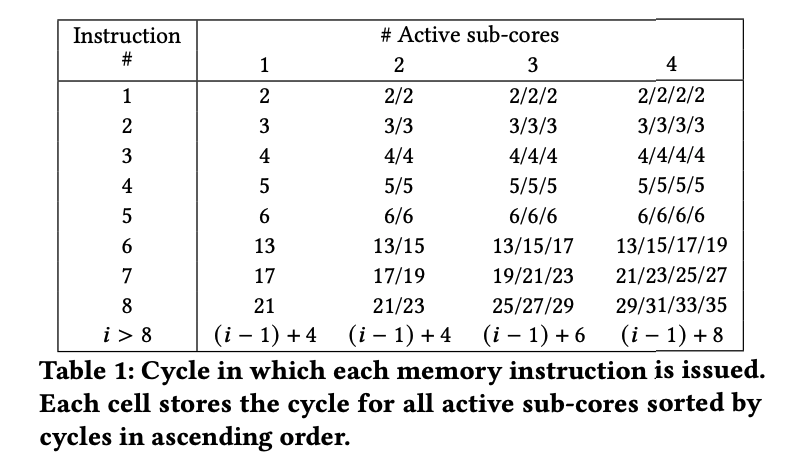

# Week 4

Status: I'm not stuck with anything

**Progress**: Read the paper assigned and the slides about graphic pipelines and SM

## Research Paper: Analyzing Modern NVIDIA GPU Cores

### Background and Motivation
- Fetch stage: Round robin scheduler -> Instruction buffer for each warp
- Issue stage: Greedy then Oldest scheduler. Selects a warp that's not waiting on a barrier and its oldest instruction doesn't have any dependencies with other instructions in the pipeline. 
    - Pregvious work suggests that each warp has two scoreboards for data dependenciesl. One to track WAW and RAW hazards. The second scheduler counts the number of instructions that are currently using a specific register to prevent WAR hazards. This is important for variable-latency instructions such as memory instructions
- After isseus, the instruction is now placed in a Collector Unit and waits for all the operands to be retrieved. Each sub-core has theri own register file with multiple ports. When all the operands are in the collector unit it moves to the dispatch stage and the operands are sent to the appropriate execution unit. The results are the written back to register file

### Control Bits in Modern NVIDIA GPU Architectures
- Rely on compielrs to detect aby data dependencies. That's why the assembly instructions include some control bits for dependencies and improve perforamance
- Sub-cores can issue one instruction per cycle and preferably using the warp that it just used. The compiler uses control bits to indicate if an instruction is ready. 
- Each warp has a coutner (**Stall counter**)The compiler sets this counter with the latency of the producing instruction minus the number of instructions between the producer and the first consumer. Another instruction will not be issues at that warp until the counter is 0
- **Yield control bit**: Indicate to hardware that no instruction should be issues to the same wap
- **Dependence counter bit**: Each warp has 6 registers to store this counters (SBx). Each counter count up to 63. The counters are initialized to when a warp starts. In a produced-consumer dependence, the producer increaseas a counter after issue and decreases it after write-back/source operand read. 
    - Each instruction has two fields of 3 bits to indicate to counter (one for RAW and WAW, the other for WAR). Additionally, the instruction also has 6 bits to indicate which dependence counters it has to check to determine if it's ready to be issues
- DEPBAR .LE instructions can also be used to check the readiness of the counters

### GPU cores Microarchitecture

**Issue Scheduler:**
- A warp can only issue issue the oldest instruction under certain conditions. 
    1. Having a valid instruction in the instruction buffer
    2. The oldest instruction of the warp cannot have any data dependencies with older instructions of the same warp that has not yet completed
    3. All the needed resources for execution need to be available. For example the execution unit
- The scheduler doesn't have the information about if the given isntruction has enough read ports on the register file without stalling. Proposed model:
    1. Control stage: Fixed and variable latency instructions. Manage dependence counters and track if an instruction is waiting for a previous one to complete. Back-toback instruction that'll use the counter has to have a cycle in between them (NOP)
    2. Allocate: The availability of the register file read ports is checked and the instruction is stalled until there's no register file port conflict. 
- The warp scheduler uses a greedy policy where it selects an instruction from 

- In A, Youngest wrap starts until it misses in Icache. Scheduler switches to W2 which takes previous instruction from W3 and servers that instruction. By the time it finishes, the miss has been served and the scheduler greedily issues that warp until the end. Then it switches back to W3 -> W1 -> W0
- It's called the **Issue scheduler policy Compielr Guided Greedy then youngest**

### Register File
- **Regular register file**: 65536 32-bit registers per SM. Arranged in groups of 32, each group corresponding to registers to the 32 threads in a warp. The registers are distributed evenly between sub-cores and registers in a sub-core is organized into two banks. The number of register user per warp is decided at compile time, but the more registers used per warp, the fewer warps can run parallel in the SM. 
- **Uniform:**Each warp has 64 private registers 
- **Predicate:** Each warp has 8 32-bit register. Each bit represent which warps should execute an instruction
- **Uniform Predicate:** Each warp has 8 bit register that store a predicate shared by all threads in a wap
- **SB Register:** Each warp has 7 registers called dependence counters
- **B registers:** Each warp has art leas 16 B registers for managing control flow re-convergence
- **Special Registers:** Other registers used to store special values
- Operand collector introduces variability in elapsed time make it impossible to have fixed-latency instructions and the latency must be known at compile time to handle dependencies. 

Register File Cache:
- relieving contention in register file ports and saving energy
- Controller by compiler and is only used by instructions that have operands in the Regular Register File. 
- One entry for each of the two register banks in each sub-core. Each entry stores 3 1024-bits values resulting in a total capacity of 6 1024-bit operand values
- The operand is stored in the RFC if the compiler has set its reuse bit for that operand

### Memory Pipeline
- Some memory pipeline has initial stages local to each sub-core while the last stage performing the memory access are chared by the 4 sub-cores because the cahce and shared memory are shared among the 4 sub-cores
- 2 types of memory accesses: 
    1. Shared memory (SM local memory share among thread)
    2. Global memory (the GPu main memory)

- The four columns show in which cycle this instruction is issued in each of the cores
- The 7th instruction is stalled for a number of cycles that depend on the number of active sub-cores
- Each sub-core can buffer up to 5 instructions without stalling and the global structure can receive a memory request every two cycles from any of the sub-cores
- Address calculation in each sub-core has a throughput of one instruction every four cycles
- With mroe sub-croes active, it takes longer to issue an instruction because one sub-cores waits for the others to finish
- Estimate the memory queu to have a size of 4. An instruction reserves the sport when it arrives and frees it when it leaves

- 2 types of latencies for instructions:
    1. Elpased time sice a load is issued until the earliest time that another instruction overwrites the same register can be issues (RAW/WAW)
    2. Elapsed time since a load or store is issued until the earlies time that another instruction that writes in the ame source register can be issues (WAR). 
- From above figure, we see global memory access are faster with uniform register because all threads share the same register and only one memory address needs to be computed. With regular registers, each thread might need to computer a different memory address
- Shared memory loads is lower than global memory 
- WAR latencies are equal for both registers because their calculation is done in shared structure
- RAW/WAW latency is one cycle lower for uniform registers
- Latency depends on the size of the data values. For WAR and store instructions, latency increases with teh size of the value that wants to be written. For RAW/WAW and load instructions, latency increases as we increase the read value 
- Accesses to the constant memory from fixed-latency instructions go to a different cache level than load constant instructions
    - L0 (fixed latency) constant caches
    - L1 VL (variable latency) constant cache
- LDGSTS instruction: Improves efficiency of transferring data to GPU. It loads data from global memory and stores it directly into the shared memory without going through register file. 

# The Rasterization Pipeline:
- View: frustum: the region of the space the camera can see
- Map frustrum to unit cube to discard out of range values and represent all vertices in normalized cube
- Clipping: Process of eliminating triangles that aren't visible from camera
- Process: original description of obejcts -> Vertex position relative to camera, camera is looking down -z diraction -> Everything the camera sees is mapped to a unit cube, object is not in 2D screen -> Can be drawn via rasterization
- Need to know to render a picture: Surface representation (represent complex surfaces), occlusion(determine which surface is visible to camera), lighting/materials
- Occlusion: which triangle is visible at each sample point
- Depth buffer: stores depth per sample
- Color buffer: store RGB value per sample
- Depth is calculated through interpolation
Compositing:
- Representing opacity as alpha (higher alpha means greater opacity)
- Over operator: Compsoite image B with opacity ab over image A with opacity aa (over is not commutative)
- Fringing: poor treatment of color/alpha
    - Use premultiplied over operation to get the correct alpha

# 5.1 Thread Scheduling
- Assigning threads to warp: Threads with consecutive thread IDs are statically fused together to form warps
- Assignment of threadblocks to core: Threadblocks are assigned to blocks in round-robin order (Threadblocks are continously scheduled to cores until at least one resource in each core is used). The core's resources are gived at the threadblock granulaity. Threads in a threadblock finish their execution before the resources are reassigned to another block
- Cycle-by-cycle scheduling decisions: Hardware schedulers decide which set of warps fetch instructions, which issue instructions, and when to read operands

## 5.1.1: Research on Assignment of Threadblocks to cores
- Throttling at threadblock level: Throttling the number of threadblocks allocated to each core to reduce contention in memory system. There's an algorithm that will monitor if a core is predominantly waiting for memory, then no more threadblocks are assigned. THis improves the overall application performance with less CTAs active
- Dynamically Tuning GPU Resources: A hardware runtime system (Equalizer) keeps track of the resource contention and will scalre threads, core frequency, and memory frequency to improve both energy consumption and performance. This system is based on 4 parameters: 1. The number of active warps in SMm the number of warps waiting fro data, ready to execute an arithmetic instruction, and ready to execute memory instructions. 

# Meeting
- Unified L1 cache and T cache?

# Questions:
- Double check my understanding with register file cache
- Control bits and registers
- Scheduler