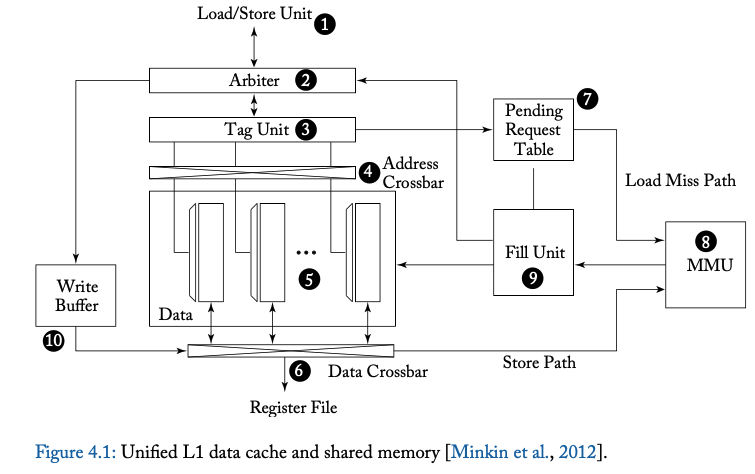
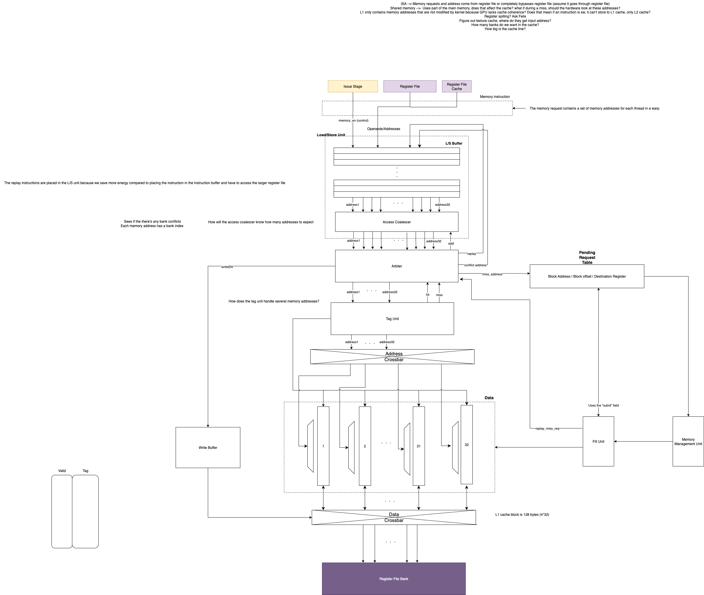
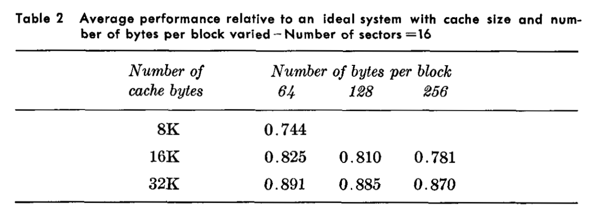

# Week 5
**State:** I'll need to clarify a few things about the address crossbar and the tag unit and how they're able to handle several memory requests simultaneously

**Questions:** 

1. How does the load/store unit know how many threads are active/how many addresses it's expecting? (maybe predicate mask)
2. Does that mean arbiter essentially knows what the address crossbar knows (address to bank mapping)? What's the point of the address crossbar then, can't the arbiter replace it?
3. How does the tag unit know which bank to check (should the address crossbar come before the tag unit)? How is the tag unit able to process all the memory requests in parallel (maybe there's 32 sub tag-units each running in parallel)?
4. Does the fill unit put the missed memory request back to the L/S buffer or does the arbiter take the address directly from the PRT?
5. How is shared memory related to this (It was mentioned earlier that we're no longer implementing a hardware scratchpad)? 
6. L2 cache is shared among all cores. However, we're starting with one core, is the L2 cache now just an extension of L1? 
7. How should the cache handle register spilling? Ask Felix

**Progress:**
- Sunday (9/21): I started on the u-arch for the memory system, specifically the L1 dcache
- Monday (9/22): My subteam presented in the team leads meeting
- Thursday (9/22):
    - I skimmed through my note for week 3 (Chapter 4 of the textbook about memory) and the presentation by Jing on Sunday. I used the figure below as the baseline model for the u-arch

- Here's the work-in-progress u-arch I'm working on:

- I reread the section in Chapter 4 to get details for how memory requests were handled:
    1. When an instruction is a memory request, the issue stage will assert a high bit to the load/store unit. At the same time, each thread in a warp that's active will find the address they want to read/write to in the register file/RFC and send this set of addresses to load/store unit (**Q1**)
    2. The set of addresses given by the register file is stored into the L/S Buffer which acts like a queue, with an exception of misses. The buffer then sends these addresses to the access coalescer which organizes several memory addresses that fall into a contigous block of memory into one memory request to reduce overhead
    3. The access coalescer sends the coalesced requests to the arbiter. The arbiter needs to detect if the set of addresses have any bank conflicts. It divides the request into two parts, one without a bank conflict. This part is sent to the tag unit. The remaining addresses that caused a bank conflict is sent back to the L/S Buffer and the replay bit goes high (**Q2**)
        - Decision: When there's a bank conflict, we could choose to send the memory request all the way back to the instruction buffer instead so that the L/S buffer would have a smaller area. However, in the textbook, it's mentioned that it's more energy efficient to buffer them in the L/S buffer and avoid scheduling memory accesses operations in the instruction buffer
    4. Once the tag unit has received the set of addresses, it checks the various banks to see if the data at the specificed index and bank have the correct tag number. If yes, the tag unit will send a hit signal back to the arbiter. Once the arbiter receives a hit, it will schedule a writeback event to the register file through the writeback buffer because it's able to predict the latency of memory acces with no bank conflict. If no, the tag unit will send the a miss signal to the arbiter and send the missed addresses to the Pending Request Table (PRT) (**Q3**)
    5. The address maps the address to the corresponding bank and uses the index bit in the address to identify the correct row to access the data
    6. The data cache is organized into banks for parallel access. Decision needs to be made on how many banks there are and how wide and deep each bank is
        - In the textbook, Page 70: "The L1 cache block size is 128 bytes in Fermi and Kepler and is further divided into four 32-byte sectors [Liptay, 1968] in Maxwell and Pascal [NVIDIA Corp.]. The 32-byte sector size corresponds to the minimum size of data that can be read from a recent graphics DRAM chip in a single access (e.g., GDDR5). Each 128-byte cache block is composed of 32-bit entries at the same row in each of the 32 banks." 
        - Liptay, 1968: https://www.andrew.cmu.edu/course/15-440/assets/READINGS/liptay1968.pdf

        

        - From the above table, the one with best perforamce is when the number of cache bytes is 32K and the number of bytes per block is 64 with the 128 bytes per block following after
        - Option 1: 32 banks and 250 rows (I believe this choice might be better because less bank conflict and up to 32 threads can run concurrently)
        - Option 2: 16 banks and 500 rows
    7. Once the data is received, it goes into the data drossbar which maps the data back to the thread that intially requested the data and the data is then written back to the register file
    8. If an arbiter encounters a miss, the missed addresses will be sent to the PRT and information about block address, block offset and restination register is kept in the table. The PRT then sends a memory request to the MMU (Memory management Unit) which is conencted to the L2 cache. The request contains which memory address to access, and how many bytes to read, as well as a "subid" field. Once the MMU has found the data back, the data is placed in the Fill Unit. The fill unit uses the "subid" field to request the information about the data from the PRT. 
    9. The Fill Unit uses the information from PRT and finds the corresponding bank and row and writes back the data to the cache. It then puts the memory request back to the L/S buffer and tells the arbiter to replay the instruction (**Q4**)

# Meeting (Thursday):
- Packet for each warp. Within a packet, there's no dependencies, the warp can schedule the instructions in any order
- 3 states associated with each warp: 
    1. Ready but not accepted (Waiting state)
    2. Ready and accepted (Active state)
    3. Not ready (Variable-latency instructions)
- Warp scheduler pulls warps to the active poll and increments the pc for these active warps
- The scheduler keeps track of the yield bit and makes sure that no instructions that depend on previous ones is issued and that warp is placed in the pending state
- Instruction buffer is for when the throughput for input and output vary

- Contains diagrams of previous NVIDIA cache organization
https://patentimages.storage.googleapis.com/7d/ac/a2/42928db1f37114/US8266383.pdf
