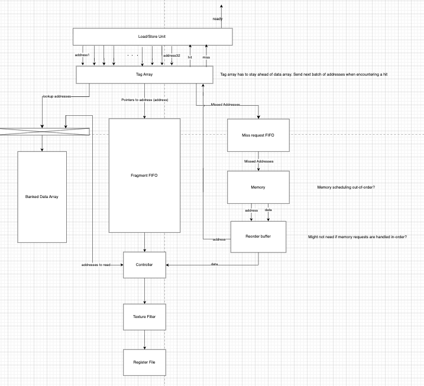
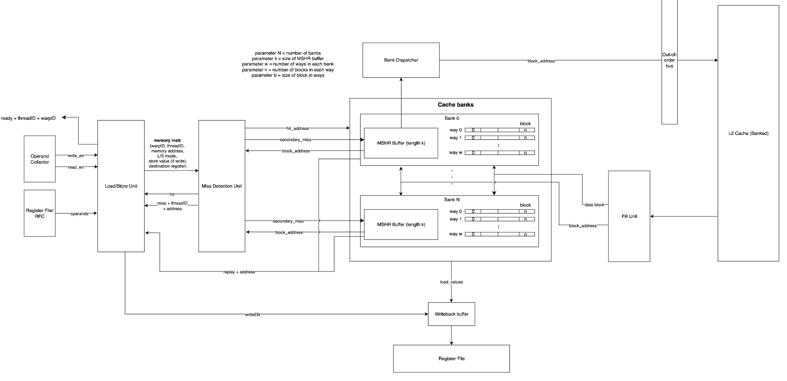
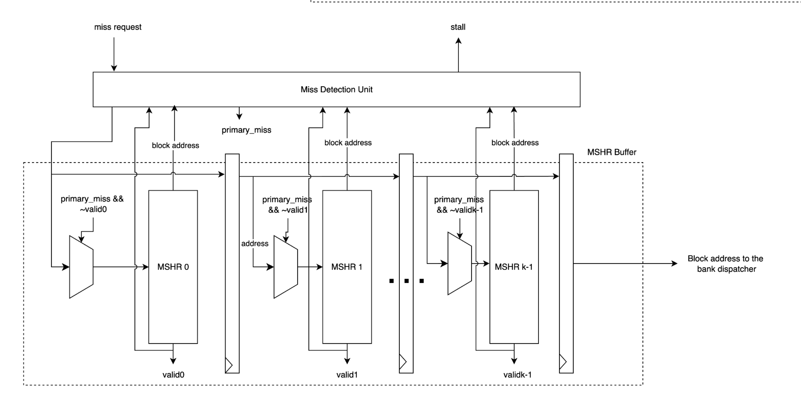
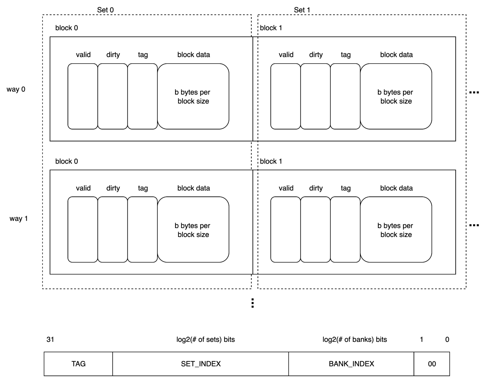

# Week 5
**State:** Finished first version of the uarch for L1/L2 dcache. Might need to clairfy if my understanding of the MSHR is correct

**Progress**:

**Thursday (10/2):** 
- Drew the first version of the tcache:

- Had a meeting with the front-end team to clarify the flow from front-end to back-end
- Got the diagram for the AI hardware d$ and will look into it
- Thread block scheduler: Keeps track of the number of threads launched by the compiler/software and the threadID, threadblockID and divide them into warps and assign the warp ID
- 2-level Warp scheduler: Chooses which warps that are going to be active. There's 3 states: Active, pending, ready
- Fetch Stage: Gets the warp ID for two warps and fetches the next instruction for each warp from i$
- Decode stage: Decoding the instruction from the warp and pushing them to the ibuffer
- iBuffer: Contains all the instructions that are decoded for a warp and keeps queuing them until the buffer gets full. Tells the fetch stage to stall when the buffer is full
- Issue stage: The issue stage then issues the instruction to the operand collector, essentially telling the operand collector which data each thread needs
- Operand Collector: The operand collector looks for the data in the register file, register file cache and sends them to the functional units

**Friday (10/03):**
- Looking through the AI Hardware d$ to get better understanding of the architecture and flow:
    1. An incoming memory instruction enters the cache from the load and store unit. This request contains all the unique identifier (uuid), the memory address, load or store action, store (if it's a store value) or destination register if it's a load instruction
    2. If the address hits, it remains the same as the diagram from last week. 
    3. If it misses, it goes through the MSHR which I didnt account for last week

- Redid my diagram for the L1 cache based on the AI Hardware d$:
https://app.diagrams.net/#G12D4zn8ihRwIJBqlRl3FHlx2Q8c-XtiMa#%7B%22pageId%22%3A%22B-uZMwzkP7IAC59_jSro%22%7D

- Added the MSHR buffer for each bank and divided the cache bank further into ways and sets

**Saturday (10/03):**
- Worked on the t$, was told by the graphcis team that they didn't need t$. 
- Worked on the design review presentation:
https://docs.google.com/presentation/d/1Is6HNChVRcIMx3nnyw-dslQUPmFsOYvEmtePV2tYh2k/edit?usp=sharing

