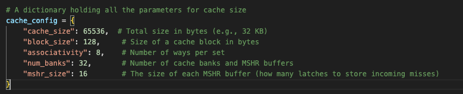
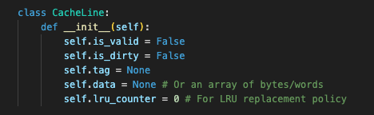
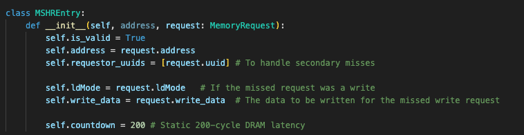
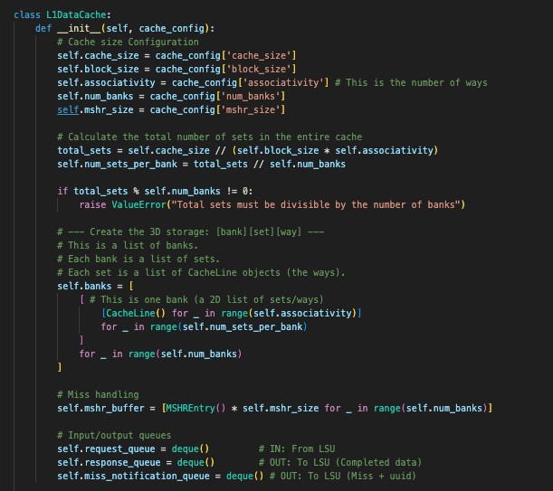
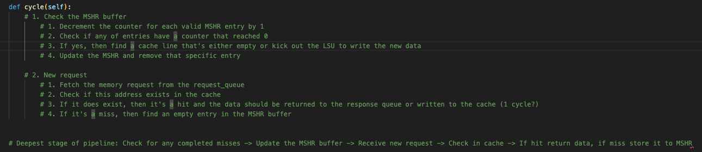

# Week 8
**State:** Setting up and starting on the python-based simulator for the L1 dcache. 

**Questions:** 
- How do I estimate how many clock cycles it takes for a hit or a miss? (in 437, its 1 cycle for a hit, but due to the large number of cache banks, one cycle might be too short)

**Progress:**
- Thursday: 
    - Worked with the abstract. Didn't go to the meeting because of 437 exam

- Friday:
    - Started setting up the simulator for the L1 dcache.
    - I made a dictionary for the cache parameters that can be changed later 
        - 32 banks so that all 32 threads could access different banks. 65kB cache is a common size for L1 dcache. With the current conifugrations, every 32 bank will have 2 sets. Each set will have 8 ways where each way stores 128 bytes. These parameters are all temporary and might change later.

    

    - Made a class for a cache line. 
        - The cache like stores the valid bit (if it contains valid data), 
        - dirty bit (if the cache line has data that's different from the main memory. When data is evicted, it needs to write the data back to main memory first), 
        - the tag(used to identify if it's the correct address), 
        - data (contains the actual data at the address), 
        - and the lru_counter (used to keep count of the least used data for eviction)
    
    

    - Made an MSHR entry class
        - field for valid (if the current MSHR entry stored a valid miss request)
        - field for address (the address that missed)
        - field for uuid (used to compare if the there's already a MSHR entry for the current memory request)
        - field for ldMode (If the MSHR sees that it was a write request, once it gets data back from main memory, it will replace the old data with the new data and place it back to the cache)
        - Field for the write_data 
        - Field for the countdown (a main memory access will take 200 cycles + 16 cycles because there's 16 latches in each MSHR buffer)
    
    

    - Made a data class for memory requests that will be sent to the dcache from the load/store unit
        - A field for uuid (a unique user ID for each request)
        - a field for warpID (The warpID that issues that request)
        - a field for thread_ID (The thread that issued the request)
        - a field for address (The address that's accessed)
        - af eild for ldMode and writeData (if the request is a write data and the data that wants to be written)
    
    - A class for the actual L1DataCache
        - The bank is organized into a 3D array where the outer index is used to index into a specific bank. The middle one is used to index into a specific set, and the inner is used to index into a way
        - Created a mshr buffer with a size of 16 (can hold 16 requests simulatenously) for every bank
        - A queue for the memory requests that come from LSU. A response queue for the completed memory requests, and a miss notification queue to place all the missed requests

    

    - Made the method cycle and filled in ideas for how to write the cycle code:
    
    