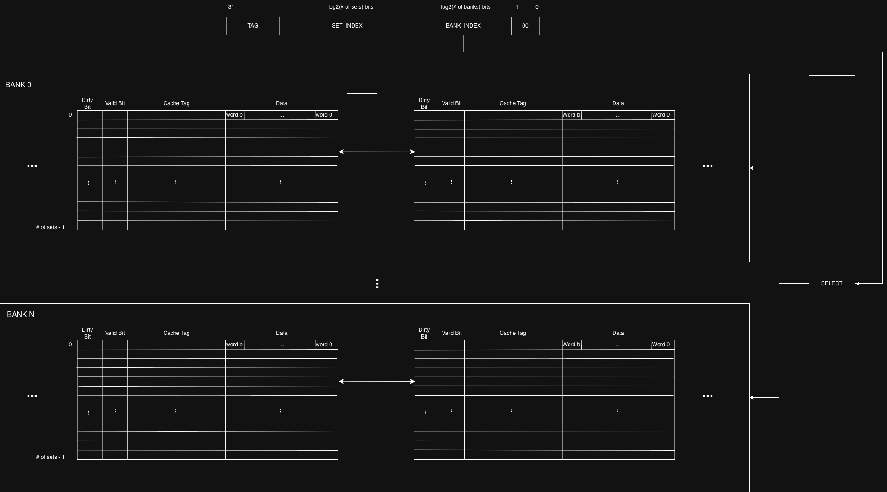
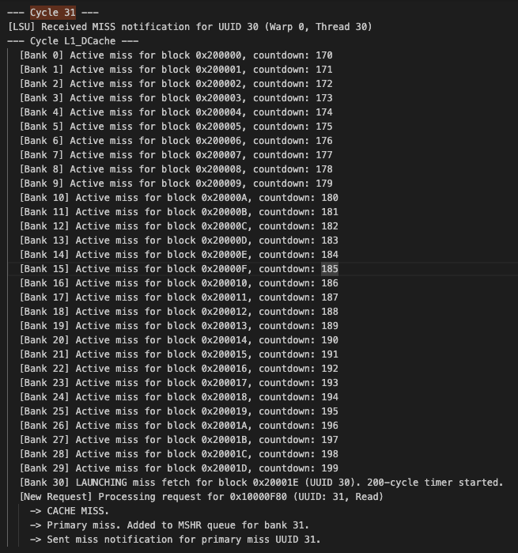
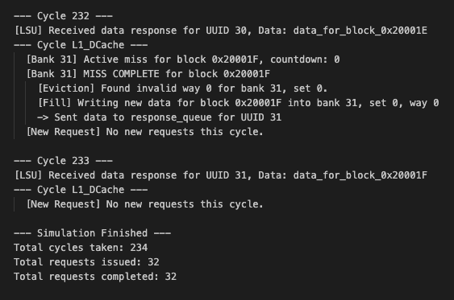
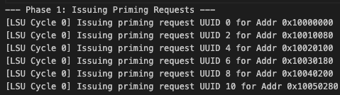
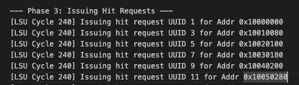
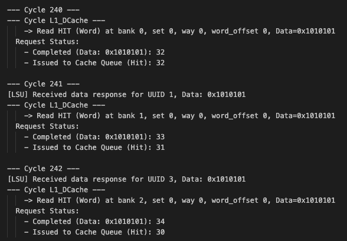
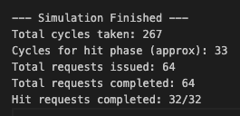
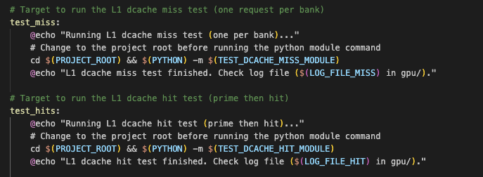

# Week 9
**Status:** Still working on the simulator for the L1 Dcache

**Progress:**
- On Sunday meeting, Jing said that the diagram of the cachie hierarchy that I presented for design review was unclear. In hindsight, I also realized that the digram was incorrect especially after doing the cache lab in 437. I made an updated version of the cachie banks which I sent to Jing. Below is the refined diagram describing how the cache is broken down into banks. Each banks will act as a mini cache with parametrized associativity. Each bank will have many sets and each set will have ways. Each way hold a cache block (or cache line). 

- Asked Chat to generate a first version of the python simulator. Had to give it a lot of information about the mshr buffers and the banked caches before it was able to generate a version that looked somewhat decent
- Asked Chat to also generate a test script where it was just testing to read from all banks in the cache (32 memory requests). Obviously, all the reads would miss (compulsory) and each request would be placed in a separate MSHR buffer for the bank that it's requesting from. Because they're all requests to different banks, every MSRH buffer should have a missed request. Then it would take each missed request 200 cycles (static) before it receives data back from main memory. Therefore, the entire simulation should take around 232 cycles:

## Test 1: Unit test that send 32 read memory requests to every bank

The above image shows that at cycle 31, all the banks' MSHR buffer has a missed memory request. And there's a counter at each bank that's keeping track of how many cycles have been sinced the request was sent to main memory. At the top we can also see that LSU has received the miss from the 31st memory request

The above image shows that at cycle 232 (200 cycles later from the last memory request), the missed request in bank 31 has received its data from main memory. It will then send the requested data to the LSU with the UUID so that the LSU knows which missed request has been serviced. The last section shows that it took this version of the cache 234 cycles to service 32 requests. This large number of cycles is because all of the memory requests missed and the miss penalty for each request is 200 cycles

- Issue: I noticed that in the first version of the code, the cache would just return the enttire cache line instead of choosing the required word from the line as request by each request. Changed that so that the block offset (which selects between words) determiens which word from the cache line is sent out

## Test 2: Unit test that hits on 32 read requests
- The test script is first sending requests to every bank like test 1. Below are the addresses that the requests are sent to

- The test then waits until all the data has been back and sends requests to the same set of addresses again. In this case, it should only take on cycle to signal that it's a hit and send the data to the LSU

From the above images, we can see that the second round of requests have the same target address as the first address with different UUID because it's different requests. The second image shows that the memory requests are actually hitting in the bank and that the requests are not being placed to the MSHR buffer. The final image shows the simulation results. The total number of requests that have been services is 64 and it took a total of 267 cycles. 

- To make the testing environment better, I set up a Makefile in the ./gpu/gpu_sim/cyclesim/tests/dcache/Makefile. It makes it easier to test different testing scripts and removing intermediate files

# Next Steps
- I need to do more testing:
    1. A sequence of requests that are a mix of hits and misses (to ensure that all the hits are services while the misses are still waiting for main memory)
    2. When the MSHR buffer gets full for a bank (it needs to stall)
    3. Tests secondary misses (if a block address is already in the MSHR buffer, don't add the same block address again if the same memory request is sent again)
    4. Test the LRU policy and that the correct data is evicted
    5. Test halt and that all the dirty data is written back to main memory
    6. Ensure that if a victim is dirty, it's written back to main memory