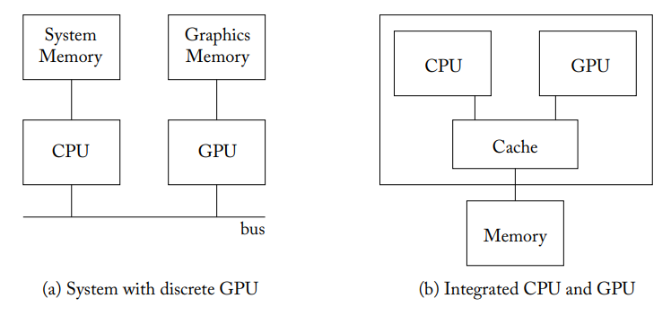
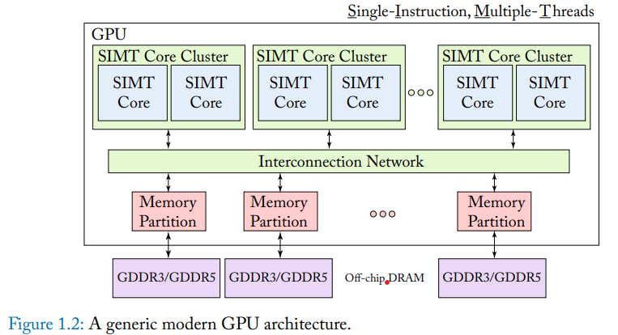
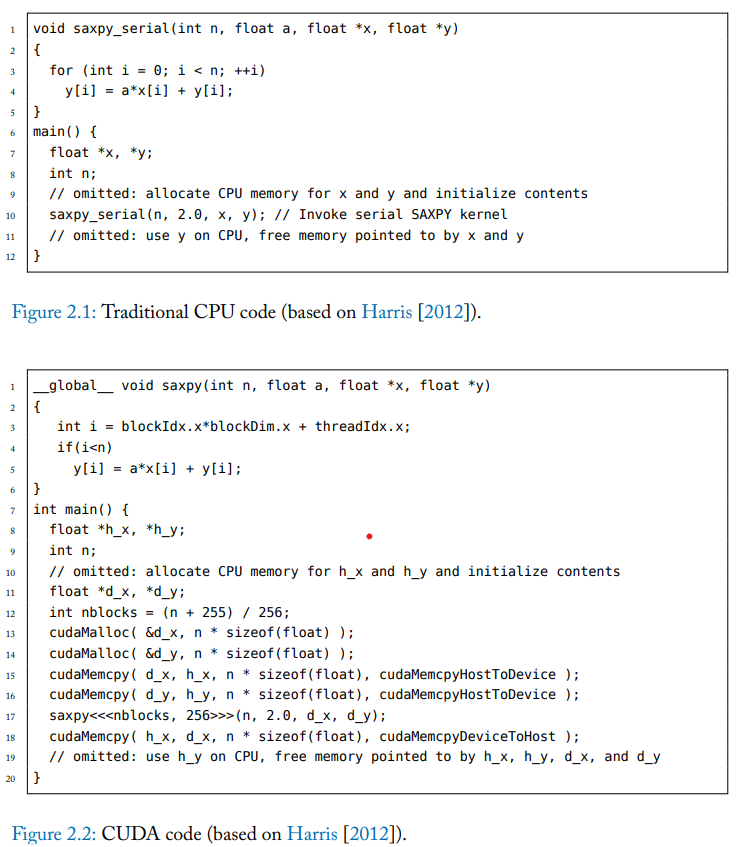

Week 1 (Chapter 1 & 2 Notes)

Status: Not stuck, making good progress

Progress: reading chapter 1 & 2 of textbook

Chapter 1: Introduction

GPUs were initially introduced for real-time rendering in video games.
Nowadays, GPUs are increasingly finding applications outside of video
games, such as in machine learning.

1.1: Computational Accelerator Landscape

-   Performance increases used to come from shrinking transistor sizes
    (more transistors possible on a chip) and improvements in compilers,
    architecture & algorithm design.

-   We can move to specialized hardware to improve inefficiencies, but
    we need to balance such improvements from specialized hardware with
    need for flexibility that many programs require.

-   GPUs are a combination of specialized efficiency and flexibility,
    for example showing excellent energy efficiency and peak performance
    metrics.

1.2: Hardware Basics

-   CPUs usually give instructions to GPUs, and thus GPUs are not
    standalone systems

    -   We don't really want to get rid of the CPU because a lot of
        software doesn't need to be run parallelly, and thus there is
        need for both components

-   There are two systems that contain CPUs and GPUs, discrete (bus
    connected) and integrated.

{width="3.8912412510936134in"
height="1.831172353455818in"}

-   Discrete systems usually have separate DRAM for CPU and GPU, with
    System Memory optimized for latency and Graphics Memory optimized
    for throughput

-   Integrated systems share the same memory and are usually found on
    low-power devices

```{=html}
<!-- -->
```
-   To start running an application, typically the application will
    start on the CPU and the CPU will initialize structures and tell the
    GPU what to start doing.

    -   **Memory Initialization**

        -   In older discrete systems, the CPU will allocate space for
            both components and is responsible for moving data to GPU
            memory

        -   In newer discrete systems, there is hardware/software
            support to automatically transfer data by leveraging
            "virtual memory support" (NVIDIA Pascal arch.)

        -   In integrated systems, the same memory is shared, so no
            allocation is necessary, although there may be
            cache-coherent issues.

    -   **Initiating Computation**

        -   A CPU will tell the GPU when to start computation, usually
            with the help of a driver.

        -   CPU will give information on what kernel (code) to run,
            number of threads, data location, the driver translates this
            info and places into memory accessible by the GPU.

-   Each GPU is composed of multiple cores (NVIDIA: *streaming
    multiprocessors* AMD: *compute units*) and each core executes a SIMT
    (single-instruction multiple threads) program that corresponds to a
    kernel.

    -   Each core typically runs on the order of thousands of threads

> {width="5.298883420822397in"
> height="2.8751476377952754in"}

-   For high computational throughput we need high memory bandwidth,
    meaning we need parallelism in our memory

    -   Each core has its own memory channel that is associated with a
        portion of last-level cache in a memory partition

-   As memory continues to grow in size, accessing large memory
    structures can consume as much/more energy as computation

Chapter 2: Programming Model

Modern GPUs use APIs to allow programmers to launch a large array of
scalar threads onto the GPU. At runtime, a GPU will execute a group of
these threads, which is called a warp.

2.1: Execution Model

-   Execution follows the procedure described in the hardware overview
    section (CPU -\> GPU).

Note: code optimized for one architecture may perform poorly on another
architecture

-   **SAXPY Example**

> {width="3.4811351706036744in"
> height="3.9261264216972878in"}

-   Computation started on line 17

-   The threads that make up a kernel are grouped into thread blocks
    which consist of warps (groups of threads) which are executed
    together. (NVIDIA warps = 32 threads, AMD warps = 64 threads)

-   Memory here is allocated with h\_ being CPU memory and d\_ being GPU
    memory

-   For actual execution, each thread is assigned a portion of the data
    with x, y, z coordinates within the grid & thread block.

-   threadIdx indicates coordinate of thread within the block, blockIdx
    indicates the coordinate of block within the grid and blockDim
    indicates the max number of threads

-   Threads can communicate with each other via scratchpad memory
    (shared memory)

2.2.1: NVIDIA GPU ISA

-   NVIDIA's high-level virtual instruction set architecture for GPU is
    called PTX (Parallel Thread Execution ISA) which is very similar to
    any RISC ISA

    -   PTX must compile to SASS which is the actual ISA supported by
        hardware

2.2.2: AMD GPU ISA

-   AMD differs from NVIDIA in that there are separate scalar and vector
    instructions

-   Each compute unit has a scalar unit with four vector units, vector
    instructions execute on vector units for each thread, scalar
    instructions execute on the scalar unit and are shared by all
    threads






