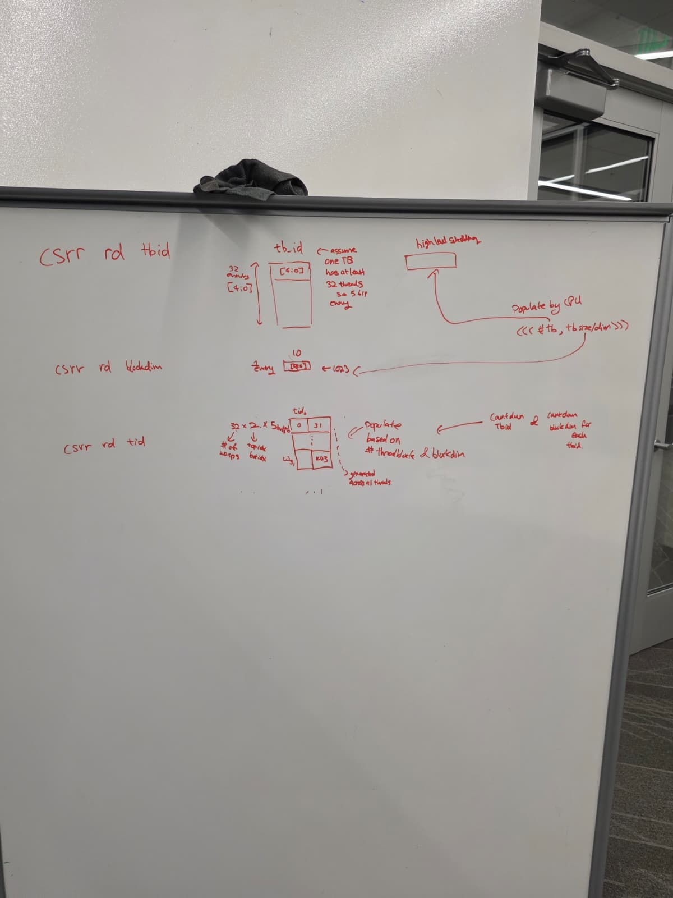

# Week 11 Design Log
Explicit Statement: I am not blocked, but I have a lot work to do. 

## Questions: 
None right now.

# Week Overview
- Issue stage is now complete. There has been a lot of progress in integrating the operand collection and ibuffer together with the issuing logic. 

# Work:
- Updates to the issue stage
  - Handled two cases where we create ibuffer_fill vector for the warp scheduler to use. It is a one hot of 16 bits to tell the warps scheduler when the buffer capacisty is num-entries - 1, the minus 1 is to absorb the one entry coming from decode. If the entire vector is 1, then the warps scheduler needs to stall. 
  - Added fust logic as a dictionary to make sure that the execute stage is able to edit, and the end of the operand collector would be able to check the structure to see if that instruction can be sent to the funcitonal unit, if not, it needs to be held at the "end" of the oc to wait to until the FU clears up, creating back pressure on all the before units. 
  
- Issues
  - The operand collection and everything tied to it right now can only do odd and even, because if we extend it, it is the same as doing 437 multicore instead of two cores, we use 4 cores. I thought about simply doing iteration through the number of operand collectors, but I don't think its that simple as in now introduced arbitration to the functional units, and there is a clog up at the end of the operand collector.
    - Additionally, if we duplicate the number of funcitonal units now, it changes the writeback policy to the register file. 
  - Potential back to back even read from register file due to icache miss on an even send from the warps scheduler, then switched out on an icache miss. 
  - Thread block breakdown should be simple as it is all linearlized, using this concept: 
    - 
  

# Next Week:
- Start implementing the CSR/thread block scheduler. Well someone needs to do it...
- Put together everyone's parts, this is going to be quite painful. 