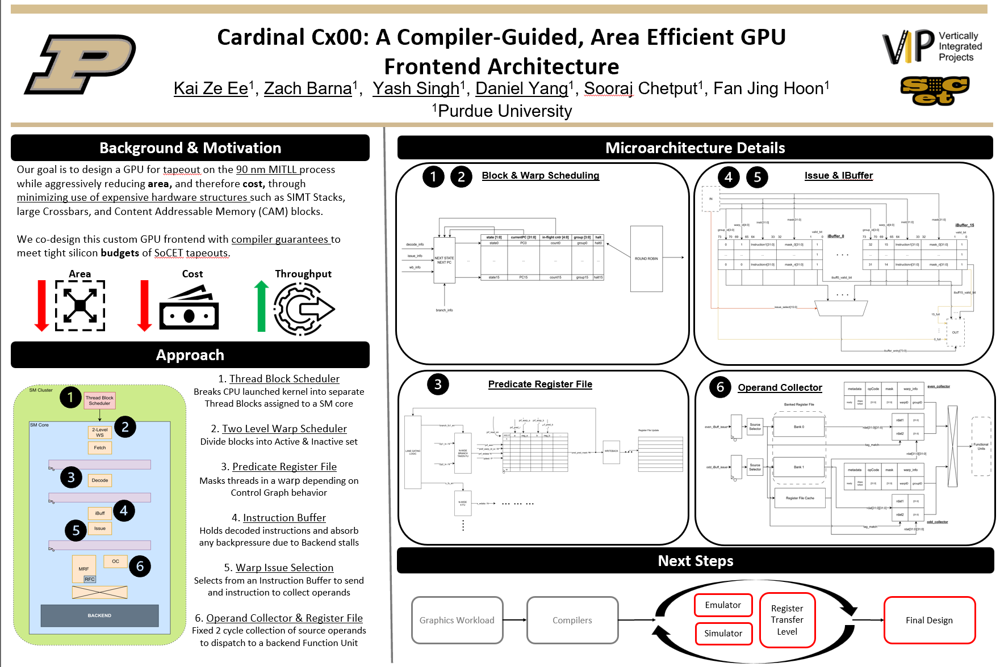
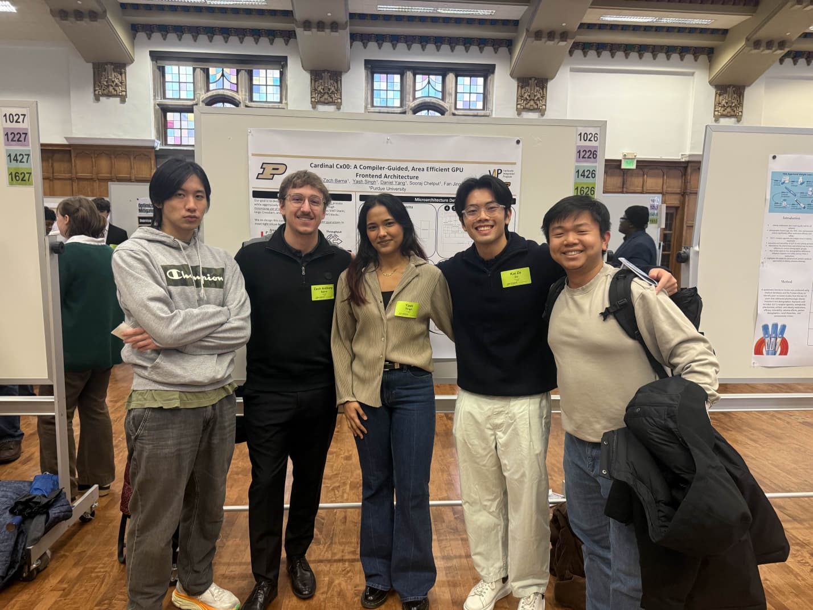

# Week 13 Design Log
Explicit Statement: I am not blocked, but I have a lot work to do. 

## Questions: 
If we just focus on emulator, does that mean everyone on the hardware team is going to be working on it, or are we still split between the cycle sim and emulator? 

# Week Overview
- Finalized our interface for Issue stage and ready to integrate with the rest of front end
- Completed Poster Session, learnt a lot about what people are curious about with regards to our project. 

# Work:
- Created the poster for the Fall session. It took me quite a bit of time, but it turned out well, and we got feedback that people liked that our poster wasn't cluttered with words; specifically, it was in a format where we could walk the viewer through the premise of our project, limitations, and our current progress. 
  - 
- Took a look at the final design review requirements and started to plan out the content that we want to include. It will be after thanksgiving break and I might need to get a headstart on it as my team members might be busy with multicore in 437. However, I am also quite busy with the 565 gem5 WIB implementation, 570 final project due this week. So I haven't been able to push much forward
  - I also want to add here that I am doing masters college applicaitons, so these thing have been adding a lot of pressure to my workload, thus bringing progress speed down. 
- I took some notes during feedback of poster session:
  - 1/4 people that came up to us actually did not know what a GPU is, so for the future session, we need to reel back the starting point of the presentation
  - We need to very explicit with what we are doing differently. We include the icons that represent lower area thus power and maintained throughput, but this might fly over some of the audience, so we need to bring it to a more day to day analogy. 
    - For instance, when I explained how we broke down the big register file into banks through an analogy of a very large table with books and needing to walk around the table to get something on the other end, I think that it really clicked with the audience and they told me that it really made sense from that perspective. 
      - 
  
- Issues
  - Simply making forward progress with the cycle sim in the final stretch of the semseter, school work/exams/personal career applications are contending a lot for time, so I am trying hard to find a good balance. 
  

# Next Week:
- Start implementing the CSR/thread block scheduler. Still no update on this both on the emulator end and cycle sim end. 
- Put together everyone's parts, this is going to be quite painful. <-- some people are not completely finished with just print statements as opposed to step throughs, so we are waiting on that. 
- Work on end of semester pro. dev. and reflections. 
- Complete final design review for Dec 3rd. 