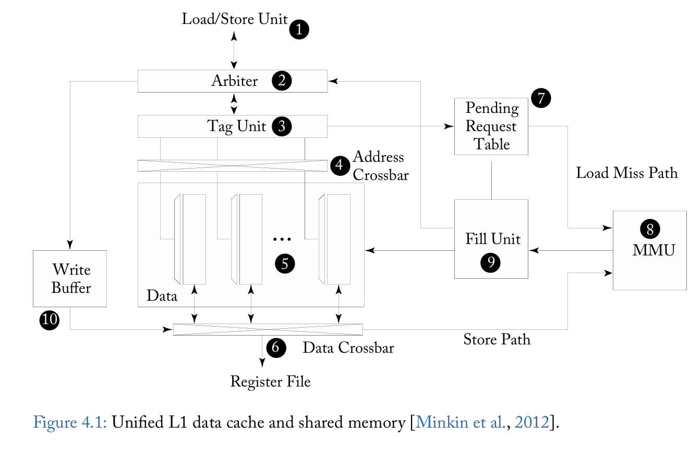
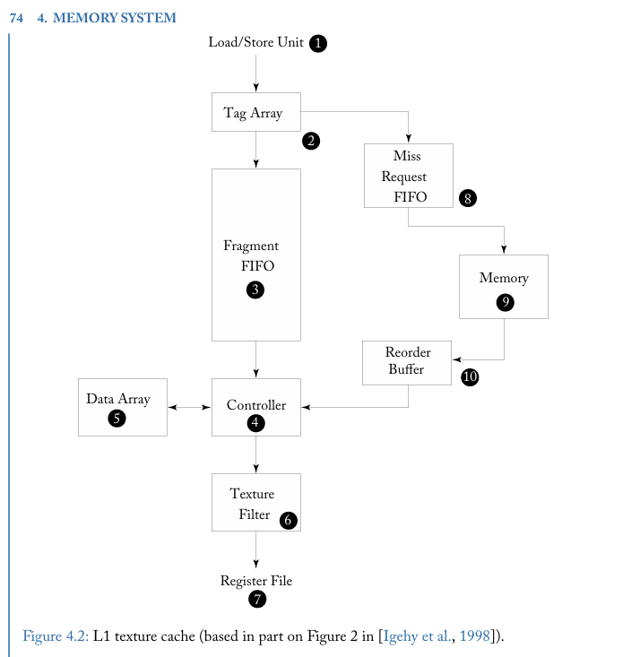
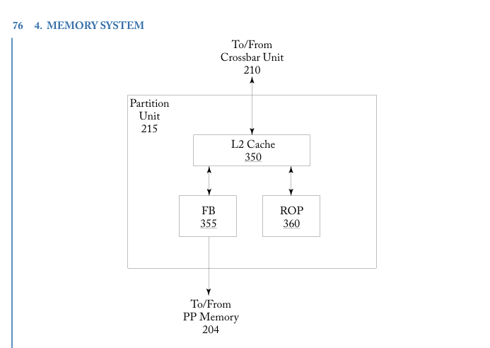
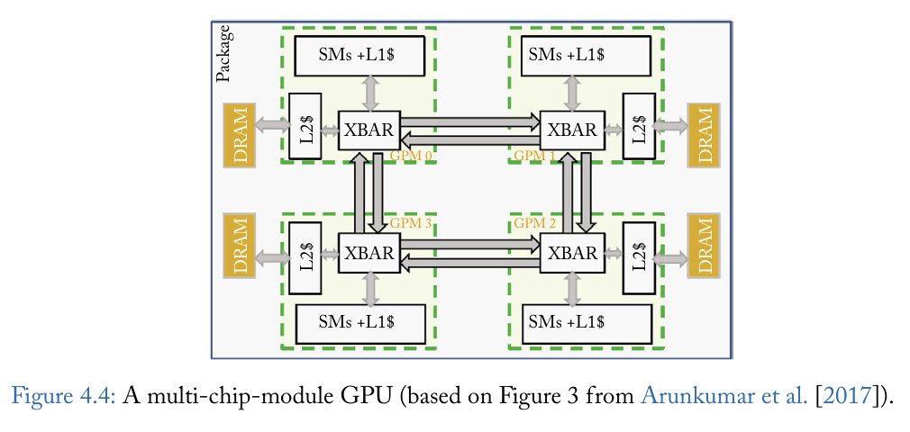

# Week 3 Design Log
Explicit Statement: I am not currently stuck or blocked

## Questions: 
1. Didn't they say that L1 was unified, why show data cache now?

# Chapter 4 Memory System
- Memory is divided into 
  - Local
    - space is private per thread (register stpilling)
  - Global
    - Shared among threads in a CTA (cooperative thread array)
- Off chip transfer costs a lot of energy (try to do everything on chip)

# 4.1 First-Level Memory Structure
- Unified L1 Cache
- Scratch pad "Shared memory"
- Pipeline hazards dealt with through replaying instructions
- 4.1.1 Scratchpad Memory and L1 Data Cache
  - Scratch Pad "Shared Mem"
    - Typically access latency is comparable to reg file access
    - NVIDIA patents -> Global Register file
    - OpenCL -> Local memory
    - Bank conflict -> occurs when a threads want multiple locations from same bank
  - L1 Data Cache
    - Coalesced
      - If all threads access the same empty block only one request needs to be sent 
    - Uncoalesced
      - Multiple access from threads to different empty cache blocks 
  - 
    - Unified Shared memory & L1 data cache
    - 5: SRAM data array 
    - 1: Load/Store Unit
      - Sends out memory access request to L1 cache
      - Has  set of mem addr, one/thread in a warp w/ op
    - 2: Arbiter
      - Determines if requested addr causes bank conflicts
        - If yes, splits req into two parts
          - 1st has addr for subset of threads w/o bank conflict
          - 2nd addr that conflict with first part
            - Sent back to instruction pipeline to be re-executed (replay)
              - Must decide to bufer the replay or just avoid scheduling when buffer runs out
    - 3: Tag unit, shared memory is **direct mapped**
      - Arbiter schedules a WB to RF, direct memory lookup is constant w/o bank conflict
    - 4: Address crossbar
      - Routes address to individual banks in data array
    - 5: Data Array
      - 32 bits wide
      - Own decoder for independent access to different rows in bank
    - 6: Data Crossbar
      - Sends data back to a thread's lane RF
    - 7: Request table
      - Holds request during a cache miss
    - 8: Memory Management Unit
      - For virtual to physical translation
      - Connect to correct partition in crossbar
    - 9: Fill Unit
      - Subid (lookup entry into PRT)
        - Fill Unit passes metadata to L/S Unit via arbiter to reschedule the instruction
    - Replay portion can access arbiter after this is done, if another bank conflict arises, split again. 
  - Cache Read Operation
    - Data array is highly bankable
    - Access to global memory is restricted to single cache block per cycle (coherence)
    - Reduce tag overhead
    - Standard DRAM interface
    - L1 Cache size is 128 bytes
      - 32 byte sector size corresponds to min data read from GDDR
      - Each 128 byte block composed of 4 byte entries in each  32 bank
    - Process:
      - L/S unit checks for coalescing and sends to arbiter
      - Arbiter can schedule based on avalibility 
        - (no cache entries, so no eviction occurs)
      - Arbiter schedules a WB to RD for fix # of cycles to correspond to the cache hit
      - Also Requests the Tag Unit
        - See if access leads to cache hit/miss
        - Hit
          - Row of data array accessed in all banks and data is returned to RF
        - Miss
          - L/S must replay the request
          - Send request info to Pending Request Table
          - Miss Status Holding Registers
            - contain block addr of cache miss + info on block offset + reg to be written 
          - Multi miss has multi entry, but Pending Register Table will merge by telling instruction pipeline what to replay
    - Cache is VIVT
      - Warps are part of the same application
      - Helps simplify mem allocs and lowers mem fragmentation
    - MMU -> Fill Unit -> PRT -> L/S -> cache hit
  
  - Cache Write Operation
    - L1 can be write back and write through
      - Depends on where it is being written to
      - GPGPU with bad temporal locality -> write through w/ no write allocate
      - Local memwrites (register splling)
        - write back with write allocate (WA -> go to cache before back to mem)
    - 10: Write Data Buffer
      - Uncoalesced 
        - Portion of cache block is written to
        - Hit
          - Write to data array w/ data crossbar
        - Miss
          - Block must be filled then written
      - Coalesced 
        - Bypass cache for invalidated tags
    - NO CACHE COHERENCE
      - Kepler only permitted 
        - local mem access for reg spills & stack data
        - Global mem data in L1
        - Research on how to have coherent L1 on GPU + GPU consistency models
- 4.1.2 L1 Texture Cache
  - How does industrial texture cache tolerate long off-chip latencies (cache miss)
  - Textue is a layer applied on top of a 3D model to make it hyperrealistic
    - Determines coordinate of sampels in image (texels) 
    - Average adjacent texels 
    - 
      - 2: Tag Array
      - 5: Data Array 
      - 3: 2 <-> 5 seperated by a FIFO buffer.
        - Hide latency of misses that need to come from DRAM
  - Assumes high cache miss and small working set
  - Flow: 
    - L/S Unit sends addr for texels to tag array
      - Hit
        - Pointer to location if put in tail of FIFO + metadata
        - @ Head, controller use pointer to lookup texel from data array
        - Return to texture filler unit
      - Miss
        - Sends memory requist with Miss Request FIFO
        - Pushed request to Memory
        - Memory returns data in out of order
        - Reorder buffer puts in order for controller to use
- 4.1.3 Unified Texture and Data Cache
  - Read Only data goes into L1 cache

## 4.2 On Chip Interconnection Network
- To supply large bandwidth of SIMT cores
  - GPUs connect to multiple DRAM in parallel
    - Utilized address interleaving -> 6 memory partitions at 256|1024B granularity

## 4.3 Memory Partition Unit
- 
  - Each partition contains:
    - Part of L2 cache 
      - Graphics and compute data
    - Frame Buffer
      - Scheduler reorders mem access to reduce DRAM access latency
    - Raster Operation Unit
      - Alpha blending and compression of graphics surfaces
      - Atomic operations found in CUDA programming
- 4.3.1 L2 Cache
  - Two slices
    - Seperate tag and data array -> process in order
  - Each cache line has 4 32B sectors (atomic sizein GDDR5 is 32B)
    - Lines are allocation for store OR load
    - Coalesced write, no data is retrieved from mem (unlike CPUs)
    - Uncoalesed writes
      - Storing byte level valid bits & bypass L2
      - To reduce area of mem access scheduler
        - written data is buffered in cache lines 
- 4.3.2 Atomic Operation
  - ROP has FU for executing atomic and reduction ops
  - Atomic ops for same mem location can be pipelined (local ROP cache)
    - Implementing sync across threads in different thread blocks
- 4.3.3 Memory Access Scheduler
  - Reorder the memory access so that you maximize the use of an open page in a bank

## 4.4
- 4.4.1 Memory Access Scheduling and Interconnection Network Design
  - SM has row-buffer locality
    - A sequence of request to partition has row buffer locality IF
      - Access the same DRAM row in the same DRAM bank
        - Effectivley meaning you utilize the open row (latency of precharge -> activate -> sense amp -> data row buffer -> read/write driver is very slow)
  - Introduce arbitration policies that prioritize 
    - Packets with memory req from same SM or w/ similar row-bank addr
  - Half routers -> reduce area and can levearge access patter
- 4.4.2 Caching Effectiveness
  - Some application benefit while others don't
  - If scratchpad is used, L1 cache is not useful
  - Consider the imapct of caching request traffic on L2 Cache (partitions)
    - Locality pattern: 
      - 1.Within-Warp
        - memory read access from load executed by different threads within warp (access same cache block)
      - 2.Within-Block
        - threads of different warps using same cache block
      - 3.Cross-Instruction
        - memory read from different load execute by threads in same thread block use same cache block
      - Use compile time algo to infer enabling of cache
- 4.4.3 Memory Request Prioritization and Cache Bypassing
  - Intra-warp contention
    - array indexing that causes mem request from a warp miss to map to same cahce set -> leads to pipeline stalls
      - Propose bypassing L1 cache 
      - Associativity stall -> all blocks in cache set are reserved to for data supplied by other cache misses (can only happen for requests that are already in flight)
  - Cross warp contention
    - warp evicts data brought in by another warp
    - Memory Request Prioritization Buffer
      - Reduce capacity miss by modifying order of access to cache for locality
      - Changing actual order of memory accesses after threads have been scheduled
        - Done right before L1 cache
        - Several parallel FIFO queues
          - Signature or Metadata -> WarpID
          - Drain Policy
            - deterine which FIFO queue to select from
            - Fixed priority scheme, where each queue has a static priority 
              - That queue is always served first
    - Analysis shows bypassing + reordering geometic speed of 4% w/ 64 way 16KB
    - Approaches: 
      - Rogers optimized code that utilizes scratchpad
      - Arunkumar bypassinga nd varying cache line
        - Based on memory divergence in static ins
      - Lee & Wu control loop based cache bypassing 
- 4.4.4 Exploiting Inter-Warp Heterogeneity
  - Memory Divergence Correction 
    - Exploits heterogeneity in memory latency divergence across warps in the same kernel
      - All/mostly Hit
      - All/mostly Miss
      - Balanced
    - No point having warps that are not all hit (tied to slowest warp on the team)
      - Simply bypass L2 for warps that are not all hit 
  - 1.Warp Type Detection unit
    - Classifies warp in
      - All miss
      - Mostly Miss
      - Balanced
      - Mostly Hit
      - All hit
  - 2.Warp Type Aware Bypass Logic
    - Decides if requests should bypass L2
  - 3.Warp Type Aware Insertion Policy
    - Where insertions in L2 is in Least Recently Used
  - 4.Warp Type Aware Memory Scheduler
    - Orders how L2 misses/bypasses sent to DRAM
  - Sample the hit ration of each warp
    - (Total hits/access) per interval
    - Eliminate accesses form all miss warps, transforms mostly miss to all miss warps
      - Sends all these high miss request to mem scheduler
    - Returns from mostly miss is passed to the LRU, others are in MRU posotion
    - MeDiC -> high priority queue & low priority queue
- 4.4.5 Coordinated Cache Bypassing
  - Selectively enable cache bypassing
  - Profile the static loads
    - Good, poor or moderate locality
      - Good -> use L1 cache
      - Poor -> always bypassed
      - Moderate -> Adaptive
        - Thread block granularity
          - Threshold adapted online using metric of L1 cache hits and pipeline resource conflict
- 4.4.6 Adaptive Cache Management
  - Take advantage of warp throttling & cache bypassing to improve performance
    - Detects cache contention & memory resource usage @ runtime
    - Protection distance (bypassing in CPUs)
      - Prevents cache line for being evicted for N # of access
      - If there are no unprotected lines in cache, it is just bypassed
  - Protection is set globally
- 4.4.7 Cache Prioritization
  - Warp throttling optimizes L1 cache hit rate
    - Off-chip bandwidth & L2 cache is underutilized
    - Assign tokens to warps -> decide which can use cache lines
    - Non polluting warps -> not given token
      - While it can execute, it cannot evcit from the cache
    - Static assignment for T and W -> 17% improvement over CCWS
  - Learning best values for W & T
    - Increase TLP & Cache hit rate (dynPCALMTLP)
    - dynPCALCCWS
      - Uses CCWS to set W then uses dynPCALMTLP to set T
        - Dynamically increases of decreases W
- 4.4.8 Virtual Memory Page Placement
  - Cache coherence across multiple physical memory types 
    - Capacity & Bandwith optimized memory
  - Memory Bandwith is non uniform
  - GPU access lowBW/highCAP cpu memory
    - Use both memory types to increase aggregate bandwith
      - Assuming pages are accessed uniformly and capacoty of bandwithOptimized is not a limitation
        - Random allocation of pages to these mems proportional to memBW works
          - BUT if BWoptimized capacity is insufficient
            - Must refine page placement to handle frequency of access
  - Profiling w/ dev tools ncvv and ptxas with CUDA API to help with page placement
    - Can get 90% of ideal page placement algo
- 4.4.9 Data Placement
  - PORPLE (Protable Data placement strategy tha)
    - Spec language
    - Source to source compiler
    - Adaptive runtime data placer
    - Observes: where data should be placed is 
      - hard for programmer to determine
      - Not backward compatible
  - Solutions
    - Memory Specification language
      - Describes all forms of mem dependedn on operating conditions
        - Adjacent global data -> coalesced/concurrent
        - Same bank of shared mem must be serialized
    - Source to source compiler
      - Transforms GPU prgraom into a placement agnostic version
        - Inserts gurads around mem access
      - (This has to hurt latency right?)
        - But I guess as a throughput machine, no one really cares
    - PROPLE-C to find static access patterns (Adaptive runtime placer)
      - Compiler generates a function to run on CPU and determine/predict best GPU-based data placement
- 4.4.10 Multi Chip Module GPUs
  - 
    - Build large GPUs out of smaller GPUs
    - It is possible to do with 10% of monolithic performance
      - Combine local caching of remote data
        - Leads to 45% better perforamce than largets monolithic GPU using that process node. 
