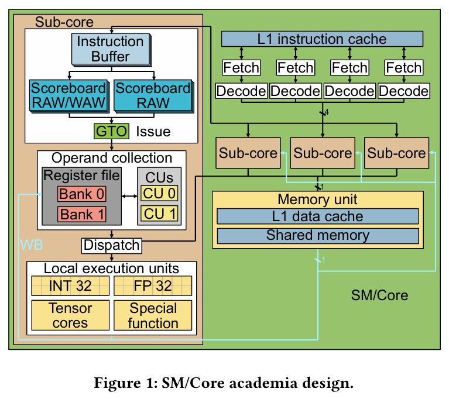
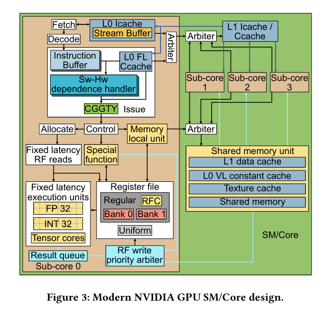

# Week 4 Design Log
Explicit Statement: I am not currently stuck or blocked

## Questions: 
1. For dependence counters, how does producer know how much to set the counter value to 
2. How does counter even detect the WAR 
    - Read goes out first and marks its counter register
      - Implies this must be done for EVERY consuming instruction
      - Could have more than 6 in flight
      - Oh, its compiler managed....
      - Plus it has two options
        - Group more instructions in same Dependence counter
        - Reorder differently

# Old Architecture

- Fetch: Round robin selection of Ifetch for a warp from L1 to 
  - Ibuff/warp -> Instruction kept until issued
- Issue: Greedy Then Oldest (GTO) selects warp
  - !barrier && (oldest_instrct != data_dependence_with_inFlight)
  - Two scoreboards:
    - 1: Marks producer registers to track WAW and RAW
      - I_issued ? all_consumers_cleared_in_Scoreboard : wait
    - 2: Operand fetch out of order
      - Avoid WAR hazard
- Collector Unit == Issue queue
  - Instruction_all_source_retrived ? GTO : Wait
- Register File
  - For each sub core
  - Multi banked --> multi access/cycle
    - Arbiter deals with multi-request to same bank
- Dispatch: When all consumimg operands ready 
  - go to mem, single-prec, special function etc
- Write Back: Goes back to register file

# New Architecture 

# Methodology
- Write microbenchmarks
- Measure execution time
- Form hypothesis

# Instruction Control Bits
- Compiler managed
- Sub-cores can issue 1I/C
  - IssueWarpX ? Oldest Ready : Choose other warp
- Stall counter (Fixed latency)
  - !StallCounterValX : IssueX : Issue_else
  - Benefit for area and energy --> Don't check RAW
- Yield 
  - Yield ? Don't Issue I of same warp : Issue I of same warp
- Stall >>> Yield
- Dependence Counter bits
  - Each counter count to 63
  - 6 counters --> tied to specific registers?
  - Init == 0
  - Producer sets count value (but how do you know by how much)
  - Instruction has counter mask & check up to 6 counters
- Dependence Counter Mask
  - Says which dependence counter must be checked (which must be 0 before issuing)
- SB1, 0x3, {4,3,2}
  - Counter, Instruction, dependent IDs
- Reuse Bit
  - Says to put the content of register into RFC or not
- NVIDIA (compiler dependent) AMD (Instruction dependent)
  
# Issue Stage
- Dependence Handling
  
- Warp Readiness: 
  - Valid instruction in IBuff
  - Oldest in IBuff must not have data dependence hazard w/ older in flight
  - Oldest cadidate for issue if all resources avaliable
  - Execution Unit: 
    - Have input latch (must be free when ins is in execute stage)
      - Occupied for 2 cycles --> width of execution is half warp
- Fixed latency instruction (2 intermediate stages)
  - 1: (Control) - fixed & variable latnecy --> increase dependence counter | read val of clock counter
    - Two consecutive instruction cannot use dependence counters
      - Unless there is a yield/stall counter > 1
  - 2: (Allocate) Fixed lat instructions
    - Check avalibility of regfile port
    - Proceed? no port conflict : stall
  - Prioity GIVEN to fixed --> needs to uphold compiler assumptions
  
- Issue scheduler policy (Greedy Policy) (CGGTY) - Compiler Guided Greedy then Youngest
  - Selects instruction from same warp
  - If switch to diff warp, select eligible youngest
- 
# Fetch Stage
- Scheduler (coordination of issue stage)
  - Attempts fetch same warp issues prev. cycle
- Intruction Prefetching (Stream Buffer)
  - L0 Icache has instruction prefetcher
    - Stream buffer that gets successive memory blocks when miss (take advantage of spatial locality)
  - IBuff size of 3 -> two stages from fetch to issue
  
# Register File
- Setup
  - Regular 65536 32bit reg / SM
  - Uniform - 64 private reg/warp
  - Predicate - 8 32bit reg/warp
    - Each bit/thread (indicate thread instruction/branch)
  - Uniform Predicate - 8 1bit reg/warp
  - SB Registers - 6SB/wrap
    - Dependency counters (track variable lat inst)
  - B Registers - 16/warp
    - Manage control flow reconvergence
  - Special Register - Thread/Block ID

- Result queue (back to back using same bank is not stalled)
- No singular read policy matching behavior 
  - Use Control & Allocate --> Reserve allocation of RF read port
  - Instruction in allocate can't get all source in next 3 cycles --> stalls
  
- Register File Cache
  - Does not use two level scheduler (active & pending set)
  - RFC controlled by compiler
  - Total cap: 6 1024 bit operand values
  - Compiler sets reuse bit for the operand
  
# Memory Pipeline
- Shared Memory Access
  - (Nothing here? What)
- Global Memory (GPU Main Memory)
  - Faster if inst use uniform regs
- Memory queue in each sub core == 4
- Constant Cache
  - Access goes to a different cache level and loads in
  - Fix latency Constant Cache (L0 FL)
  - Variable latency Constant Cache (L0 VL)
  
# They created a good model nice :) 