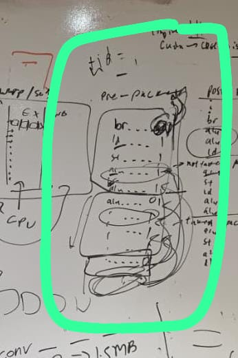
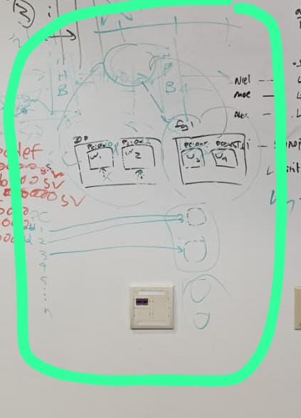
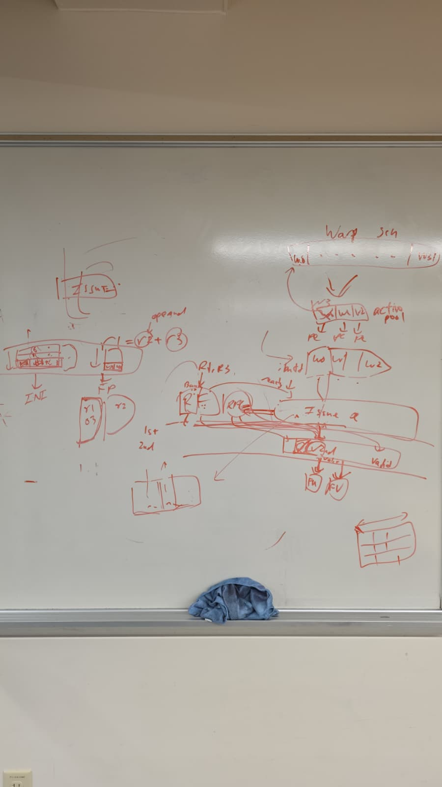

# Week 5 Design Log
Explicit Statement: I am stuck :(

## Questions: 
1. Not sure what I should work on now that we don't have a scoreboard
2. Still am not sure how the entire dataflow works

# Week Overview
- Sunday (GPU Team Discussion)
- Monday (Senior Design Presentation Proposal)
- Wednesday (Clarification of Instruction Packet w/ Rishi)
- Thursday (Hardware Meeting)

# Work:
- Instruction Packet Interpretation & Application
- 
  - Instructions within a packet are independent
    - (denoted with 0 as start and 1 as part of packet)
    - One packet is assigned to a warp
    - Yield bit to handle interpacket dependencies
- Register File Cache w/ Compiler Team
  - Deciding between:
    - adding an actual RFC w/ additional control bits
    - "Saved" RFC space in the MRF, compiler managed use of the RFC
- Two Level Scheduling 
  - Interpretation 1 (Instruction Issue): Heirarchical Schedulers
    - 
      - This is two literal layers of scheduling, where we select a group of warps. That is the first level. Within the second level, we select and individual warp to serve. This can be using a GTO setup which keeps serving a warp until it stalls in a FU, then move to the next warp in the group. Then to the next group etc. 
  - Interpretation 2 (Warp Scheduling): Active & Pending Sets
    - 
      - This follows the impelmenation of the paper where we sort by the lowest latencies. Once we identify that, we can place the shortest latencies into an active set and serve them first. 
      - There seems to be three states here, and active, idle, and pending state. 
      - Implies that compiler should be able to sort, but then we need "assign" latencies?
- Clarify physical identification of a warp (literally just warpID & Tag based)
  - I thought that there was some physical connection, but it really is just logical
    - Why? 
      - Because after a warp is given its next instruction, it will be assigned to a functional unit 
      - From there, each thread will retrive its respective data from its register file and advance in the functional unit
- Instruction Buffer
  - Do we still need an instruction buffer?
  - We have explicitly definied that there will only be one fetch at a time, so I don't see the need
  - I also don't see how we can fetch when all the warps are stalled

# Next Week:
- I think that bare minumum, everyone on the hardware team needs to be on the same page, or else I feel that we keep going in circles, and everytime we have a group discussion, we go off on a tangent and never really address the synchronization. Then once we are on the same page, then we can face outwards (software/compiler team). Without this, it feels quite tough.