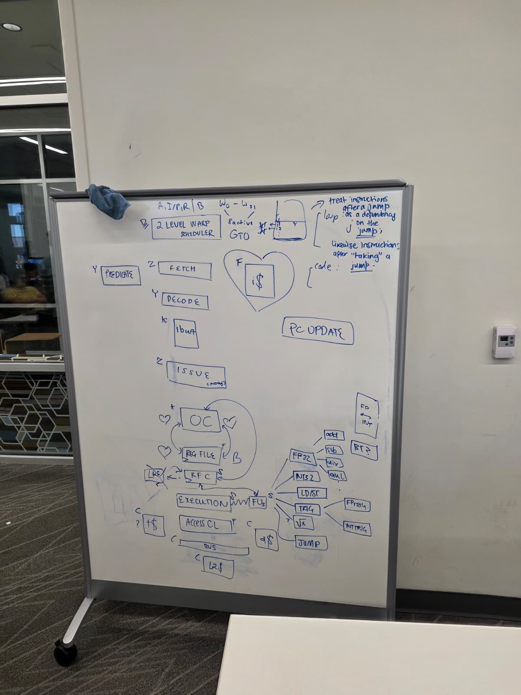
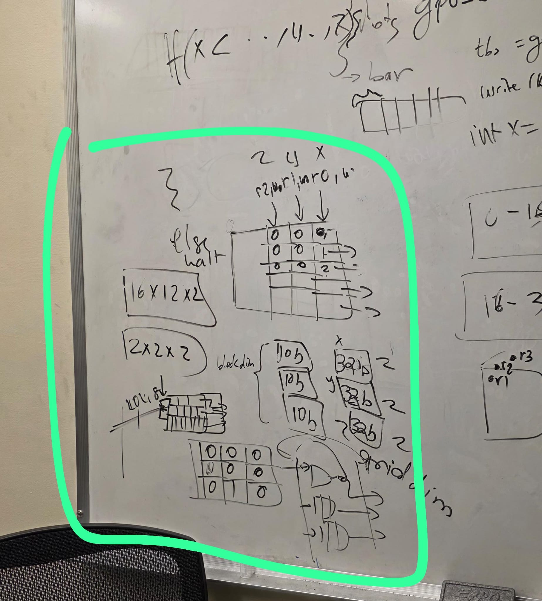
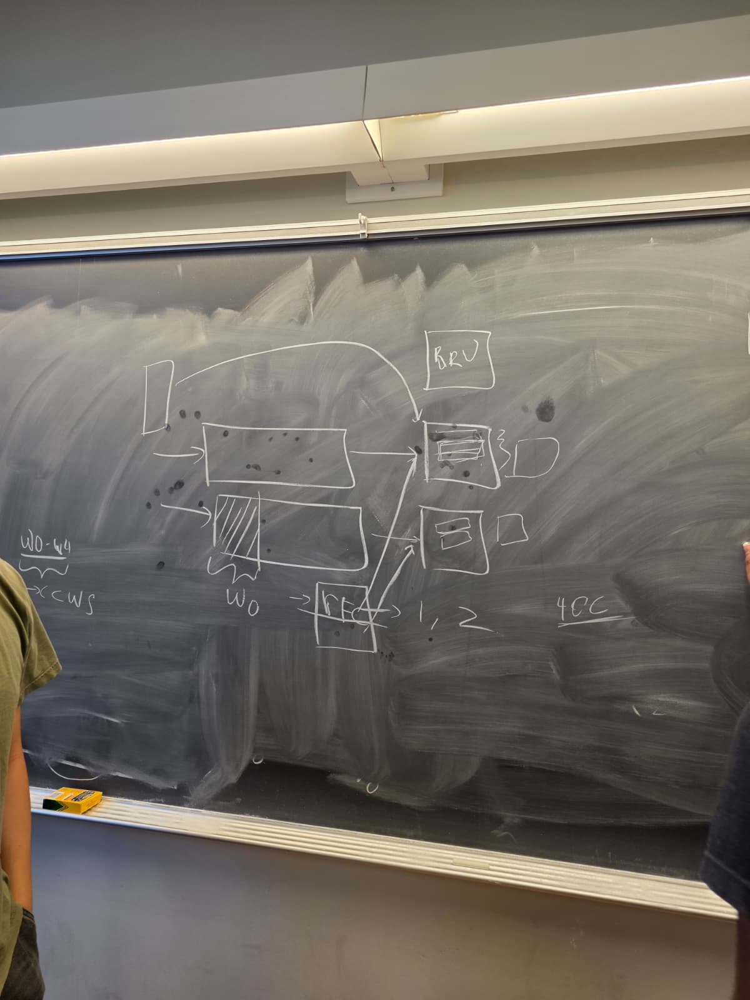

# Week 6 Design Log
Explicit Statement: I am not stuck or blocked

## Questions: 
1. We want to make sure to have a TBS in order to have core scalability
2. We need to force RFC access to be 2 cycle delay, even if it can access in one, line up with a potential OC grab

# Week Overview
- Sunday (GPU Team Discussion)
- Mon - Wed (OC & RFC clarification, Scheduling Clarification)
- Thursday (Hardware Meeting)
  - Complete connection with Backend
- Friday (Sooraj OH Special Unit for GlobalTID)

# Work:
- Hardware Flow
  - 
    - I was assigned the resposibility of working on the operand collector after much discussion due to its scheduling dependency on the issue stage. 
    - Also I have a good idea of the overall flow for the entire thing. 
- Special Unit Dimension Breakdown
  - 
    - This is used to calculate the global thread ID which is imporatant for bringing the correct data from unified memory.
    - The assumed flow is as follows: 
      - The CPU and GPU share the same memory space. 
      - Before the CPU lauches a kernel, all params for the kernerl is packed into a struct, be it pointer or actual data. 
        - This ensures that we will have a contiguous memory space for all the data param for the kernel
      - When kernel is launched, the pointer to the struct is passed in the CSR so the SM core will be able to access the correct data. 
    - There will also be a "boot" like process since the GPU is a device. Given the kernel dimensions, it will need to populate the value of the special units so that the correct calcualtion for offsetting into a mem location can be done by a thread. 
- Operand Collecter Connection to RF Banks
  - 
    - Our decision here is that we need to switch between and even and odd warp so that we can hid the 2 cycle access latency of the two banked register file. So our scheduler will select a warp group that contains and even and odd warp. Warps in a wg will always be in lockstep. 
    - We use one PC to fetch the same ins for the two warps and fill BOTH iBuffs of the warps, then issue one by one to the RF banks for access
    - We just need to stall if there is a RFC access so that the warp will dispatch from the OC on time, but I will be able to handle this with flag bits in the operand collector to tell valdidty...
- DRAW.IO: https://drive.google.com/file/d/1zLESrLZCIRFvtnY3vko3Y-sId9EeJUVy/view?usp=sharing
  - I completed the OC and Ibuffer diagrams...

# Next Week:
- Upon finishing up the design review, we need to start thinking about how we want to simulate in Python. Probably go in the direction of everyone creating their modules as classes that can be called in a main function that holds an event queue...
- Hard to think of the connection between the modules, but everyone needs to be able to invoke their own modules and make sure/ prove that their thing works. 