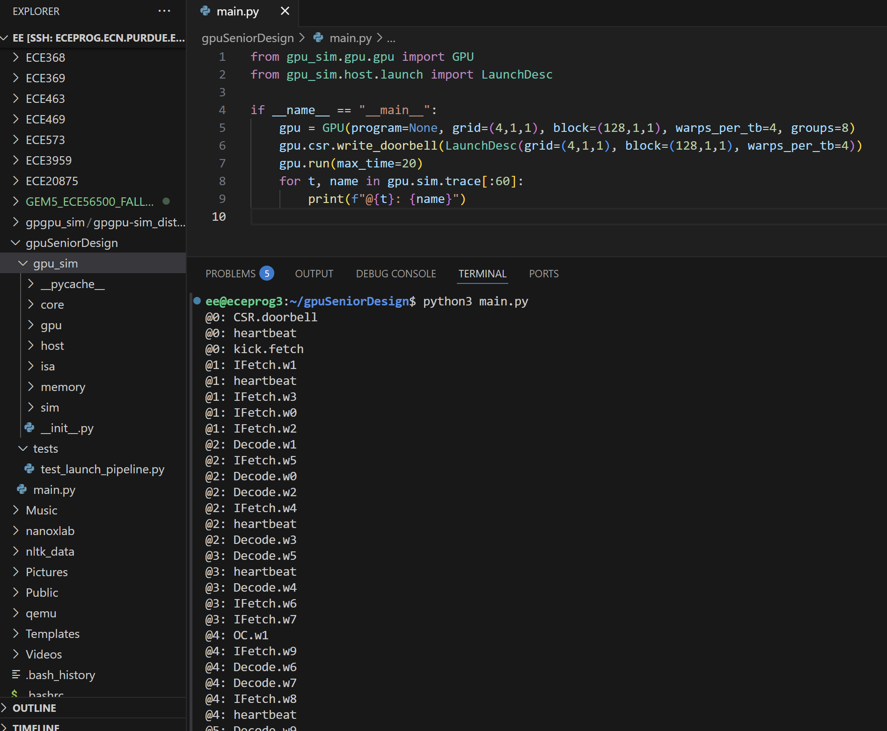

# Week 7 Design Log
Explicit Statement: I am not stuck or blocked

## Questions: 
1. What does SOORAJ want for the functional simulation 

# Week Overview
- Tried to create a simulator in Python
- Started documentation file for functional simulator block ownership and interfaces

# Work:
- Simulator in Python: 
  - This was before Sooraj told us to stop
  - This shows tick by tick which functional unit is invoked and what they do in that tick. I think that it will be a very good framework for us to work off of. 
  - I still want to tweak it a little, but I think that it will serve as a really good starting point. 
  - I read up on how exactly one would go about creating a simulator, and ofc went through the GEM5 and GPGPUSIM structures to get a sense of how people are currently doing things. 
  
- Document link: https://docs.google.com/document/d/1ZrpINJHHHvNZMJDcf2lQWTzsc0vbJP-SSdklxbKuefU/edit?usp=sharing
  - The document has each function unit, the purpose, and the interface so that everyone will have a global place to look at the connections and ensure the intergration process is easy. 

- Let's not do RFC :) awesome okay yay

Hardware Meeting Sim Notes: 
- Do deepest FU first

Functional Unit Class
- Method
  - Cycle
- Members
  - Number of stages
  - Queue (to hold ins)
- 200 cycle latency for DRAM sim
- 500 MHz

# Next Week:
- After Sooraj explains what he wants us to do, then we do it.
- Seems likes some members on our team will be doing an emulation to facilitate the compiler's team correctness. 