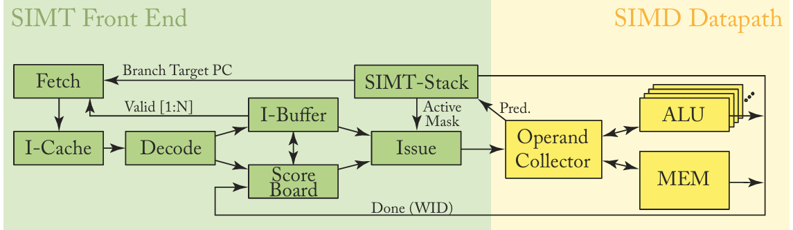

# Design Log Week 1

## Status

Not stuck or blocked.

## Notes on Chapters 3 GPGPU Architecture: The SIMT Core

- GPUs must have large off-chip bandwidths because of the amount of data they operate on at a time
  - However, caches can still be effective
    - Especially because of the spatial locality of adjacent pixels in textures for graphics

### GPU Pipeline Microarchitecture

> The diagram above shows what the pipeline of a single SIMT Core looks like

- Consists of a SIMT front end and a SIMD back end, and three loop scheduling loops:
  - I-Fetch
    - Contains the blocks labeled Fetch, I-Cache, Decode, and I-Buffer
  - I-Issue
    - Contains the blocks labeled I-Buffer, Scoreboard, Issue, and SIMT Stack
  - Reg. Access
    - Contains the blocks labeled Operand Collector, ALU, and Memory

### One-Loop Approximation
> Assume there is only a single scheduler that schedulues a single a warp/wavefront at a time

- GPUs contain function units such as a LD/ST unit, FP unit, or a Tensor Core for data processing in the pipeline
- An issue with the abstraction presented that all threads execute independently is branching and control flow
  - If one thread in a warp meets the requirement for a branch, and the rest of the threads don't, something needs to happen so that the branching thread instruction is cleared but the others are not
    - This is where predication and predicate masks comes into play
#### Predication and Predicate Masks
- Unlike the RISC-V processor design we made in ECE 437, which uses branch prediction, GPUs commonly use masking of threads to handle differences in control flow between threads
- Consider an if-else statement:
  - The threads that meet need to execute the instructions in the if block will do so first, while the threads that need to execute the instructions in the else statement are masked out and effectively NOPs
  - Then, the instructions in the else block are executed, and the threads that executed the instructions in the if block are masked out
- This effectively serializes the execution of threads that follow different paths
- A stack can be used to store the order of instruction blocks to be taken at branches, and what threads to be masked for each instruction block
-   However, this SIMT stack can induce a special kind of deadlock not found in MIMD architectures called SIMT-deadlock

#### Stackless Branch Reconvergence
- Uses registers to track the state of threads in warp during branches
  - These registers contain information suchs as Barrier Participation Mask, Barrier State, Thread rPC, and Thread State
    - Thread State can be used to push threads past a convergence barrier in the case of a SIMT-deadlock
- Threads are stalled until all necessary threads meet the convergence barrier, which are located where branches reconverge after diverging
  - The WAIT instruction is used to implement this behavior
  - There may be multiple barrier participation masks and convergence barriers for nested branches
- Warp splits occur using this method of branch reconvergence, which means that the scheduler will switch between groups of diverged threads 
  - The YIELD instruction is used to implement this behavior
  - This allows forward progress for a warp when some threads have acquired a lock and othes haven't

### Two-Loop Approximation
> We now take into account the fact that multiple instructions will be executed at the same time

- This means that data dependency and structural hazards must be addressed
  - GPUs fetch instructions in advance and use an instruction buffer to pick instructions that do not have hazards with instructions currently in the pipeline

- There are two common methods to detecting data dependencies:
  - Scoreboard: can be used for OoO and in-order execution, however most GPUs use in-order scoreboards for their simplicity and inexepensive use
    - Must limit the amount of entries in the scoreboard though, since there are so many threads in a warp
    - Instructions are only allowed through the instruction buffer if all bits are cleared on the scoreboard for the operands used in the instruction
  - Reservation Stations: require logic that takes up a lot of energy and area

> Summary: First loop selects a warp that has space in the I-buffer. Second loop selects an instruction from the I-buffer that has no dependencies in the pipe and sends it to the execution units.

### Three-Loop Approximation
- To hide latencies from memory accesses, cores must support multiple warps and be able to switch between them quickly
  - This requires a large register file to hold the state of all active warps
    - To reduce the area of the RF, multiple banks of single-port SRAM modules are used
    - To manage this, the operand collector module is used

#### Operand Collector
- In a simple implementation of a RF, there are a lot of conflicts when accessing operands when they are mapped to the same bank (since each bank only has one port)
- To fix this operand collectors are used
  - Instead of staging registers, collector units are implemented
    - If two instructions use the same operand, they can both get this operand from the same collector unit
      - This helps prevent some bank conflicts
  - Scheduling is used to avoid other bank conflicts
    - Avoiding bank conflicts is maximized by allocating equivalent registers from different warps in different banks
    - This can lead to WAR hazards, but this can be prevented by requiring instructions from the same warp leave in program order

#### Handling Structural Hazards
- In simple CPUs, it is common to stall the pipeline when a structural hazard occurs until it is resolved
  - This is undesirable for GPUs because of the high level of parallelism
  - Instead, instruction replay is used by keeping instructions in the I-buffer until it is confirmed the instruction has finished executing

### Register File Architecture
> The RF is often the biggest power consumer of all the modules on a GPU. Thus, there is a lot of motivation to find out how to improve efficiency in the RF

#### Hierarchical Register File

- Implementing a Register File Cache (RFC) can greatly reduce usage of the RF, which saves some energy
- Up to 70% of values are only read once, and only 10% are read more than twice in typical compute workloads
  - Adding static lifetime information can allow the RFC to idenfify values that won't be read again
    - This information can be leveraged to reduce RFC-to-RF writebacks by not writing back "dead" values

#### Compile-Time Managed Register File Hierarchy
- This method takes the static labeling of values even further by replacing the RFC with a Last Result File (LFC) and compile-tim managed operand file (ORF)
  - The LFC buffers the value written back by the last instruction in each warp
  - Buffered values are put in the ORF at compile-time

#### Drowsy State Register File
- This method utilizes different power states (ON, OFF, and DROWSY) to save power
  - Register file banks not yet allocated are set to OFF
  - Register file banks must be woken up from OFF or DROWSY
  - Register file banks are set to ON when an access is needed, and then immediately set to DROWSY
- This takes advantage of the long access delays to individual RF banks

#### Register File Virtualization
- This method claims that the RF size can be reduced, and main memory/caches can be used to store values that would previously be stored in the RF 
- It also implements register lifetime analysis to figure out when registers can be reclaimed to store other values

#### Partitioned Register File
- This method implements the RF using two different SRAM technologies: near-threshold voltage (NVT) SRAMs for the slow register file (SRF), and regular SRAMs for the fast register file (FRF)
- The SRF is much larger than the FRF, uses much less power, but access time are much longer than the FRF

#### RegLess
-  A study found that much of the RF goes unused during run-time
- It proposes that instead, a operand staging buffer
- The compiler splits up the kernel into regions to limit the number of live registers

