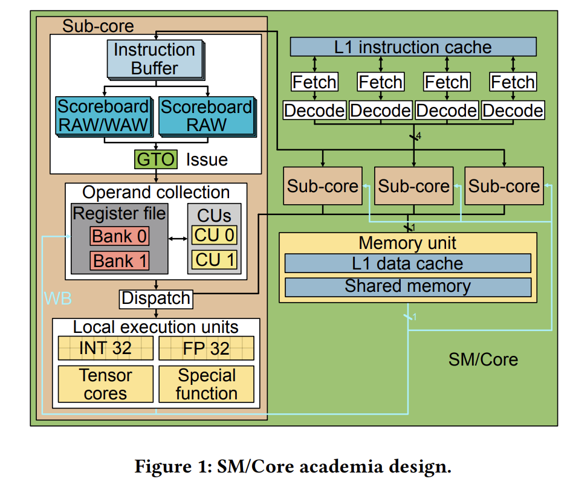
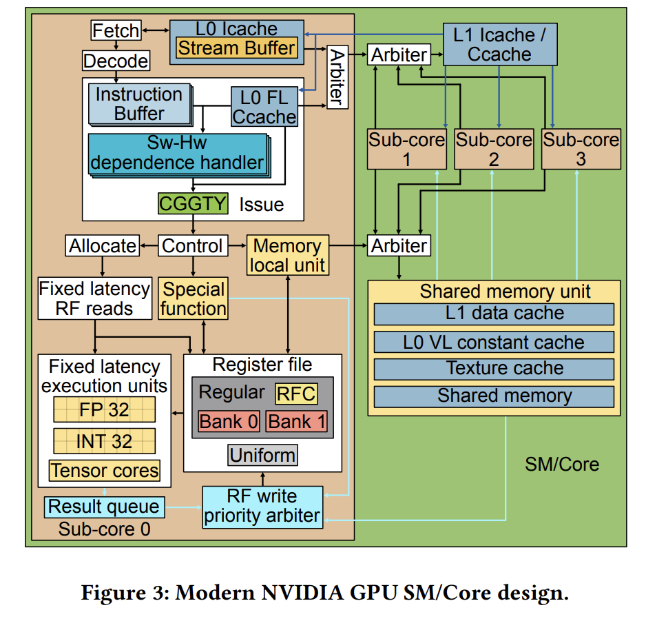

# Design Log Week 4

## Status

Not stuck or blocked.

## Notes on Chapter 5.1 GPGPU Architecture: Thread Scheduling

> There are three main ways GPU schedulers manage threads:

### Assignment of Threads to Warps 

> Threads are grouped into warps. 

- Threads with consecutive thread IDs are statically grouped together into a warp.
  - This grouping doesn't change during execution in the GPU model established by the textbook.

### Assignment of Threadblocks to Cores

> The GPU assigns work to its SIMT cores in chunks called threadblocks.

- A GPU-wide scheduler assigns threadblocks to available cores in round robin fashion.
- Once a threadblock is assigned to a core, it runs to completion, and a new threadblock does not execute until the one before is completely done.
  - This is because of the massive state each threadblock needs maintained

### Cycle-by-Cycle Warp Scheduling

> Each core chooses warps from the threadblocks assigned to it to execute each cycle.

- The main goal of the per core warp scheduler is to hide latency and avoid dependency stalls. 
  - When a warp stalls (like during a memory access), the scheduler can instantly switch to another ready warp to keep execution units busy.
  - The scheduler wil only pick warps whose threads have no dependencies currently in the pipeline.
- This scheduler is also in charge of fetching instructions and reading/writing operands

### Scheduling Multiple Kernels

> When multiple kernels are running on the GPU, the scheduler must also decide how to share resources between them.

- This is relatively new for GPUs, as older models only ran one kernel at a time.
- Similar to a CPU which is often used to run multiple programs at once.

### Research on Assignment of Threadblocks to Cores

A naive approach to scheduling threadblocks to cores is simply using round robin assignment until all cores have at least one resource completely used.
  - This could be the core's scratchpad memory, register file, warp slots or threadblock slots.
- Research has been done on improved ways of assigning threadblocks to cores:

#### Threadblock Throttling 

- Some workloads can overrun the memory system which creates a bottleneck. 
- This approach proposes throttling/limiting the number of threadblocks assigned to each core to reduce this effect.
  - Works by monitoring if a core is spending most of its time idle or waiting on memory. 
  - If it's waiting on memory too much, the core can pause existing threadblocks instead of adding more.
      - This improves performance by reducing the interference from other threadblocks trying to access memory at the same time.

#### Dynamically Tuning GPU Resources (Equalizer): 

- This method scales the core clock frequency and memory clock frequency based on the kernel to save energy.
  - Based on whether the workload is memory-intensive or compute-intensive, it can scale frequencies up or down. 
    - Ex: for a compute-heavy kernel it might lower the memory frequency to save power.

### Research on Cycle-by-Cycle Warp Scheduling

#### Two-Level Scheduling 
- This splits the warps on a core into two groups: an active pool and an inactive pool. 
- The scheduler only picks from the small active pool each cycle, which reduces the energy used by the selection logic. 
  - A warp gets moved to the inactive pool when it hits a long latency operation.
  - This also helps improve performance by keeping warps with locality together.

#### Cache-Conscious Warp Scheduling (CCWS)

- If multiple warps are competing for the same cache space, they can evict each other's data which hurts cache performance.
- CCWS fixes this by limiting the number of active warps based on tracked cache evictions.
  - It detects when data that was recently accessed by a specific warp is being lost.
  - This is accomplished by using a victim tag array that tracks tags of evicted cache lines. 

#### Divergence-Aware Warp Scheduling (DAWS) 

- DAWS is an extension to CCWS that creates a more accurate estimate of a warp's cache footprint.
- It makes optimizations for handling loops and their patterns on caches. 
- It also accounts for control flow divergence:
  - Threads that have exited a loop no longer contribute to its cache footprint and no longer need to be held on to.

#### Mascar (Memory-Aware Scheduling): A system that combines two ideas for memory-intensive workloads:

- Memory Aware Warp Scheduler (MAS): When the memory system is getting overwhelmed (like when L1 miss queues are full), the scheduler prioritizes the execution of a single warp. 
  -  Helps with overlapping its computation with the memory accesses of all the other stalled warps.
- Cache Access Re-execution (CAR): Sometimes warps that have L1 cache hit are blocked because the load/store unit is stalled by other warps that missed, so CAR adds a buffer to let these cache hits continue. 
  - This prevents the pipeline from getting clogged by lots of cache misses.

### Research on Scheduling Multiple Kernels

Running multiple kernels at once on a GPU brings up the need for preemption, just like on a CPU.

#### Chimera 
- Since saving the entire context of a threadblock is expensive, Chimera dynamically chooses one of three ways to perform a context switch:
  1.  Do a full context save/restore (slow).
  2.  Wait for the threadblock to finish executing.
  3.  If the threadblock can be restarted, just kill it without saving its context.

### Research on Fine-Grain Synchronization Aware Scheduling

- Fine grained locks (like spin locks) are tricky on GPUs:
  - If one thread in a warp holds a lock but other threads in the same warp are spinning trying to acquire it, a simple scheduler might keep running the spinning threads
  - This wastes energy and prevents the thread with the lock from making progress.
- A possible solution is integrating hardware that identifies spin loops.
  - If a warp is detected as spinning on a lock, its priority is demoted which allows other warps to make progress and reduce memory contention.

## Notes on Modern NVIDIA GPU Microarchitecture

> This research paper reverse engineers modern NVIDIA GPUs (Ampere) to create a more accurate model of how they work. 

### Compiler-Managed Dependencies

> Older GPUs use solely hardware scoreboards, but modern NVIDIA GPUs rely on the compiler to add necessary information about scheduling to prevent data hazards.

- The compiler inserts information into the SASS instructions using control bits. 
- The hardware uses these bits to know when it's safe to issue instructions. 
- This saves a lot of die space and power by eliminating some of the overhead of scoreboarding.

#### Control Bits: Stall Counter

- This is used for fixed latency instructions.
- The compiler knows the exact latency of an instruction, so it can calculate the number of cycles a warp needs to wait before a dependent instruction can be issued safely.
- This value is encoded in the instruction's control bits: the hardware just has to read this value and stall the warp for that many cycles.

#### Control Bits: Dependence Counters

- This is for variable latency instructions when the compiler can't predict the latency (like memory accesses).
- Each warp has access to a small set of special counter registers
- A producer instruction increments one of these counters when it's issued.
- A consumer instruction has a control bit mask that tells it to wait until that specific counter is zero before it can be issued.
- The producer instruction decrements the counter when it finishes (writeback after a load), then the consuming instruction is allowed to continue.

#### Control Bits: Yield Bit

- This is a simple flag: if an instruction has its yield bit set, it will tell the hardware scheduler to try and issue an instruction from a different warp in the next cycle.
- This gives the compiler a way to manually control context switching between warps to better hide latency.

### The Modern Core Pipeline

The paper proposes a newer model of the NVIDIA SM core, shown in Figure 3 of the paper. 

Some of the differences include:

#### Issue Scheduler: CGGTY
- The old model used a Greedy Then Oldest (GTO) scheduler. Modern GPUs use something the paper calls Compiler Guided Greedy Then Youngest (CGGTY).
  - Greedy: The scheduler will try to issue instructions from the same warp over and over as long as it can.
  - Compiler Guided: The control bits inserted into instructions by the compiler can override the default/greedy behavior and force the scheduler to wait or switch warps.
  - Youngest: When the schedule has to switch warps, it picks the youngest available warp that is ready.

#### Register File and Operand Collectors

- The textbook details an operand collector block that resolves bank conflicts in the register file.
  - This paper found that modern GPUs dont use an operand collector.
-  An operand collector would add unpredictable stalls to the pipeline
  - This breaks the compiler's ability to schedule instructions in the way described above.
- Instead the pipeline has extra stages before the insturctions is executed:
  - An instruction goes through an allocate stage where it reserves the register file read ports it will need.
  - If the instr can't reserve them, the instructions stalls in this stage which stalls the issue stage.
  - This guaranteesst that all fixed latency instruction won't have any structural hazards for register file ports and won't stall after the issue stage.

#### Register File Cache (RFC)

- To help with the high pressure on register file read ports and to save power, new NVIDIA SM cores add a small compiler controlled Register File Cache (RFC).
- Each source operand in an instruction has a reuse bit:
  - If the compiler sets this bit, the value of that register is placed in the RFC when it's read.
  - The reuse bit is only set if subsequent instructions will use that operand later.
  - This results in cache hits for these operands.

#### Memory Pipeline
- Each sub core within a SM core has its own local queue for memory instructions (5 instructions deep).
- These local queues then feed into a shared memory unit for the whole core.
- This shared memory can become a bottleneck:
  - It can only accept one memory request every two cycles
  - THis means that if all four subcores are trying to issue memory instructions at once, they will be stuck until the memory instruction buffer can handle the request.