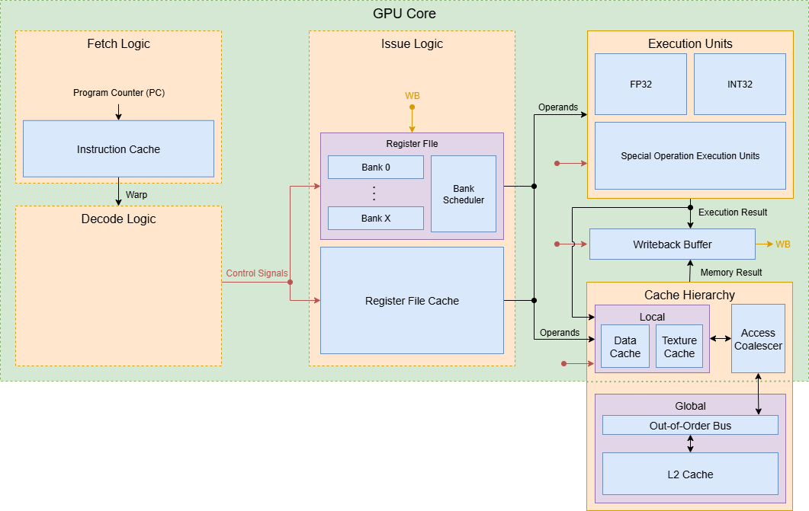
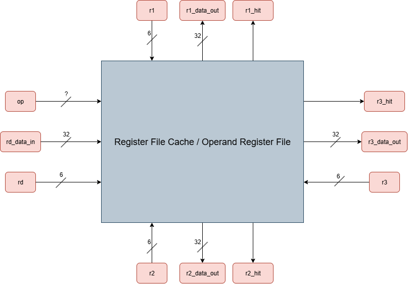

# Design Log Week 5

## Status

Not stuck or blocked.

> The GPU Hardware Backend team is currenty working on creating the microarchitecture of modules so that work can begin on the cycle-accurate functional simulator of the GPU. 

## Project Proposal Presentation

- Presented the GPU Hardware Backend proposal on Tuesday, September 24th to SoCET faculty and GTAs
- [Link to poster slide](https://docs.google.com/presentation/d/1q0YpC5ikDYjNVcPbiTcd9zR6me7aMwpvCTcR7NQ8XOc/edit?usp=sharing)
  - I was in charge of creating the block diagram seen in the slides

## Modules: Register File Cache and Functional Units

I am in charge of designing the Register File Cache and Functional Unit modules.

### Register File Cache (RFC):

- Used to store operands that are frequently accessed
- This reduces contention for the main register file's limited banks and ports.

> Top Level Diagram of the Proposed Register File Cache

#### Initial Proposed Specifications:

- 3 Read Ports
  - Allows reading multiple operands simultaneously
- 1 Write Port
- 6 entries per thread
- Allocation by register namespace
  - Values written to register R1 - R6 will be written to the cache automatically
- No formal eviction/flush/writeback/write-through policy: evictions and flushes will be carried out by software
  - The compiler will schedule mov instructions to transfer dirty values from registers located in the cache to registers located in the main register file (MRF)

> Questions to be answered: how will operands be supplied from the RFC and MRF to the functional units?

### Functional Units:

- Perform the operations specified by warp instructions
- Warp instructions are dynamically scheduled to idle functional units
- Current list of necessary functional units:
  - FP32
    - add, mul, div
  - INT32
    - add, mul, div
  - LD/ST
  - SIN/COS
  - Other potential specialized units:
    - sqrt, exp, 3x3 matrix
