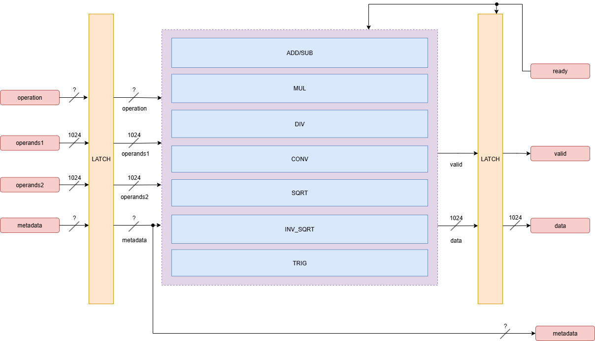
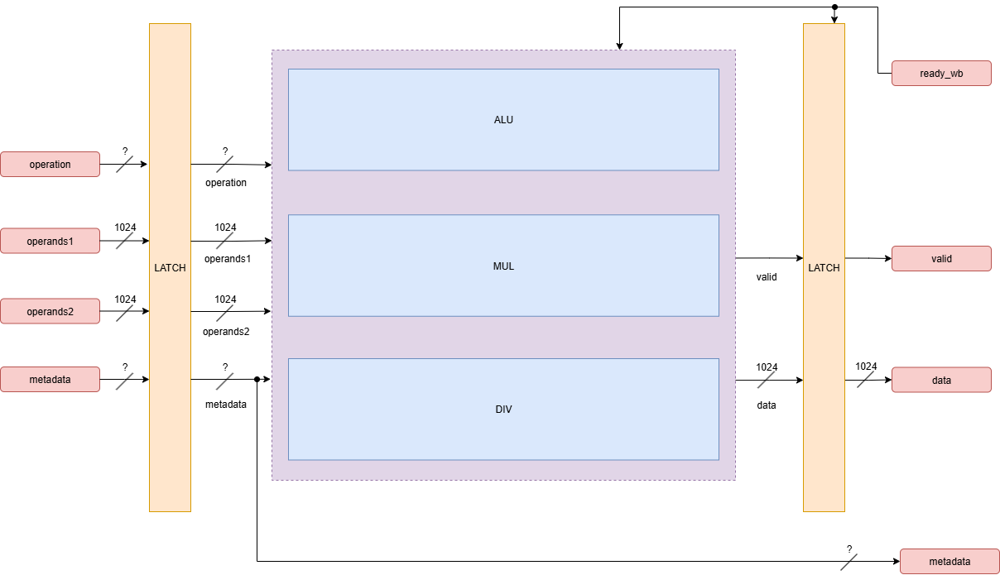

# Design Log Week 6

## Status

Not stuck or blocked.

> Work has continued on fleshing out the microarchitecture so work can begin on the Python simulator

## Microarchitecture Presentation
- The whole GPU hardware team met to discuss final microarchitecture decisions and interaces between modules for the microarchitecture presentation on 10/5
- In preperation for the presentation, I created some block diagrams of functional units that are necessary for the graphics workload we are running on the GPU

## Functional Units Plan of Action

> [This thread on Discord](https://discord.com/channels/1158125785052352573/1423406591729995777) will contain updated information on functional units

### FP32

#### Owner: 
- Digital Design Senior Design Team *(more details below)*

#### Supported Operations: 

- add, sub, mul, div, sqrt, trig

#### Design Decisions:

- The current plan is to reuse the FPU currently being developed by a senior design Digital Design team: https://github.com/Purdue-SoCET/FPU_F25/tree/main
- This unit will support add, sub, mul, div, and sqrt operations
  - Trig operations will not be supported, so I am looking into developing a standalone Trigonometric Unit
    - This unit can be integrated later into the FPU if needed

> Block Diagram of the FP32 Functional Unit

- This diagram is pretty basic as of now because a lot of time will need to be spent adding pipeline stages to decrease combinational path
  - This is challenging because the pipeline latches have to be strategically placed so that all supported operations fit into the pipeline stages correctly
  - Additionally, since the FPU team will be working on this unit, I can't make any design decisions until they are at a point where we can fork their design

### INT32

#### Owner: Seth McConkey (me)

#### Supported Operations:

- add, sub, mul, div, and, or, sll, slt, sltu, srl, sra

#### Design Decisions:

- This unit will be designed from scratch
- The unit will also be heavily pipelined to improve throughput
- All operations, no matter how simple, will follow the same pipeline stages and have the same latency, for a few reasons:
  - Simplifies control logic
  - Avoids having to implement forwarding logic
  - An instruction can be issued to the unit every cycle that it isn't stalled
  - This has some tradeoffs: low-latency instructions (like add) will end up matching the latency of longer-latency instructions (like mul and div)
    - This is acceptable because we are optimizing for throughput over latency
- Current algorithms I am considering implementing
  - ADD/SUB: Carry Save Adder (CSA)
    - Carry_out bits are forwarded ahead to the next stage instead of laterally to reduce propagation delay
    - This design is also easily piped
    - [More info](https://courses.csail.mit.edu/6.111/f2007/handouts/L13.pdf)
  - MUL: Wallace Tree Multiplier
    - Uses CSAs to reduce the number of partial products through each stage
    - This design is also easily piped
    - [More info](https://en.wikipedia.org/wiki/Wallace_tree)
  - DIV: SRT Division
    - This is a division algorithm that works faster than traditional restoring and non-restoring division algorithms (which are similar to how long division works with pen and paper)
    - It does this by calculting multiple paths at once and then selecting the correct path later, and using a larger radix to reduce the number of iterations needed
    - [More info](https://klabs.org/DEI/Arithmetic/division/dh_arith_97.pdf)

> Block Diagram of the INT32 Functional Unit

- This diagram is also pretty basic as of now because I need to spend more time fleshing out the pipeline stages and control logic
  - I also need to do more research on the algorithms I plan to implement to ensure they will work correctly in a pipelined design

### LD/ST Unit

#### Owner: Andrew Larkins

### Branch Unit

#### Owner: Yash Singh

### Trigonometric Unit

#### Owner: unassigned

- I will do some research on this unit and determine if I will have time to work on it, or if I should assign it to someone else
- I've looked into the CORDIC algorithm, which is a popular estimation algorithm for calculating trigonometric functions in hardware
  - [More info](https://en.wikipedia.org/wiki/CORDIC)

### Jump Unit

#### Owner: unassigned

- Lowkey don't know what this unit is for, I need to talk to Jing about what needs to happen with it

## iCache

- I think iCache should be pretty basic
- I have the one I made in ECE 437 still, and I assume we can easily resue most aspects of it
- Interfacing with the Fetch and Isse stages should be similar to how it was done in 437
- I will need to look into how to interface it with the L2 cache/main memory
- I will also need to look into specific policies and parameters we want to use since GPU workloads are different from CPU workloads
  - Size, associativity, block size, replacement policy, write policy, etc.