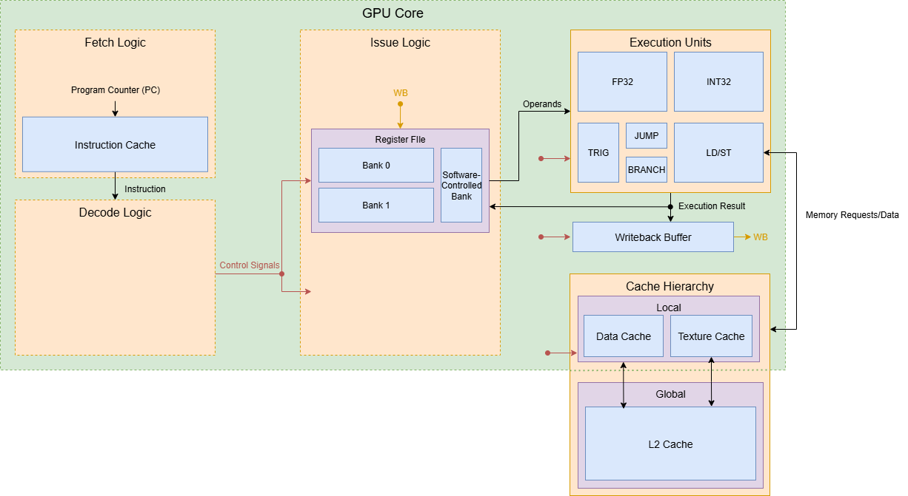
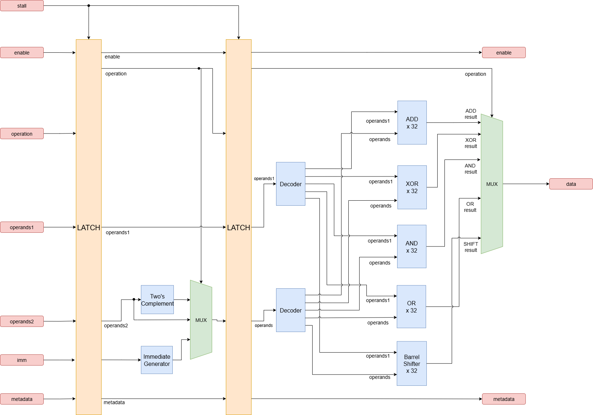
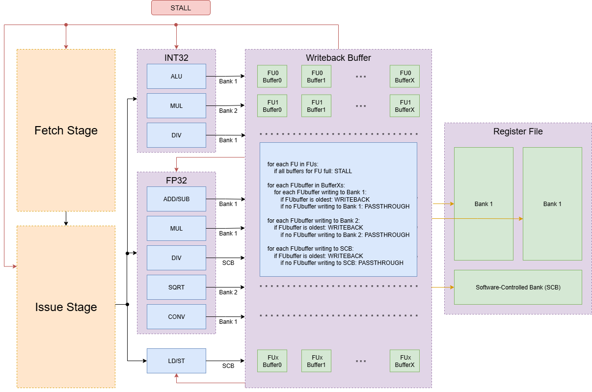
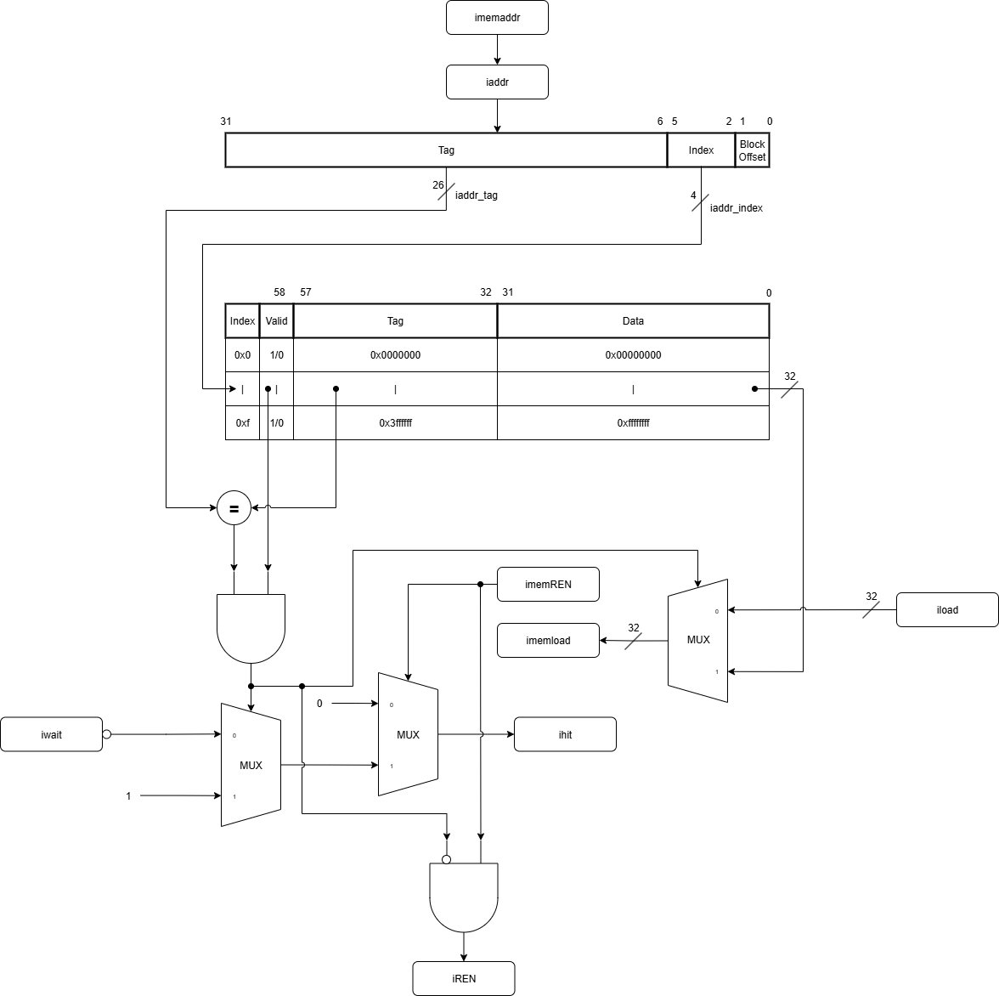

# Design Log Week 7

## Status

Not stuck or blocked.

> Sub-teams gave presentations on proposed microarchitecture and module designs on 10/5. These presentations were the last step before starting on the implementation of the cycle-accurate Python simulator. Below are details from the backend's presentation

## Backend Microarchitecture Overview

In preparation for last meeting, the GPU core's backend microarchitecture was established. The backend is responsible primarily for the Execute and Writeback stages of the pipeline, which includes the execution units, register file hierarchy, and cache hierarchy.

[Link to presentation slides](https://docs.google.com/presentation/d/1Is6HNChVRcIMx3nnyw-dslQUPmFsOYvEmtePV2tYh2k/edit?usp=sharing)

## Register File Hierarchy
In order to manage the state necessary by all active warps while also optimizing for power and performance, we decided on a two level register file hierarchy.

### Main Register File (MRF)

- The MRF will store all data for all warps and it is composed of two banks to allow two simultaneous reads:
  - one for even-numbered warps and one for odd-numbered warps. 
    - This split guarantees some bank conflicts but allows us to coalesce accesses between even and odd warps
    - Reading operands from the MRF will always take 2 clock cycles

### Register File Cache / Software-Controlled Register File (RFC / SCRF)

- To save power a small 8-entry Register File Cache will be implemented
- The compiler will schedule instructions to use the RFC as much as possible (while minimizing conflicts) to achieve energy savings 
- Like the MRF, reading from the RFC will take 2 clock cycles
  - Accessing the RFC could take only 1 cycle, but this would require more complex hardware to forward RFC hits to the OCs to take advantage of the lower latency

## Functional Units

The core will contain several functional units to handle different types of operations.

### INT32 Unit

- This unit will handle all 32-bit integer arithmetic and logic operations
- Compelex instructions will be heavily pipelined and divided into three sub-units:

- ALU: A 2 stage pipelined CLA for standard operations like add, sub, and, or, and shifts
- MUL: An 8 stage pipelined multiplier using a Tree-of-Wallace-Trees structure and Radix 4 Booth encoding to reduce the number of partial products
- DIV: A 12 stage pipelined divider implementing the SRT algorithm with Radix 8 to reduce the number of iterations necessary.

### FP32 Unit

- We plan to integrate the FPU being developed by the Digital Design senior design team 
- This unit will handle 32b FP add, sub, mul, div, sqrt, and conversion operations
- NOTE: The Graphics team requested support for inverse square root
  - I am looking into implementing this using [the fast square root algorithm](https://en.wikipedia.org/wiki/Fast_inverse_square_root)
    - This uses a magic number (loaded into a register), and it is determined by using Newton's method, which gets rid of a lot of the cycles needed to compute on hardware

### Trigonometric Unit

- Since the DD team's FPU will not support trig functions, we will be designing a dedicated unit for sin and cos operations 
- The current plan is to implement the CORDIC algorithm for these operations
  - CORDIC uses an iterative approach to estimate these functions in hardware

### LD/ST Unit

- This unit is responsible for all memory load and store operations 
- Includes an Access Coalesce Unit, which combines memory requests from threads in a warp into a single wider access to DRAM
  - Improves performance by turning multiple high latency memory accesses into one

## Writeback Stage

- A Writeback Buffer will sit between the execution units and the register file
- This buffer holds the results from the FU pipelines and manages writing them back to the correct register file banks
- We will need to use the Python simulator to test different configurations (ex: buffer size, queue vs. stack implementation) to find the best design

## Cache Hierarchy

The backend includes a multi-level cache system to reduce memory latency.

- **Instruction Cache**: A standard i$ that feeds the Fetch stage
- **L1 Data Cache**: A local data cache for each core
- **L2 Cache**: A larger, global cache shared across all cores
- **Texture Cache**: A specialized cache for texture data
  - May or may not be used, still discussing with the Graphics team

- In order to handle lots of memory requests in parallel in one LD/ST unit, the L1 data cache will use Miss Status Holding Registers (MSHRs)
- These track outstanding cache misses to allow the cache to continue taking other requests instead of stalling on a cache miss
  - Necessary for hiding memory latency and maintaining high throughput.

## Python Cycle-Accurate and Functional Simulator
- With the microarchitecture defined, we can now start implementing the GPUsimulators in Python
  - We will make both a cycle-accurate simulator and a functional simulator
- A meeting was held (had to miss because of scheduling meeting conflict) to discuss the overall structure and division of labor for the simulator implementation
- I received some details from Felix:
  - All Functional Units will inherit from a abstract `FunctionalUnit` class
    - `FunctionalUnit` will define the `cycle()` method that each FU must implement that returns the number of cycles it takes to execute an instruction
    - It will also push values forward in the pipeline on each call, including inputs and outputs at each end of the pipe
  - The `WritebackBuffer` class will be its own class, and an instance of it will be bundled together with each FU in another class
    - This will allow each FU to have its own dedicated WB buffer to hold results before writing back to the register file, while all FUs reflect the same changes from the `WritebackBuffer` class
- I will be on the Emulation team, which doesn't require any hardware implementation details, simply instruction RF/memory input/outputs
