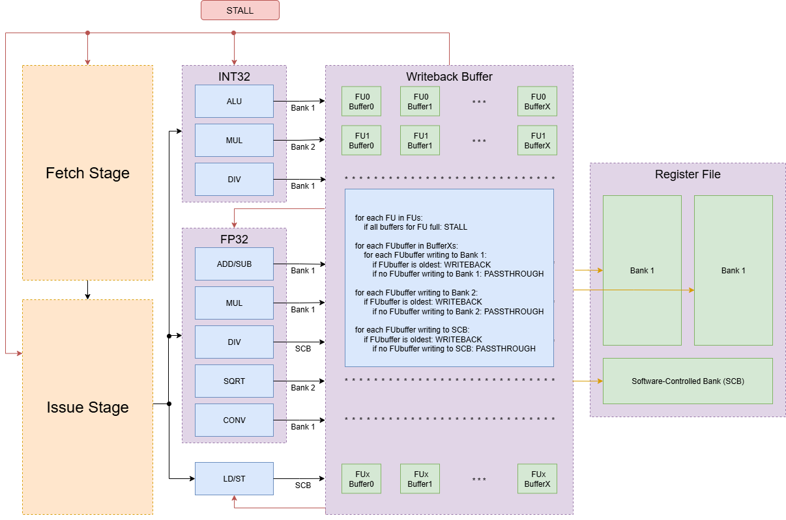

# Design Log Week 9

## Status

Not stuck or blocked.

> Emulator is close to done, planning for the cycle-accurate simulator is beginning

## Functional Simulator Progress

https://github.com/Purdue-SoCET/gpu/tree/main/gpu_sim/emulator/src

- Implementation of all the instructions included in the [compilers' teal card](https://docs.google.com/spreadsheets/d/1quvfY0Q_mLP5VfUaNGiiruGoqjCMpCyCKM9KlqbujYM/edit?usp=sharing) is finished (as of Thursday)
- I talked with Dan and Felix, who are working on the emulator with me on Thursday, and we have the final plans laid out to finish the emulator
  - Implement CSRs
  - Implement memory
    - Read, write, and dump

## Cycle-Accurate Simulator Progress

- Yash has created the base classes necessary for implementing all parts of the GPU microarch
- I am in charge of:
  - All FP FUs
  - All INT FUs
  - All TRIG FUs
  - The writeback buffer
- The plan is to have these implementations finished with unit tests for each module that tests edge cases and common cases to make sure that there are no module-level syntax errors or logic errors

### FUs

- William Cunningham messaged me back with the latencies of some previous SoCET IP of a INT Radix-4 divider and INT Wallace-tree multiplier.
  - Radix-4 divider: 17 cycles per op/17-stage pipeline
  - Wallace-tree multiplier: 6 cycles per op/6-stage pipeline
  - This information will define the parameter for the latency for one instruction inside of the cycle-accurate simulator
- Parameters to test:
  - Number of functional sub-units
  - Pipeline stages/cycle latencies for various instructions

#### Performance Counters

- Number of cycles with an instruction issued for functional sub-unit X
- Number of cycles with a NOP issued for functional sub-unit X
- Number of cycles stalled by functional sub-unit X

### Writeback Buffer

- For the writeback buffer implementation for the cycle-accurate simulator:
  - I plan to use the microarch design proposed in this diagram:
  
  - Only one write per bank can occur
  - There will be a buffer per functional sub-unit (FP_ADD, INT_ALU, LD/ST)
  - If there are no buffers writing to one of the banks, then writes can pass through the buffer straight to that register file bank
    - There will be a total of `f*r*1024` wires between the functional sub-units (`f`) and register file bank (`r`)
    - There will be a total of `f*1024` wires between the functional sub-units (`f`) and the writeback buffers
    - There will be a total of `b*r*1024` wires between the buffers (`b`) and the register file banks (`r`)
      - Total of `(f*r + f + b*r)*1024` wires
  - If a buffer for a single functional sub-unit is full, the whole GPU will stall
  - Parameters I plan on testing:
    - Writeback priority policies:
      - Prioritize oldest value?
      - Prioritize fullest buffer?
      - Prioritize LD/ST values?
    - Buffer size per functional sub-unit
      - Different sizes for different functional-sub units?
    - Buffer types
      - Circular buffer?
      - Stack?

- With the cycle-accurate simulator, I want to determine:
  - Will this (sort of naive) implementation suffice? 
    - Do we need to implement a FUST so that the whole pipeline doesn't stall every time a buffer is full?
      - If using a FUST, should we have all functional sub-units writeback to one buffer per register file bank?

#### Performance Counters

- Average buffer load of buffer X
- Average buffer load of 10% highs of buffer X
- Average buffer load of 1% highs of buffer X
- Max buffer load of buffer X
- Number of total cycles stalled
- Number of writes to bank X
- Number of stall cycles caused by buffer X

  
 
