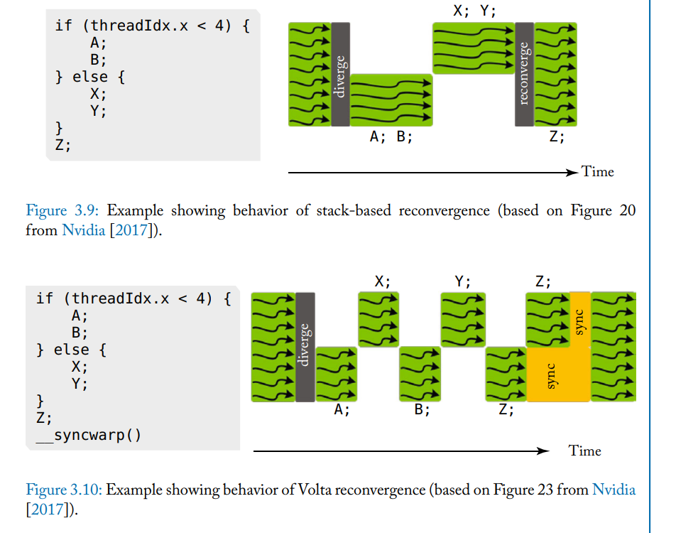

State: I am not stuck with anything, don't need help right now. 

TODO: Rename images

Progress:
MIT videos watched
Notes
##Chapter 3 - SIMT Core
- Core consists of a SIMT front end and a SIMD backend. 
- Pipeline has three scheduling loops that make up the overall pipeline. Instruction fetch, instruction issue, and register access.
- fetch has fetch, I cache, decode, and I buffer
- Issue has I buffer, scoreboard, issue, and SIMT Stack
- Register has Operand collector, ALU, Memory

###3.1 One loop Approximation

- In each cycle, the GPU selects a warp for scheduling. An instruction is fetched, decoded, and then registers are fetched. In parallel with fetching of operands, SIMT execution mask values are found. 
- When execution masks and registers are available, execution is done in a SIMD manner. Specific hardware is used to do specific instructions.
#### 3.1.1 - SIMT Execution Masking

- SIMT Stack and prediction
- Stack handles issues with independent execution, liken ested control flow. Some branches are dependent on others. Both this and skipped computation can be handled. 
- See assembly(pdf 38) for this
- Threads are able to diverge from each other while to the programmer they look to be executing in lock step. The execution of these different threads is serialized.
- A stack like data structure can maintain the order of threads so that masking of diverging threads can happen.
- After threads diverge, they will attempt to be converged at the nearest point. When the stack of divergent threads is resolved, the threads can be executed together again.

#### 3.1.2 - SIMT Deadlock and stackless architecture
- A stack can lead to a deadlock condition
- Modern architecture does not use the stack, independent thread scheduling

- Fairly similar to OS deadlock concept
- Threads can diverge in a way that makes synchronizing difficult.
- There is a concept of a warp barrier. Instead of a stack, the mask is used to determine which threads can be allowed to run at a given time and state. The barrier prevents these threads from competing against each other
- Threads with a common next PC will be done together while other threads are blocked. The scheduler can switch freely  between groups of diverged threads instead of needing to clear a stack of divergent threads. A wait instruction holds the threads.

#### 3.1.3 Warp scheduling

- Which order should the warps themselves be executed in? 
- Memory is of variable latency which informs the decision. Ideally, a round robin could be used to even out latency, increasing number of warps per core increases the amount of space needed for registers. This means decreasing the core count.
- Active research Area
### 3.2 Two Loop Approximation

- To help reduce visible latency, being able to issue subsequent instructions before the current has been completed is important. 
- GPUs have instruction memory that can solve hazards and schedule instructions.
- Instruction memory is a first level instruction cache with one or more secondary caches. 2nd Cache can also mask a cache miss with a miss register.
- Uses a scoreboard for detecting data dependency. Instructions that want to R/W to a register that has a scoreboard bit set are stalled until that bit is cleared by the instruction writing to the register. This solves hazards. The scoreboard is "in order". 
- Instead of one read port per warp and operand, multiple entries per warp and accessed when instructions are added to the buffer and when instructions writeback.
- Scoreboard entries are compared with instruction source and destination registers. Bits are set for a match of any operands, which can be a hazard. The instruction cannot be scheduled until these bits are cleared.
- The bits are cleared as instructions writeback bits to the register file. If all the entries are used, then fetch stalls or instruction is discarded.
- Loop once selects a warp that has space in the buffer, looks up the PC and performs an instruction cache access to grab the instruction. Loop 2 selects an instruction from thatbuffer that has no dependencies and issues it to be executed.

### 3.3 Three Loop Approximation

- Big register file. Operand collector exists. It is the third loop.
- Operand collector collects the instructions. 
- Naive implementation will be either slow for the amount of data needed or excessively large

#### 3.3.1 Operand Collector
- Staging registers are replaced with the operand collector. Each instruction is allocated a collector unit when entering register read. There are multipler collector units so multiple instructions can overlap the reading of operands to improve throughput when conflicts emerge.
- Scheduling can help to tolerate a bank conflict. Splitting across banks can improve the cases where data is read.
- Write after read hazards are possible. Bloom filter tracks register reads. 

#### 3.3.2 Instruction Replay

- Many structural hazards exist in the GPU, often related to running out of resources. 
- In a CPU, younger instructions can be stalled. This could impact the critical path or otherwise poorly affect a multithread workload. 
- Instruction replay is used. GPUs avoid speculation, this avoids clogging the GPU pipeline. the GPU holds instructions in the buffer until it is known they are completed or all parts of the instruction ahve been executed.

### 3.6 Research Directions fir register files
 
- Hierarchical: Extend main register file onthe GPU with a register file cache. Forms a hierarchy of the register file, dramatically reducing access to the min register since most values are only used once.
- Compile Time Managed Register File Hierarchy uses a last result file which is a buffer of register values. Managed by the compiler. 

#### 3.6.2 Drowsy State register file

- Tri modal register file that reduces leakage with a drowsy code. On ir normal, OFF does not retain, and frowsy retains but needs to be turned ON before access. All nonallocated registers are in OFF mode, and placed into drowsy after access.

#### 3.6.3 Register File Virtualization

- A concept of virtual registers, where they are allocated as a program needs them. Tracking when registers are used allows them to be reclaimed. Doing this reduces the area by being more intelligent with the usage of registers, but could place more work to the compiler.

#### 3.6.4 Partitioned Register File

- Partitions into a fast and slow register. Slow register file is accessed less commonly, takes longer, saves power or area. Unlike the hierarchy, the hardware is different and this is not just an artificial distinction.

#### 3.6.5 Regless

- Because registers are not used often compared to their quantity, try to replace them with a buffer. Primarily leads to large space reduction but requires a new compiler.

## Questions
Not a question, just review this material later after learning about cache in 437