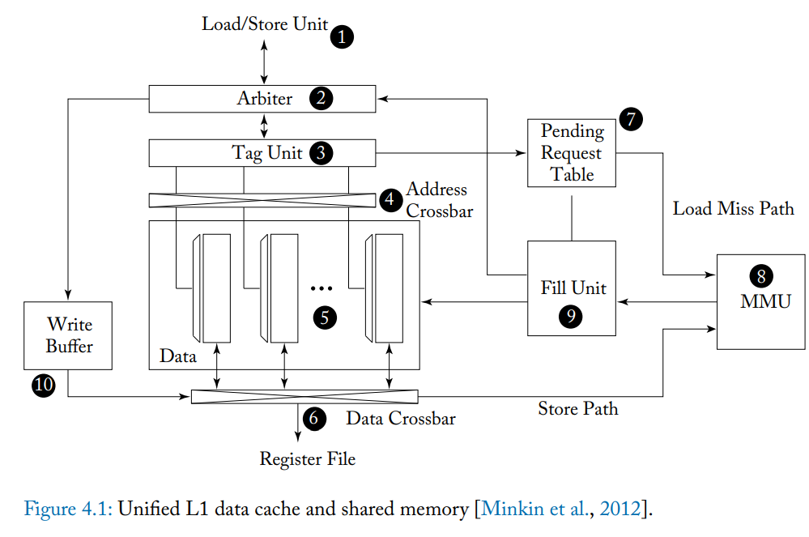
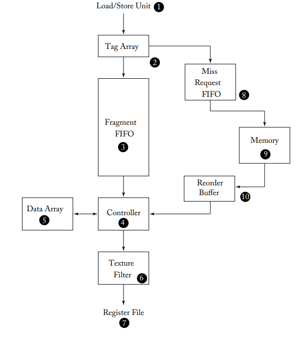
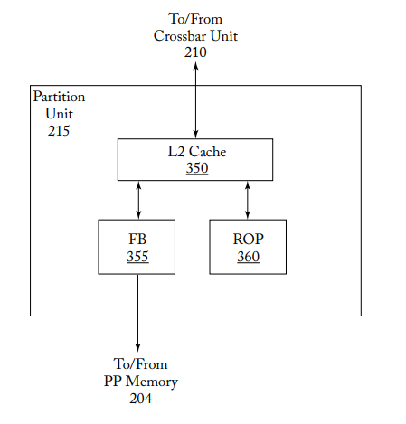

State: I am not stuck with anything, don't need help right now. 

Research? Meeting plan is saturday. 

## Chapter 4 Memory System

The memory structure within a GPU will be more complex compared to a CPU, due to the increased needs from highly parallel tasks. The GPU further subdivides into local and global spaces. Local memory is private per thread and used for "register spilling", while global memory is shared among threads. Programmer uses shared memory to add things they think will be needed. Memory is slow compared to the processors, so it is beneficial to preload in scratchpad. 

### 4.1 First Level Memory Structures

- Describes first level cache in GPU with focus on L1 and scratchpad. 
#### 4.1.1 Scratchpad Memory and L1 Data Cache

- Shared memory is a small memory space in CUDA which has low latency but is accessible to all threads in a given CTA. Also referred to as scratchpad. 
- Bank conflicts are when more than one thread accesses the same bank on a clock cycle and the threads wish to access differing data within the bank. 
- L1 cache maintains a subset of global memory address space in cache. Generally, it is best if accesses to lower memory can be coalesced such that multiple threads can retrieve data at once.

- This structure of L1 cahce and unified memory has appear
ed on mid 2010s gpus.
- Arbiter first determines whether conflicts will occur. If so, request is split. The first is those with no conflict. Those with conflicts are returned to the instruction pipeline to be executed again. 
- Accepted part of request is not looked up as shared memory is directly mapped. If not a shared memory requet, the tag unit determines mappings so the data bank can be accessed. 
- If the replayed portion encounters further conflicts, it can be replayed more times in partitions
- If the tag unit finds the requested data is not in cache, it must be fetched. Cahce is of a 128 byte block, further divided into 32 byte components representing the minimum read on modern memory. 
- A load store unit computes addresses and applies rules for coalescing to turn a warp memory access into multiple coalesced accesses. These are fed into a memory arbiter. 
- Something like a miss status holding register for the cache. 
- L1 cache is virtualized, including tagging. Memory is paged. An MMU exists for virtual to physical translation. 
- Memory goes from the MMU to a fill unit. The fill unit lookups information about the request. ?
- Caches also supports write through and write back. Data to be written to some memory is place in a buffer. If in the cache, it will be edited there, otherwise a request must be made. Cache can be bypassed if stale. Figure above is not coherent. Only local memory accesses for register spills or read only data is allowed. Modern GPUs may be cache coherent.

#### 4.1.2 L1 Texture Cache

- There is also a texture cache, which may be combined with L1. Textures are applied to a 3D surface. A fifo buffer is added to this structure. It helps to mask the latency of miss requests that need to go to DRAM. Cache misses are frequent and working set is small. 

#### 4.1.3 Unified Texture and Data Cache

- Read only L1 cache. Texture cache can be used with only changes to addressing logic. 

### 4.2 On Chip Interconnection Network

- GPUs connect to multiple DRAM chips in parallel with memory partition units. Addresses are interleaved, and this improves throughput enough to allow for performance.

### 4.3 Memory Partition Unit

- L2 cache exists below L1, containing graphical and compute info. Memory partition units also contain memory access schedulers called frame buffers, and a raster operation unit. Memory access scheduler reorders memory read and write to reduce overhead, ROP is used in graphics operations. 

#### 4.3.1 L2 Cache

- L2 cache in each partition has 2 slices. Each contains seperate tag and data arrays and processes incoming requests in order. To match DRAM size of 32 bytes, each cache line has 4 32 byte sectors. 

#### 4.3.2 Atomic Operations

- ROP unit includes functions for executing atomic and reduction operations. ROP unit includes a local ROP cache. Atomic operations can be used to synchronize threads across different thread blocks.

#### 4.3.3 Memory  Access Scheduler

- GPUs have a special DRAM called GDDR that stores individual bits in small capacitors. A row of bits called a page is read in and put in a row buffer. DRAM has buffers, but there is still latency due to the nature of reading from the capacitors. Reordering accesses to minimize the number of times data needs to be moved can help. 

## 4.4 Research Directions

1. Memory access scheduling and noc, dram row buffer locality by arbitration, use scalable NoC, since traffic is often latency insensitive
2. Caching, Not sectoring L1 may help. 
3. Request prioritization and cache bypassing, inter warp conflicts handled by bypassing L1 on stall and improved locality with warp id bucketed memory request prioritization buffer that reorders accesses before L1.
4. medic, classify warps by L2 hits, warp aware L2 bypassing insetion and Dram scheduling to reduce queue and latency.
5. Cache bypass by instruction, profile instructions by locality, then allow cache usage by instruction
6. Adaptive cache, Detect memory contests at runtime to add protection and keep cache effective at runtime
7. Cache prioritization with tokens. Only tokened warps permission to use L1, dynamically schedule warps and token warps
8. Virtual memory page placement across DRAM. Place pages based on bandwith vs capacity optimization. 
9. PORPLE. Memory spec language, inserts guarded access, runtime prediction
10. Assemble multiple GPUs together and recover performance compared to one big GPU, better than a single die potentially.

Questions:
End of cache read on 71. Did not follow texture cache discussion. Did not really understand research