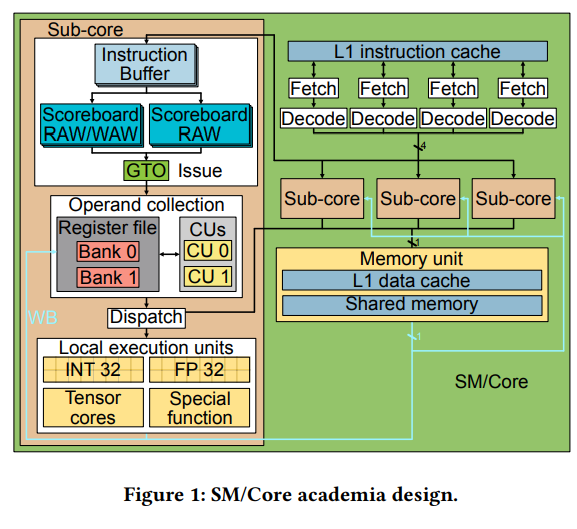
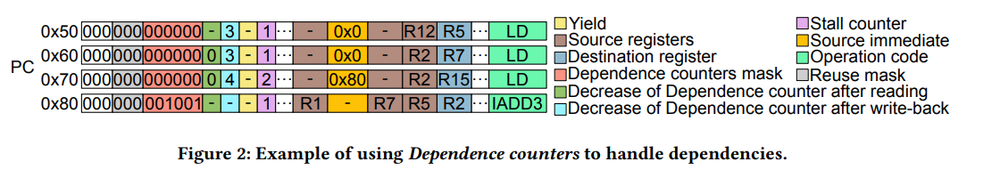
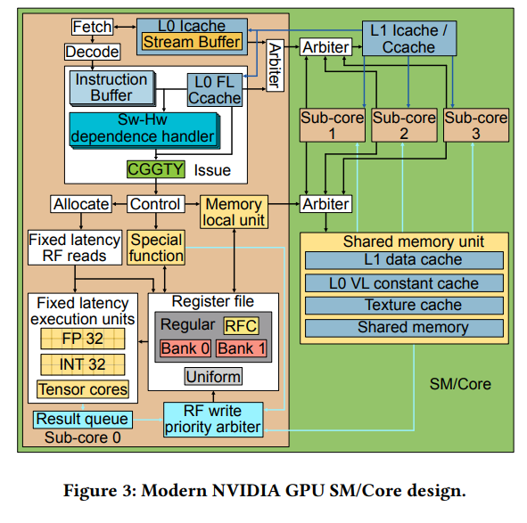
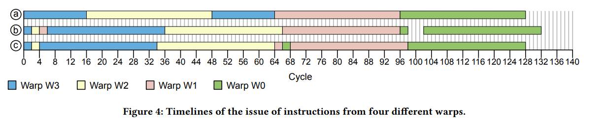

State: I am not stuck with anything, don't need help right now. 

Slide is done for Monday. Below is book and then paper notes. Taking notes about pipeline seperately.

## Research Paper

### Background and Motivation
- Paper describes a more modern architecture. 

- Round robin scheduler selects warp witih instruction in the L1 Icache and has empty slots in the Ibuffer. 
- In issue, GTO scheduler selects a warp not waiting and its oldest instruction with no dependency. Previous architecture had two scoreboards for this.
- Instruction goes to collector unit and waits for operand retreival. Then moves to datapath when ready and then executed by correct unit. Writeback follows.
- This model misses some modern features. The hardware is reverse engineered using 3rd party assembly tools.

### Control bits

- The compiler is now responsible for handling data dependency. ASM instructions now include control bits taht manage dependencies and this improves performance and energy.
- Sub core issues a single instruction per cycle. 
    - Compiler indicates when instructions are ready for issue using the control bits.
    - Warps now have a stall counter to determine if it is a candidate for the scheduler.
    - Set by compiler, then decrease by 1 per clock. This is used in place of the scoreboard.
- Control bit yield
    - Do not issue an instruction of the same warp. Each instruction sets both of these. 
- Variable latency instructions have a dependence counter bit, with registers that can count for this purpose. 
    - Producer can increase the register at issue and decrease at writeback.
    - Up to two counters in instruction btis
    - One decreased at writeback and other at register read
- Above approach can be limited if more than 6 instructions needing to access or generate this data. Could either be in the same register or reordered.
- Instructions exist to stall until certain count registers are ready. Can solve some hazard issues. 
### GPU Cores Microarchitecture

#### Issue Scheduler

 - Warp readiness. Warps are candidates for issuing their oldest instruction if some conditions are met. Can depend on other instructions or hte core state. Resources must also be guaranteed to issue.
    - This includes execution unit. Instructions can be latched entering hte execution unit.
- If there is a long cache miss, an instruction can be passed on. Issue scheduler does not know if there will be competition for read ports.
    - Potential extra stages in the issue stage for reading operands. Second stage for fixed latency instructions. Availability of ports are checked, and stalled until available with no conflict.
- Greedy instruction scheduler chooses instructions from the same warp if possible. When switching, the youngest eligible warp is selected.

- Compiler guided greedy then youngest since the compiler helps scheduler using control bits. When the current warp is ineligible, we see the switches to the next capable warp.

#### Front end

- Streaming multiprocessor has 4 subscores and warps are distributed among subcores in round robin.
- Subcore has an L0 cache that connects to the L1 instruction cache. Can fetch and decode one instruction per cycle. 
- Fetch scheduler tries to getch from the same wrp that was issued in previous cycle.  If not, switch to youngest warp with free entries.

#### Register File

- Regular registers, 65k 32 bit registers per SM store values operated by threads. Grouped into 32, one register per thread in the warp, so 2048 warp registers. Evenly distribtued between sub cores and organized across 2 banks.
- Registers used decided at compile time. More registers means less paralellism.
    - Uniform: Each warp has 64 private, 32-bit registers that
    store values shared by all the threads of the warp.
    -  Predicate: Each warp has eight 32-bit registers, each bit being used by a different thread of the warp. These predicates
    are used by warp instructions to indicate which threads
    must execute the instruction and, in the case of branches,
    which threads must take the branch and which ones not.
    -  Uniform Predicate: Each warp has eight 1-bit registers
    that store a predicate shared by all the treads in the warp.
    -  SB Registers: As described in section 4, each warp has six
    registers, called Dependence counters, that are used to track
    variable-latency dependencies.
    -  B Registers: Each warp has at least 16 B registers for managing control flow re-convergence.
    -  Special Registers: Various other registers are used to store special values, such as the thread or block IDs.
- There is not an operand collector. Each register file bank has a 1024 bit write port, some bypassing of results and result queueing is used instead.
- Ports must be reserved in the allocate substage. Fixed latency spends 3 cycles reading operands, even if idling is involved.
- A register file cache helps to reduce conflict and save energy.
    - Compiler controlled rfc has one entry per bank. Can hold 6 1024 bit operand values. Reuse bit sets if the cache will be written to. Subsequent instructions can read from the cache, becomes unavailable when a read arrives to the same bank and operand.

#### Memory Pipeline

- Some memory stages are per subcore, while others are combined.
- Accesses can either go to the shared memory or to teh global memory. Sub core can issue one instruction per cycle for 5 consecutive memory operations. 6h is stalled. Hence, this is the buffer size. Throughput of addresses calculation is once per 4 cycles. Shared structures can bottleneck at more than 2 sub cores active.
- Latency from elapsed time since load is issued. RAW/WAR latency. 2nd latency is time from load/store to time that instruction writes a register of the operation can be issued.
- Uniform registers are faster than normal registers. Seperated cache for fixed and variable latency instructions.

## Book Chapter 5

### 5.1 Thread Scheduling

- Scheduling of threads is very important to minimizing downtime and effectively servicing requests. 
- Assignment of threads to warps: Threads must be fused for the MIMD to SIMD model. In the book, consecutive thread IDs form warps.
- Dynamic Assignment of Threadblocks to Cores: Work is assigned in bulk. Multiple warps form the threadblock. In the basic GPU, threadblocks are assigned to core in a round robin fashion. Core resources are assigned at threadblock level. Threads run to completion before resource reassignment.
- Cycle by cycle scheduling decisions: Fine grained schedulers decide which sets of warps fetch, issue instructions, and read/write operands.
- Scheduling Multiple kernels: These decisions can take place within a kernel and across multiple running concurrently. Modern GPUs can run multiple kernels.

Questions: Front end was hard to understand. Variable control bits are interesting as well.