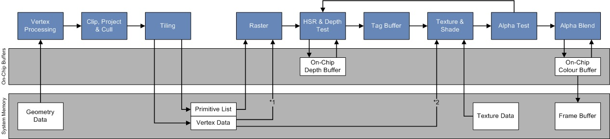

Progress:

I am not stuck with anything right now.

GPU subteam: Graphics

## Week 5
### Functional Units

Gave senior design presentation, met with subteam to discuss required hardware and the graphics pipeline itself. The current functional units are as described

- INT 32
- FP 32(Most Important)
    + Should be capable of Add, Sub, Mul, Div,
    + Mul in particular should be fast due to very high use
    + There is a potential need for a high power operation to do reflections properly.
- Sin and Cos
- Memory operations

CSR

- Warp/Thread ID for programmability

The approach being taken is that there should be very few functional units. The ones which are implemented should mostly be capable of general workloads with very little graphics accelerating hardware(sin,cos). It will be easier to write software routines that achieve the functionality we need than to implement more hardware. The goal is a pre-rendered graphics pipeline, so there is no need for real time latency.

## Graphics Pipeline

This week the team and I were researching the graphics pipeline and what units would be required for that. We came to the conclusions above on that side. The hardware team requested this information by 9/28, so we must discuss with them some important things as well

- How will communication with the GPU specifically be handled? 
- How will memory be used(shared, distinct for GPU)?
- For writing efficient code, what hardware units are being decided on? How many lanes will be present, how many warps? 
- Expectations for light source and reflection?

As far as the pipeline goes, the specific details of which stage will be done first and how that will look is what is being researched. In particular, we are researching textures. The textbook in EE256 contains some information on what should be exiting and entering each stage of the pipeline. What we do know is this:

1. Load data from memory
2. Vector kernel - Load vertices from memory, apply rotation/translation in this stage, and project onto the 2d plane the camera sees.
3. Primatives - On top of just vertices, there is also connectivity data. We do not need to render objects that will not be on the screen, so they are either culled(removed completely) or just clipped along the screen edge. New triangles and vertices can be generated here. (Must be looked into as well)
4. Pixel processing and rasterizing. Each pixel lies within or along a triangle, so it must be assigned a color based on that. We can use the triangle and the texture associated with it to determine this color, as well as applying a potential light source.
5. Writeback to memory. Frame must be stored back to the memory so that it can be read onto a different device and assembled into a video.

### Research on Graphics Pipeline

[Video](https://www.youtube.com/watch?v=ZEXVQgbWxQY&list=PL78XDi0TS4lEBWa2Hpzg2SRC5njCcKydl&index=4)
- Graphics pipeline receives commands from a kernel launched by the CPU, has its own memory but must pull from storage first.
- Vertex kernel runs first, some operations are more effective to do per vertex rather than per pixel.
- Some operations are instead required to be done per pixel, such as deciding which color the pixel will represent. 
- Process is from vertices to triangles to a rasterized triangle to the interpolation with textures and colors.
- Modern systems have multiple samples per pixel. These can then be used as an average to determine pixel color. In effect, the outputted image is downsampled from the scene.

Jing sent this image. We are looking into the order of the stages. We likely will not implement alpha test/blend right now, there is no need for opacity. Other stages are all required, but we have not researched tiling or texture adequately. 