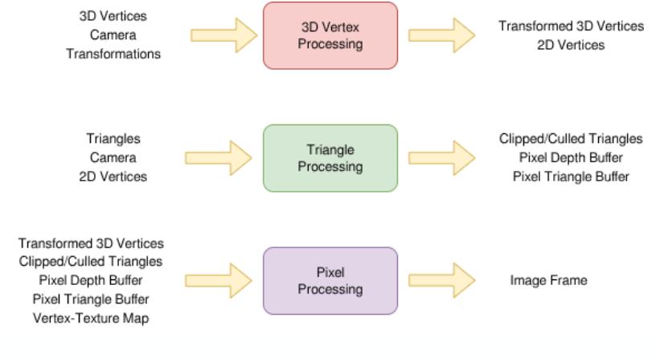

Progress:

I am not stuck with anything right now.

GPU subteam: Graphics

## Week 5

Design review Presentation is on Sunday. Team Meeting this week was to work on the slides for that. Primarily discussed what would be needed for the graphics pipeline at each stage and what the actual flow of execution will look like.

### Design Decisions

* Hardware Subset - Only implement "required" floating point and integer operations
    + Integer/Float Add,Sub,Mult,Div
    + Float Sqrt, sin,cos
    + Integer/Float ld and sw
    + Likely requirement of Texture cache

Discussing these in basic detail. These standard arithmetic operations don't need to be explained. Sqrt, Sin,Cos are worth examining. Many vector operations require taking the normal of the vector. This involves inverse square root, which can be done as square root and then one more operation to invert. If this proves difficult in hardware, the inverse square root algorithm instead requires a bit shift operation for floating point.

A sin operation is required because of common appearances in both mathematical and graphical workloads. This can be implemented as a lookup table followed by interpolation based off of a paper that we are reading. Cos is just a shift on this sin operation, effectively a psuedoinstruction.

The texture cache will likely be very helpful. In the per pixel stage, each pixel must be mapped to a texture through the triangle it is representing. This requires as many texture accesses as there are pixels(640 * 480 = 300k) which will not be fast in a system with any memory latency. We are researching this right now but I have nothing to share. It must be seen if texture cache accelerates this or is used for advanced operations like antialiasing.

In most software operations, we can heavily optimize the algorithms and avoid math/data reuse where possible, leading to the diagram here.

The idea is to only use data required in each stage, and store back into memory for the next stage to use. This side of the programming model will avoid recalculating uncessarily, with a slight increase to code complexity. This is always preferable to hardware complexity for us. There is not an issue if the program ends up being fairly long, since the intended workloads are not real time. If they were, this would be a major issue. 

It is an issue regarding how the GPU will begin executing. Generally there is a concept of retained mode where our graphics library handles gpu calls. To do this, there must be some controller/CPU device that is actually making requests to a graphics library. Some of this can be replicated by a testbench, but it must be clear among all teams as to how the GPU will begin operating and how it will communicate, otherwise the code is meaningless. As of Thursday, this must be discussed with hardware. One idea is to use the testbench with tasks to simulate the CPU, so that the elusion of a controlling device can be maintained in sim. On the FPGA and beyond a proper solution is needed. This many involve using a desktop processor to communicate over a serial line.

Memory is likely to be a problem. We are assuming a full 4gb across the 32 bit address space, especially when programming and deciding on concepts like memory mapped I/O. The possible virtualization of memory has to be considered, but this would be hard so it should be avoided. The FPGA does not have close to this, and memory is expensive in tapeout(I think). Cole suggested producing an offboard chip that will contain all the memory we need, this would have latency that can be masked by the high throughput/parallelism of the GPU. The standard FPGA has about 2 mb of memory, which is not likely to hold multiple complex textures and a framebuffer.

Related is the idea of the framebuffer. It is handwaved in the above image. We must decide on how the GPU will writeback the frame. One thought is that this is not the GPUs job in this sense. Converting raw data to output display standard is done by a dedicated controller near the I/O or the CPU. For our case, it would be fine to use a program to stitch the framebuffer into a trivial image format.

Aiden S has greater detail about the math and pipeline we expect to be writing, Aidan M has been looking into openGL as a basis for how retained mode graphics work. 