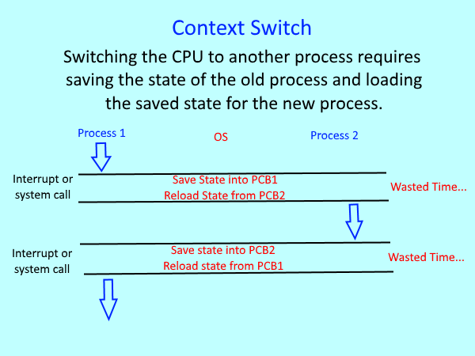

Progress:

I am not stuck with anything right now.

GPU subteam: Graphics

## Overview & Update

This week we have begun to write our graphics library. The intention is to finish some parts for testing in one week from now, and the proper library by the middle of November. I have taken on the task of writing some intermediate complexity asm unit tests. These will be meaningful asm programs that implement some single function we plan to have. They should be fairly easy to track and effectively demonstrate any issues with the simulator. Ideally, it will saturate most of the instructions, but there are a lot that are useless to graphics or even most programs so it may be hard.

As always, I only include information I am personally responsible for. If you are looking for everything happening this week, you must check the other design logs as well.

### Meetings

I attend so many meetings for a 2 credit class. Today we discussed the memory space, the concept of the testbench, and how programs may be ran.

#### Work distribution

There are two immediate tasks, making asm unit tests described above and creating actual GPUC kernels. There would have been the task of creating a graphics library for the CPU, but we have delayed this as a future task for until after we decide on a target core. SV/C++ testbench tasks can adequately be used for all of the functionality we need, acting as a sort of library, but not one that would work on a real core. The GPU C kernels must be created. Aidan and Aiden will work on this. The immediate goal is to write code for our CPU simulator, which loops through the dimensions of our kernel sequentially to emulate the effective output of a GPU. We could then take the same GPU kernels and convert them to effective GPU C code, as the same semantics are used in each. Since the kernels were researched, this should not take very long to do at all.

#### Memory Map

We attempted to make a memory map, but there are questions which need to be asked to the entire team. For function calls, which will be minimal(perhaps a depth of 2-3) the predicate is being stored in the hardware, but registers must be saved to a stack per warp. This requires each warp to be aware of where its stack is, as the programmer and by extension the compiler cannot be directly aware of what warp ID is being used. This has not been communicated to the hardware team yet. The idea was also floated of using a linker doc to more dynamically change out memory segments. Because we have no OS, using a linker doc makes sense as compiled objects must be placed somewhere in memory with some relations. 

### Thread synchronization

There was some discussion about how threads would be synchronized. My answer to this is here. It isn't happening. The programming model will support the concept of multiple threadblocks, but we will not be running two kernels at once or actually using more than one threadblock at a time. The issue is memory coherency. When two kernels are ran or two threadblocks, there must be some guarantee that the memory operations of both will be accurate with respect to each other. FENCE instructions may guarantee this, but fundamentally this scheme of programming is not useful yet. With only one hardware SM, we cannot actually run two different tasks at once. The best that could be done is the illusion via constant switching of the two tasks. We see no benefit to this. In the future, when additions are being made to allow for multiple SMs, the instructions to fence memory and commit atomic read/write will be needed. Then, with a call of synchronize_threads(), similar to CUDA, programmers can ensure that their kernels which run together will be memory coherent. With no shared memory, coherency only needs to be maintained at a threadblock level and between different kernels. This scheme is not too complex to implement, but we believe it should be implemented when there is a performance gain to be had. 

Basically, the current model is going to be like a single core system switching between tasks. We are going with the system
1. Do not assume threads are synchronized during execution. There is consistency inside of a warp, but not between different warps.
2. Threads will be synchronized when a kernel ends.

Based on this model, a system with only one kernel will not encounter problems running with 1 threadblock. No kernel being written by our subteam will need to access memory in a manner that causes a coherency issue. If we were doing alpha blending, or a more standard method of handling triangle rendering, such issues may occur, but we opt to ignore them for now.

In the future, when hardware is written to manage coherency, the programmer will have no additional work to do, save for launching multiple kernels at once or programming with multiple threadblocks.

## Week 10 Plan

Speak with the whole team about the memory model and the programming model. Then, write asm unit tests that will be used to demonstrate the accuracy of the functional simulator. Compare with an equivalent CPU kernel to demonstate accuracy.