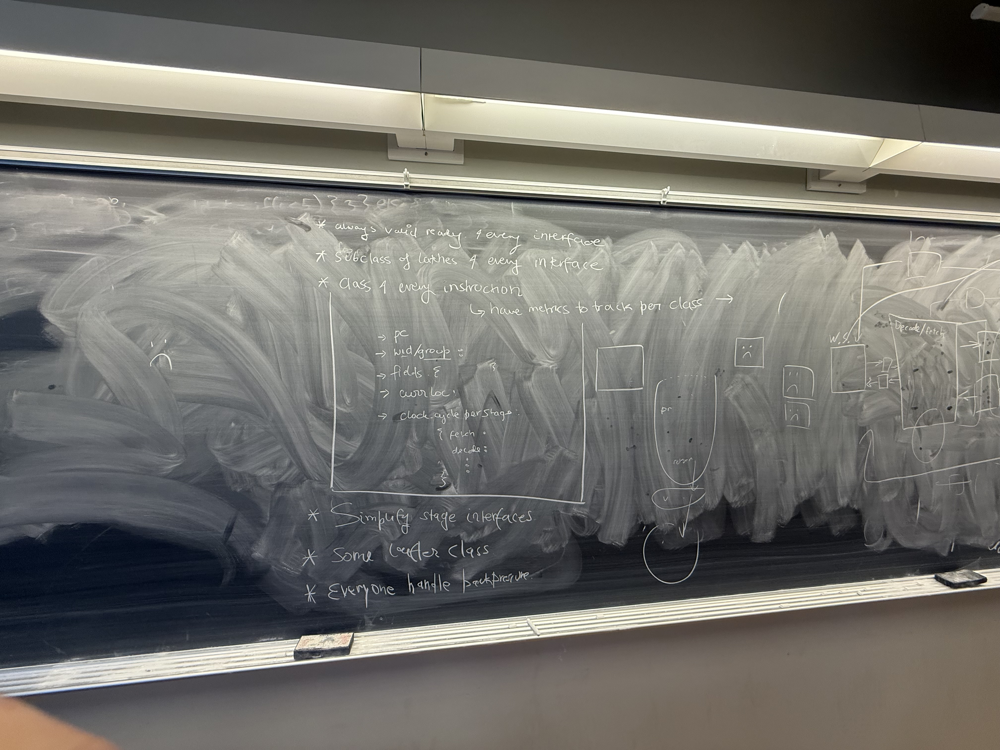
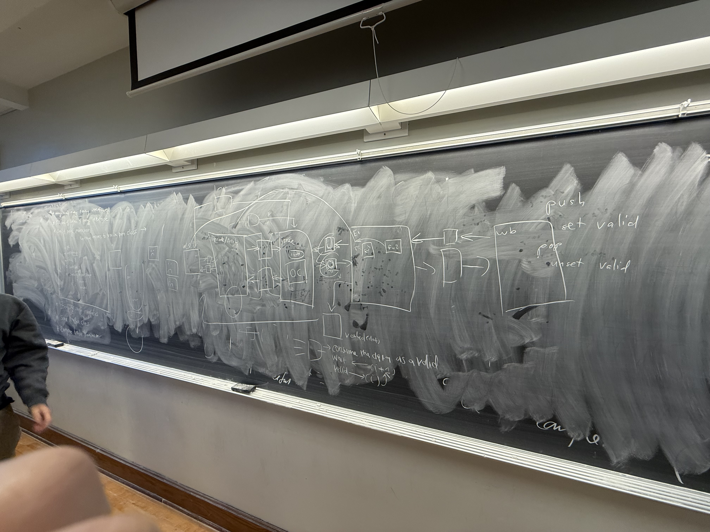

# Week 10 Design Log
## Explicit Statement: I am not stuck, but I am blocked by the changes we have made to the base class, so I am waiting on this to be finalized.
## Progress:
Progress this week has been alright, I have began working on the issue stage using the round robin scheduling algorithm, but we have made some changes that necessitate waiting for the base class for our functional sim to be updated to implement.

First change that we made this week: Each FU's WB buffer will instead of sending the readiness signals directly to the issue stage will send the readiness signals to their respective FU, and then the FU will send full signals to the issue stage. This will prevent us from stalling for an unncessary amount of cycles, as the WB buffers may no longer be full by the time the instruction we issue to that FU makes it to the end of the FU's pipeline. So now, once the FU has an instruction in each of its stages, and it cannot take any more instructions in, if the WB buffer for that FU is still full, then the FU will alert the issue stage to stop sending instructions to that specific FU from the iBuffers. 

Second change that we made this week: We are restructuring the class setup in the functional simulator, with the main changes being that the stages will communicate forward in the pipeline (latching signals to the next stage), as well as backward in the pipeline (any backpressure that needs to be applied to previous stages), using specific push/pop classes, as well as latch/forwarding interfaces. This will help modularize the code and ensure that everyone is utilizing the same method for writing their units/submodules so that it will be easier to integrate everything together. We will have a wait signal that the stage ahead will set in the forwarding interface so that the stage called earlier in the pipeline (later in the simulator) will only write to the latch interface if the stage ahead has finished executing. In addition to this, there will also be valid bits set in the latch interface by the previous stage in the pipeline to let the stages ahead in the next cycle that there is valid data to take in from the latch interface to compute the next stage. I know this might sound a bit confusing and a bit all over the place, but we just talked about it roughly half an hour ago and I wanted to make sure I got my thoughts down now before I confuse myself.

Here are two drawings from our meeting this week that demonstrate the changes that have been proposed to the functional simulator classes:

*** I should also mention that the flow of the frontend in the second image is not entirely correct, it was simply to get our thoughts down on the board with an example. ***

## Future Plans:

Now that we have made these changes, the next steps are going to be making the changes to the base class in the funcsim, which I have offered to help Yash fix so that everyone can effectively implement their units/submodules. From there, we will set up the latch/forwarding interfaces needed to move from one stage to the next, as well as forwarding signals backwards from one pipeline stage to a previous to have correct operation of the pipeline. Then, as far as my own stages to work on, once we have made the changes to the base class and everything works with the push/pop classes as well as the latch/forwarding classes, I will alter the issue stage to take into account the readiness signals of each of the FUs and prevent the instruction from an ibuffer from being issued if that instruction would be sent to one of the FUs that is currently full, and then use the RR scheduler to simply move to the next ibuffer until we can issue an instruction on that cycle. However, I am waiting on Kai Ze to have an implementation of the ibuffers to fully implement this, so I will just just make a dummy ibuffer in the mean time until he is done. In addition to this, I also still need icache module and a memory module/interface to make my fetch stage fully functional, which I will need to talk to backend/the emulator guys about.
