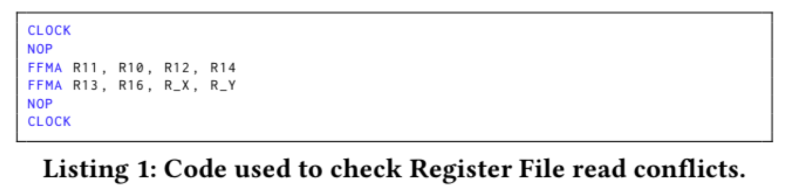
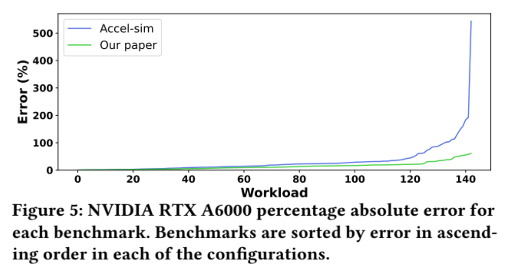

# Explicit Statement: I am not stuck or blocked.
# Analyzing Modern NVIDIA GPU Cores
# Abstract
- HPC Workload: Highly complex, data-intensive task that is spread across computing resources, which each run parts of the task in parallel
- Modern GPUs leverage hardware-compiler techniques, where the compiler guides the hardware during execution
  - In particular, the compiler reveals how the issue logic works including the issue scheduler policy, the structure of the register file and the RFC, and multiple features of the memory pipeline
- Software-based dependence management mechanism (scoreboard) in modern GPUs outperforms a hardware mechanism in terms of both performance and area
# Section 1: Introduction
- The advances that have made inference and training of LLMs possible are the significant innovations in GPU microarchitecture, GPU interconnection technologies, and GPU communication frameworks
- Modern NVIDIA GPUs do not use an operand collector stage or collector units
- A naive stream buffer for instruction prefetching provides greater performance accuracy, and almost performs the same as a perfect icache
# Section 2: Background and Motivation
- The architecture modeled in this simulator consists of four sub-cores and some shared memory components, such as the L1 icache and L1 dcache (separate caches), and texture units
- In fetch stage of the GPU pipeline, a RR (round robin) scheduler selects a warp whose next instruction is in the L1 icache, and has empty slots in the ibuffers
- ibuffers are dedicated per warp and store consecutive instructions of a warp after they are fetched and decoded, and they will stay in the ibuffer until they are ready and selected to be issued
- In issue stage, a GTO (Greedy Then Oldest) scheduler selects a warp if it is not waiting on a barrier and its oldest instruction does not have data dependence with other in-flight instructions in the pipeline
  - *Side note: GTO (Greedy Then Oldest First): once you issue an instruction from one warp, you keep prioritizing that warp as long as there are ready instructions to launch from it. We do not change this warp until it is stalled even if we have other ready warps that are issued at the same cycle. Once this warp is stalled, we select the oldest warp (based on dynamic warp ID) to issue instructions next*
- Each warp has two scoreboards for checking data dependence, where the first one marks pending writes to the registers to track WAW and RAW dependencies (an instruction can only be issued when all its operands are cleared in the scoreboard), and the second one counts the number of in-flight consumers of registers to prevent WAR hazards (this one is necessary since operands might be fetched out of order due to variable-latency instructions, even though the instructions are issued in-order)
- Once an instruction is issued, it is placed in a CU (Collector Unit) and waits until all its source register operands are retrieved
- When all source operands of an instruction are in the CU, the instruction moves to the dispatch stage, where it is dispatched and to the proper execution unit
- Once instruction reaches the WB stage, the result is written into the register file
- Some important aspects of modern NVIDIA GPUs that are left out of academia research models are the L0 instruction cache, uniform register file, and components of the sub-cores such as the issue logic, private register files, and RFCs
# Section 3: Reverse Engineering Methodology
- The paper's approach to discovering the microarchitecture of cores (SMs) in the NVIDIA Ampere GPUs was to write small microbenchmarks that consist of few instructions and measure the execution times of a particular small sequence of instructions
- Ex: The following image is one of the test sequence of instructions that the researchers employed
- 
  - When registers R_X, R_Y take on the values of R19 and R21 (both odd), the elapsed time of the test program is five cycles
  - When registers R_X, R_Y take on the values of R18 and R21 (one even, one odd), the elapsed time of the test program is six cycles
  - When registers R_X, R_Y take on the values of R18 and R20 (both even), the elapsed time of the test program is seven cycles
  - Therefore, two consecutive instructions can have 0-2 cycles of bubbles in between depending on which registers they use, as demonstrated above
# Section 4: Control Bits in Modern NVIDIA GPU Architectures
- ISA of modern NVIDIA GPU archs contains control bits and information that the compiler provides to maintain correctness, and unlike past archs that check data dependence by tracking register redas and writes at run time, these new GPU archs rely on the compiler to handle register data dependencies
- Sub-cores can issue a single instruction per cycle
- By default, the issue scheduler tries to issue instructions of the same warp if the oldest instruction in the program order of that warp is ready, where the compiler will indicate when an instruction is ready for issue using the control bits in the instruction itself (as previously described above)
- If the oldest instruction of the warp that issued an instruction in the previous cycle is not ready, the issue logic selects an instruction from another warp
- To handle producer-consumer dependencies of fixed-latency instructions, each warp has a counter called the <u>stall counter</u>
  - If the counter is not zero, the warp is not allowed to issue instructions
  - The compiler sets this counter with the latency of the producing instruction minus the number of instructions between the producer and the first consumer
  - These per-warp stall counters are decreased by one every cycle until they reach 0
  - The issue logic will simply check this counter and will not consider issuing another instruction of the same warp until its value is zero
- *Side note: wires from fixed-latency units to the dependence handling components are not needed (since these dependencies are compiler-handled) in contrast to a traditional hardware scoreboard*
- Another bit is used to tell the hardware that in the next cycle, it should not issue an instruction of the same warp, which is called the <u>yield bit</u>
  - Therefore, if the rest of the warps of sub-core are not ready in the next cycle, then no instruction is issued
- Each instruction will set the stall counter and the yield bit, and if the stall counter is greater than one, the warp will stall for at least one cycle, so it will not matter what the yield bit is set to in this case
- Some instructions have variable-latency (memory instructions for example) and so the compiler will not know their execution time, so the compiler cannot handle these hazards through the stall counter
  - Therefore, these hazards are resolved through <u>dependence counter bits</u>, where each warp has six special registers to hold these counters
    - Counters referred to as SBx, x in range of [0-5], and each counter can count to 63 (so I assume they are all 6-bit counters)
  - The dependence counters are set to 0 when a warp starts, and to handle a producer-consumer dependence (RAW/WAW), the producer increases a particular counter after issue, and decreases it at write-back; the consumer instruction is instructed to stall until the counter is zero
  - For WAR hazards, idea is the same, but the counter is not decreased at writeback, it is decreased after the instruction reads its source operands
  - In each instruction, there are some control bits to indicate up to two counters that are increased at issue (one will be decreased at WB to handle RAW/WAW, the other will be decreased at reg read to handle WAR)
  - Each instruction then will have two 3-bit field to indicate each of the two counters
  - An instruction can check up to all six counters if needed, which is good
  - The same dependence counter can be used without losing any parallelism if an instruction has multiple source operands whose producers have variable latency
  - This mechanism, however, may limit parallelism if there are more than six consumer instructions with different variable-latency producers
    - In this case, the compiler must choose between two options:
      - 1.) Group more instructions under the same dependence counter
      - Or 2.) Reorder the instructions differently (out of order)
  - Incrementing of dependence counters is performed the cycle after issuing producer instruction, so therefore, if the consumer is the next instruction, the producer has to set the stall counter to 2 to avoid issuing the consumer instruction the next cycle
- One way we can check the readiness of these counters is through the DEPBAR.LE instruction
  - <u>Ex:</u> DEPBAR.LE SB1, 0x3, {4,3,2}
    - This instruction requires the dependence counter SB1 to have a value less than or equal to 3 to continue with execution
    - The last argument ([, {4,3,2}]) is optional, and if used, the instruction cannot be issued until the values of the dependence counters specified by IDs {4,3,2} are 0
  - DEPBAR.LE is especially useful for allowing the use of the same dependence counter for a sequence of N variable-latency instructions that perform WB in order when a consumer needs to wait for the first M instructions
    - Using DEPBAR.LE with its argument equal to N-M makes this instruction wait for the first M instructions of the sequence
  - Another example that DEPBAR.LE is especially useful for is reusing the s ame dependence counter to protect from RAW/WAW and WAR hazards
    - Since WAR hazards are resolved earlier than RAW/WAW, if an instruction uses the same dependence counter for both hazards, a following instruction of DEPBAR.LE SBx, 0x1 can be issued to wait until the WAR is solved and then allow the warp to continue its execution
- Modern NVIDIA GPUs have a software-managed RFC, where the compiler adds a control bit to each source operand called the <u>reuse bit</u>, which tells the hardware whether or not to cache the content of the register (this was literally our research with the Hierarchical Register File)
# Section 5: GPU Cores Microarchitecture
- __Issue Scheduler__
  - For fixed-latency instructions, a warp is candidate to issue its oldest instruction in a given cycle only if it can be guaranteed that all needed resources for its execution will be available once issued
    - One of these resources is the execution unit: execution units have an input latch that must be free when the instruction reaches execution stage 
    - The latch is occupied for two cycles if the execution unit has half-warp width, occupied for one cycle if the execution unit has full-warp width (I don't really know what this means, ask)
  - For instructions that have a source operand in the constant cache, the tag lookup is peformed in issue stage
    - *Side note: The <u>constant cache</u> is a specialized, read-only memory cache used for storing constant data that will need to be accessed by multiple threads*
  - When the oldest instruction of the selected warp requires an operand from the constant cache and the operand is not in the cache, the scheduler does not issue any instruction until the miss is serviced, unless if the miss is not serviced within four cycles, where the scheduler will then switch to a different warp
  - The issue scheduler is unaware of the availability of read ports in the register file for evaluated instructions
  - To take care of this, fixed-latency instructions are broken into two intermediate stages between the Issue Stage and the stage for reading source operands:
    - 1.) Control Stage: common for fixed and variable latency instructions; duty is to increase the dependence counters or read the value of the clock counter if needed
      - Therefore, an instruction that increases the dependence counter and the instruction that waits until the dependence counter is 0 must have at least one cycle in between to allow the increase of the dependence counter to be visible, so two consecutive instructions cannot use dependence counters to avoid data dependence hazards unless the first instruction sets the yield bit or the stall counter to a value greater than 1
    - 2.) Allocate Stage: used only for fixed-latency instructions; duty is to check the availability of the register file read ports, and to stall the instruction until it is guaranteed that it can proceed without any register file port conflict
  - Variable-latency instructions are delivered directly to a queue after going through the Control stage, and are only allowed to proceed when they are guaranteed to have no register file port conflict
    - Fixed-latency instructions must be given priority over the variable-latency instructions to allocate register file ports as they are required to complete in a fixed number of cycles, hence why the variable-latency instructions are placed in queue
  - The warp scheduler uses a greedy policy that selects an instruction from the same warp if it meets the eligibility criteria described above, then when switching to a different warp, the youngest one that meets the eligibility criteria is selected
    - The issue scheduler policy is called <u>Compiler Guided Greedy Then Youngest (CGGTY)</u>, since the compiler assists the scheduler by means of stall counter, yield bit, and dependence counters
    - However, this behavior is only confirmed for warps within the same thread block/CTA, as analyzing interactions among warps from different thread blocks/CTAs is an incredibly difficult task
- __Front-End__
  - Modern NVIDIA GPU SMs have four different subcores, and warps are evenly distributed among subcores in a round robin manner
  - Each subcore has a private L0 icache that is connected to an L1 icache shared among all four subcores of the SM
    - Arbiter will obv handle the requests of different subcores to the L1 icache
  - Each L0 icache has an instruction prefetcher (which is seen as effective in GPUs by the paper)
  - Not concretely determined, but suspected the GPU makes use of a simple scheme like a stream buffer that prefetches successive memory blocks when a miss occurs (size of stream buffer assumed to have a size of 16 (bits?, values?))
  - Fetch policy assumed to be similar to issue policy, otherwise the condition of not finding a valid instruction in the ibuffer would happen relatively often, which was not observed by the paper
  - Assumed that each subcore can fetch and decode one instruction per cycle
  - The fetch scheduler tries to fetch an instruction from the same warp that has been issued in the previous cycle, unless it detects that the number of instructions in the ibuffer + its in-flight fetches are equal to the ibuffer size, in which cause the fetch scheduler would switch to the youngest warp with free entries in its ibuffer
  - Ibuffer is assumed to contain three entires per warp since it is enough to support the greedy nature given there are two pipeline stages from fetch to issue (the greedy policy of the scheduler would fail if the ibuffer contained two entries per warp as previously assumed by academia research)
- __Register File__
  - Most NVIDIA GPUs have various register files: 
    - Regular: Recent NVIDIA archs have 65536 (2^16) 32-bit registers per SM used to store values operated by threads
      - Registers arranged into groups of 32, each group corresponding to the registers of 32 threads in a warp, resulting in 2048 warp registers
      - Registers are evenly distributed between subcores, and registers in each subcore are organized in two banks
      - Number of registers used by a particular warp is determined at compile time
      - The more registers used per warp, the fewer warps can run in parallel in the SM
    - Uniform: Each warp has 64 private, 32-bit registers that store values shared by all the threads of the warp
    - Predicate: Each warp has eight 32-bit registers, each bit being used by a different thread of the warp
      - These predicates are used by warp instructions to indicate which threads must excecute the instruction and in the case of branches, which threads must take the branch and which ones will not
    - Uniform Predicate: Each warp has eight 1-bit registers that store a predicate shared by all the threads in the warp 
    - SB Registers: Each warp has six registers, called dependence counters, used to track variable-latency dependencies (described above in Section 4)
    - B Registers: Each warp has at least 16 B registers for managing control flow reconvergence
    - Special Registers: Various other registers are used to store special values, such as the thread IDs or block IDs
  - Modern NVIDIA GPUs do not use an operand collector to deal with conflicts in the register file ports
    - This would introduce variability in elapsed time between issue and write-back, which would make it impossible to have fixed-latency instructions in NVIDIA's ISA (since dependencies must be handled at compile time)
  - Regardless of number of register file conflicts, value required in the stall counter field and the elapsed time to execute the instruction remains constant, hence no need for operand collector
  - Each register file bank has a 1024-bit write port
  - When a load instruction and a fixed-latency instruction finish at the same cycle, the load instruction is delayed first
  - When there is a conflict between two-fixed latency instructions, neither are delayed
    - This behavior assumes that the modern GPU cores make use of the result queue as described above, storing the variable-latency results in a queue to ensure the fixed-latency results can indeed be computed in a fixed number of cycles as required by the ISA
    - Computed results will be forwarded to the consumer before being written to the register file, insinuating the use of a bypassing scheme
  - Each register file bank has a 1024-bit port regarding reads
  - Regarding the Control and Allocate intermediate stages between the instruction issue and operand read of fixed-latency instructions stage, all the fixed-latency instructions spend three cycles for reading source operands
    - If the instruction in the allocate stage realizes it cannot read all its operands in the next three cycles, it will be held in this stage (allocate stage) and generates bubbles until it can reserve all ports needed to read the source operands in the next three cycles
  - NVIDIA design for the RFC is similar to the Compile-Time Managed Hierarchical Register File described in Gebhart et al. (2011)
    - RFC is controlled by the compiler and is only used by instructions that have operands in the Regular Register File
    - For the LRF structure, what we call the result queue behaves similarly (the result queue we have been mentioning essentially is our LRF)
    - However, a two-level issue scheduler is not used
    - The RFC has one entry for each of the two reg file banks in each subcore
    - Each entry stores 1024-bit values, each corresponding to one of three regular register source operands that instructions may have
    - RFC total capcity is six 1024-bit operand values
    - Some instructions have operands that require two consecutive registers. In this case, each of the two registers come from a different bank and are cached in their corresponding entries in the RFC
  - Compiler manages allocation policy
  - When an instruction is issued and reads it operands, each operand is stored in the RFC if the compiler has set its reuse bit for that operand (if not being reused, no need to cache it -> locality)
  - A subsequent instruction will obtain its register source operand from the RFC if the instruction is from the same warp
  - A cached value is unavailable after a read request arrives to the same bank and operand position, regardless of whether it hits in the RFC
- __Memory Pipeline__
  - Memory pipeline in modern NVIDIA GPUs has some initial stages local to each subcore, and the last stages that perform the memory access are shared by the four subcores since the dcache and shared memory are shared by the four subcores
  - Two main types of memory accesses: those that go to shared memory (SM local memory shared among all threads in a block), and those that go to global memory (GPU main memory)
  - Each subcore can issue one instruction per cycle for five consecutive memory instructions
  - The issue of the sixth memory instruction is stalled for a number of cycles that depend on the number of active subcores
  - Each subcore can buffer up to five consecutive instructions without stalling, and global structures can receive a memory request every two cycles from any of the subcores
  - Address calculation done in each subcore has a throughput of one instruction every four cycles
  - When two subcores are active, each can issue a memory instruction every four cycles since the shared structures can handle one instruction every two cycles
  - When more subcores become active, the shared structures become the bottleneck
  - Memory queue per subcore estimated to be a size of four; instruction reserves the slot in the queue when it arrives at the unit and frees when it leaves the unit
  - RAW/WAW Latency: the elapsed time since a load is issued until the earliest time that a consumer can issue OR an instruction that overwrites the same destination register can issue
  - WAR Latency: the elapsed time since a load or store is issued until the earliest time that an instruction that writes in a source register of the load/store can be issued
  - Global memory accesses are faster if instructions use uniform registers for computing their addresses rather than regular registers
  - When using uniform registers, all threads in a warp share the same register, and so only a single memory address needs to be computed
  - But when using regular registers, each thread needs to compute a potentially different memory address
  - Latency of shared memory loads is less than that of global memory
  - WAR latency is same for regular and uniform registers, but RAW/WAW latency is one cycle lower for uniform registers
  - Since WAR latencies are equal for regular and uniform registers, this suggests that the address calculation for shared memory is done in the shared structures rather than the local subcore structures, and so the WAR dependence can be released once the source registers are read
  - Latencies also depend on the size of the read/written values
  - Latency of loads for WAR dependencies does not change since source operands are only used for address calculation and so they are the same size no matter what
  - WAR latencies increase with size of written value to memory for store instructions
  - RAW/WAW latencies increase with size of read values from memory for load instructions
  - Constant cache's WAR latency is significantly greater than loads to global memory, but RAW/WAW latencies are lower
  - Accesses to constant memory done by fixed-latency instructions go to a different cache level than load constant instructions
# Section 6: Modeling
- All modeling techniques were pretty much explained at one point or another throughout the first five sections
# Section 7: Validation
- 
- Characteristics of the stream buffer instruction prefetcher have high impact on global memory accuracy
- A straightforward prefetcher, such as the stream buffer, behaves close to a perfect icache in GPUs
  - This is because the different warps in each subcore usually execute the same code region, and the code of typical GPGPU applications do not have a complex control flow, so prefetching N subsequent lines usually performs well
  - Since GPUs do not predict branches, it is not worth implementing a Fetch Direction Instruction prefetcher, as it would require the addition of a branch predictor (yucky)
- There is still room for improvement regarding the organization of the SM register file and its cache (RFC), not completely deterministic of what is best from experiments in paper
- A mechanism based on the traditional scoreboard requires as many entries as registers that can be written, 332 entries per warp (255 for regular registers, 63 for uniform regs, 7 for predicate regs, and 7 for uniform predicate regs)
  - Two scoreboards are needed: one for WAW/RAW hazards, and another for WAR hazards, because even though instructions and issued in order, the read-write operands may occur out of order due to variable-latency instructions
  - WAR hazards may occur because variable-latency instructions are queued after being issued and may read their source operands after a younger arithmetic instruction writes its result
  - Although first scoreboard requires only a single bit per entry, the second scoreboard requires more hardware as the number of consumers per entry increases: assuming support for up to 63 consumers per entry, a single warp would require 2324 bits for dependency handling
  - For the entire SM, this translates to 111,552 bits, a whopping 5.32% of the register file size... YIKES
- In constrast, however, a software-hardware mechanism managed by the compiler requires six dependence counters of six bits each, a stall counter of four bits, and a yield bit, which is only 41 bits per warp for a total of 1968 bits per SM
  - This is only 0.09% of the register file size, a magnitude of roughly 60 times less overhead than the traditional hardware-managed scoreboard (this is awesome!)
- For GPUs that support up to 64 warps per SM, this overhead becomes even more significant for the traditional hardware-managed scoreboard at an even more whopping 7.09% of the register file size, as opposed to only 0.13% of register file size for the software-hardware codesign
- Although the model was only validated on Turing and Ampere NVIDIA GPU architectures, the researchers believe their findings remain applicable to other NVIDIA architectures
- Most significant NVIDIA architectural changes have been limited to enhancements in Tensor cores, ray-tracing units, and minor features such as distributed shared memory between SMs of the same TPC
# Section 9: Conclusion
  - Final remarks: the paper concludes that GPUs are hardware-compiler codesign where the compiler guides the hardware in handling dependencies and introduces hints that can improve both performance and energy