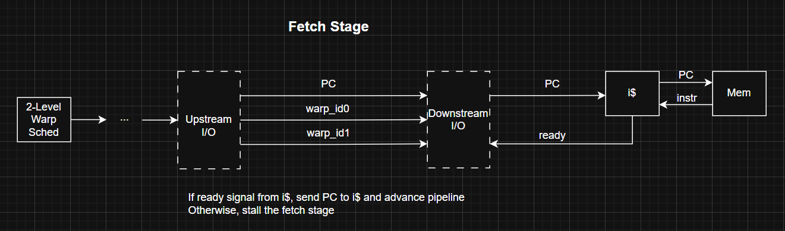
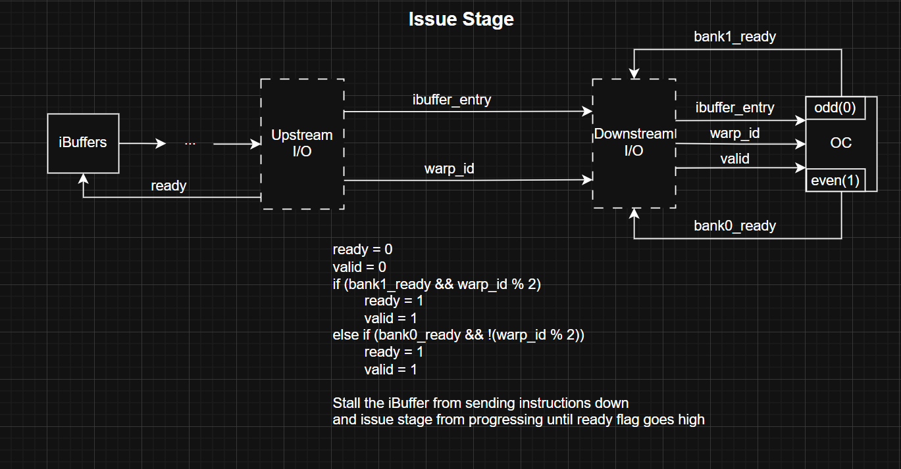
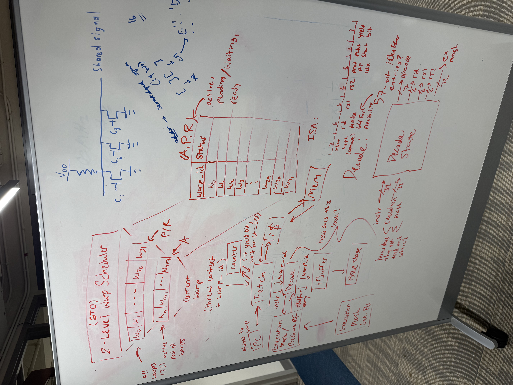
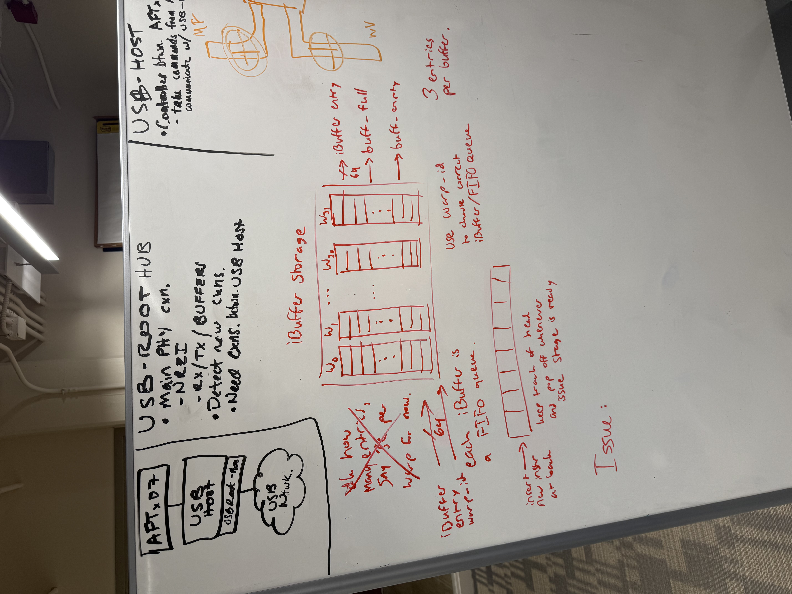
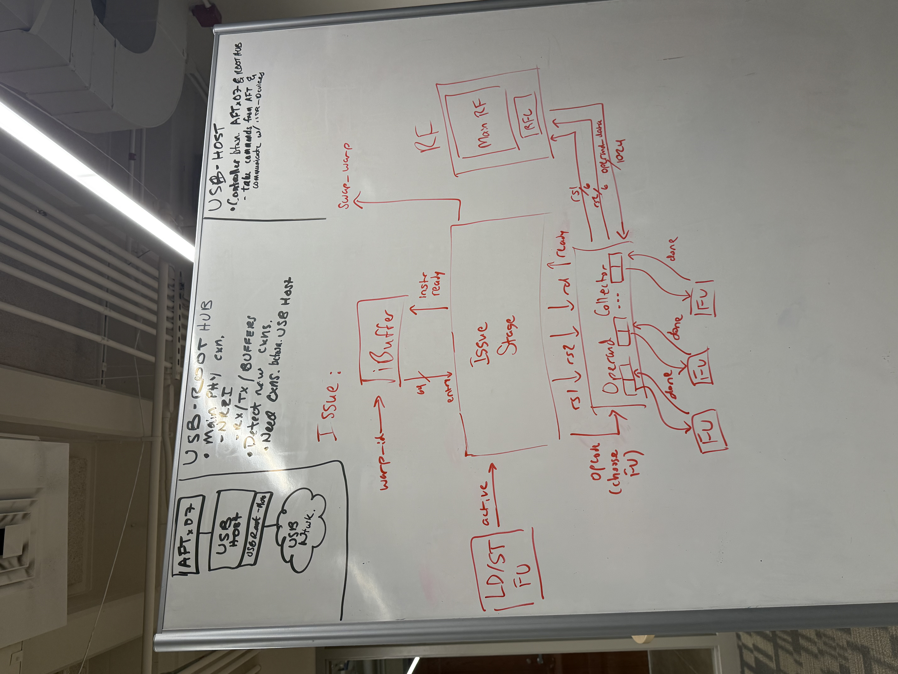

# Explicit Statement: I am not stuck or blocked.

__Progress:__ Progress has been pretty good this week, I have figured out relatively what we want our fetch and issue stages to look like, with a few specific design choices in each. For fetch stage (and throughout the rest of the pipeline), we are going to group warps together in pairs of 2, and make the two-warp pair share the same PC. That way, when we have 2-cycle waits in the operand collector for source operands from the same warp (bank conflicts), we can swap in the other warp and start collecting operands for that warp as well. This will allow us to consistently send one instruction per cycle downstream to the FUs instead of one instruction per two cycles. Here is a diagram of the proposed fetch stage that I have devised:

Then, for the issue stage, since there are two operand collector slots (one for even-numbered warps, and one for odd-numbered warps), we are going to have instructions sent down to the issue stage from the ibuffers with the corresponding warp id, and will feed the ibuffer entry downstream to the corresponding spot in the OC slot as long as that OC slot is ready for more instructions. If the OC slot is not ready for more instructions given that instruction, we will need to stall, and there will be signals coming from either OC or the LD/ST FU that will alert the warp scheduler to swap out the warp if we encounter long-latency instructions. Regardless, we will know whether to send more instructions downstream depending on the ready signals from the OC, and will also know when the issue stage is ready for more instructions from the ibuffer based on the ready signal. Here is a diagram of the proposed issue stage that I have devised:

In addition to these "finalized" RTL products in my design log, I also have some top-level planning that I did to try to guide our team in the right direction for front-end hardware designs. Here are the "notes" I came up with during my top-level planning for front-end:

__Future Plans:__ Now that a proposed RTL for fetch and issue stages have been made, we will need to finalize/polish up tomorrow, 10/03, and begin to put everything together for all of hardware front-end for our design review on Sunday, 10/05. My immediate next step will be to talk to Kai Ze to ensure that our communication between issue stage and the iBuffers/OC make sense and will coincide with the rest of the pipeline stages (Kai Ze designed iBuffers and OC). Once we clear this up and ensure everything is all good between our modules, we will confirm everything with the rest of hardware front-end and then back-end, and once we are good in both of these departments, we will make our finalized microarch presentation for design review.