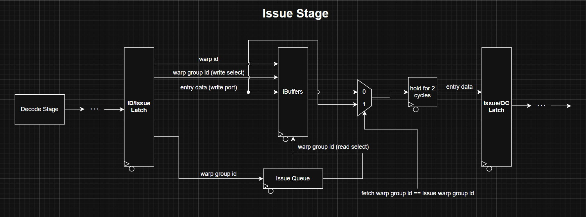
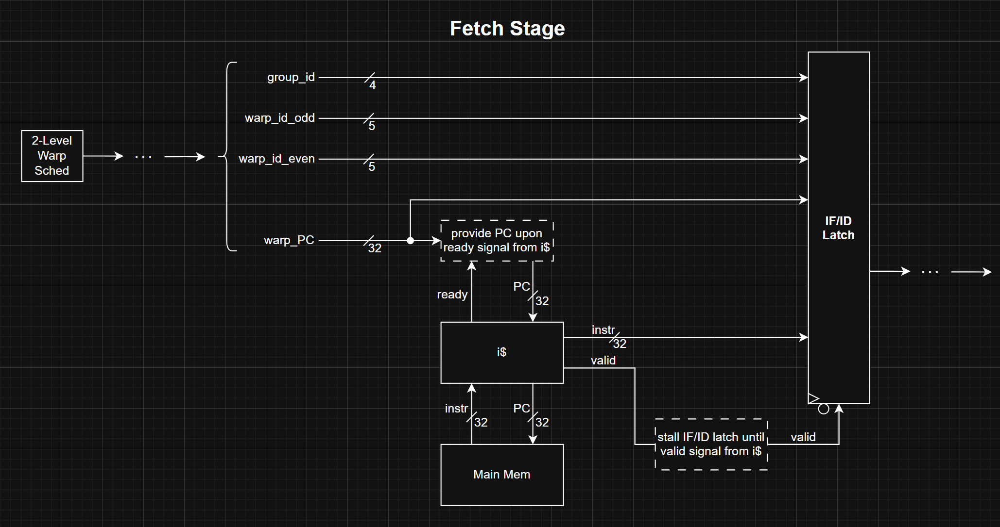

# Explicit Statement: I am not stuck or blocked.

# Notes:
- Motive for reading papers: Frontend team is currently struggling to find an optimal implementation of GTO, as our current implementations may have certain drawbacks/limitations such as power consumption and area on the chip. I am searching various papers to see if there is a description of what the optimal GTO implementation should look like in hardware.

- __Prof. Rogers Micro 2012 CCWS Paper:__
  - Terminology from paper:
    - Intra-wavefront locality: locality that occurs when data is initially referenced and re-referenced from the same wavefront; a combination of intra-thread locality and inter-thread locality
    - Inter-wavefront locality: locality resulting from data that is initially referenced by one wavefront and re-referenced by another wavefront
    - Intra-thread locality: data is private to a single scalar thread
    - Inter-thread locality: data is shared among scalar threads in the same wavefront
  - As shown in paper, intra-wavefront locality sees that most cache hits per thousand instructsion (PKI), and so it is important to preserve intra-warp locality over inter-warp locality
  - CCWS introduces an intra-wavefront locality detector that will alert the scheduler if decisions for sheduling are being made that will destory intra-wavefront locality to keep HCS (highly cache-sensitive) access stream L1dcache hits PKI as high as possible, ultimately reducing the number of cycles we will need to stall when swapping warps
- realizing there is really no more point in reading this, no GTO implementation is discussed in this paper and CCWS is far too complex for what we want to implement

# Progress:
Progress has been alright this week. Due to the massive amount of time that I sunk into the design review and revision of design decisions last week, this week has been more of a quiet one to work on assignments/studying for other courses. However, I have revised the Issue stage a bit, as I felt the Issue stage that was presented in the design review was not elegant and may actually have had incorrect functionality. Here is the diagram of the new issue stage that I have proposed:

The idea behind the new issue stage is to have a warp group id queue that will continue to service the warp group id that came in the latest. This will ensure that we can drain our instruction buffers to prevent unnecessary warp swapping/stalling by needing to swap out warps. In addition to this, I have also added somewhat of a skid buffer to allow instructions to pass directly through the iBuffers when we are trying to issue instructions for a warp group while we are also fetching from the same warp group. Additionally, we are now going to fetch for one warp group at a time instead of alternating the fetch for two warps within the same warp group, so the issue stage will need to hold the instruction for an additional cycle after being popped off the iBuffer queue/after bypassing the iBuffers to ensure the instruction can be issued for both the even and odd warps within the warp group before the instruction is lost. 

In addition to this, a change to the fetch stage also needed to be made, as we are going to need the warp id for both warps so that we know which warp the instruction is for when it is moving downstream since they are now being fetched at the same time. Here is the diagram of the new fetch stage:

There really is no difference between the original fetch stage and the new one other than both the even and the warp id's need to be passed through the pipeline to ensure the issue stage will know which warp from the warp group will be issued from.

Beyond the issue and the fetch stages, there really has been no additional progress to figuring out what the optimal GTO implementation will look like for the warp scheduler. However, I know that Akshath and Dan have been talking about this, so I trust there is good conversation being had there.

# Future Plans:
For the immediate future, I plan to begin working on the fetch and issue stages for the functional simulator in python. However, before we begin working on our invidiual stages/sections of the GPU in the functional simulator, I believe we need to have a meeting between the frontend and the backend teams and go through the entire operation from the beginning to the end of each instruction to ensure that our signals/functionality from stage to stage of the pipeline align. This way, we can sort out any issues/discrepancies that we have so that when we are writing the functional simulator stages/sections, the only issues we need to deal with are bugs in the simulator code and not actual bugs in the logic between stages/modules. 