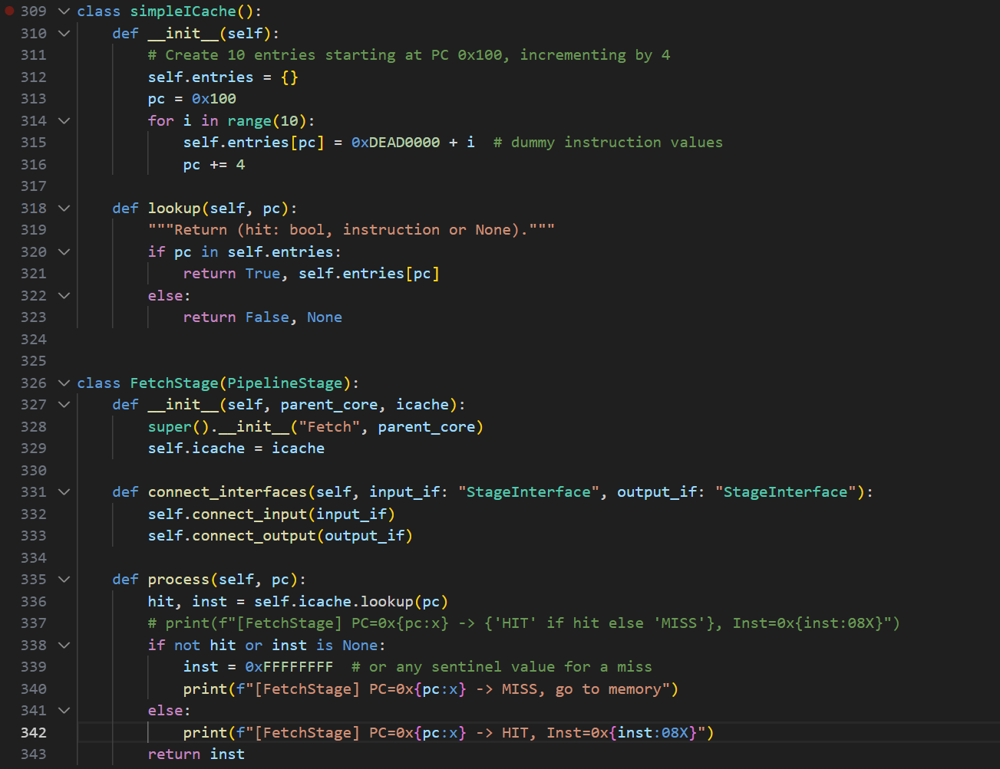
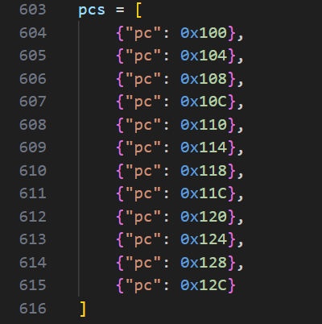
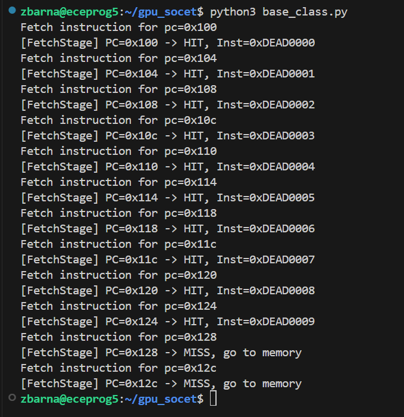

# Week 9 Design Log
## Explicit Statement: I am not currently stuck or blocked.
## Progress:
This week I have continued to work on the fetch stage for the simulator, and I have gotten something to work for correct functionality of the fetch stage. I set up two classes: a fetch stage class, and a dummy icache class for now until the actual icache we need from backend is complete. Here is a picture of the code that I wrote for both the fetch stage class and the icache class:

I have set up the icache to be a simple array that holds 10 pc values, 0x100 to 0x124, and simple instruction values, 0xDEAD0000 to 0xDEAD0009, and then I am feeding in a pc value from the fetch stage class into the icache class to see if we get a cache hit or not. The fetch stage will then return the instruction that it fetches from cache if the pc is in the cache, and if the pc is not in the cache, then it will return "go to memory", as I am unsure currently of how to interface with our memory for the GPU. This is a discussion that I need to have at our meeting tomorrow, 10/26/25.

I then used a test dictionary of pc values from 0x100 to 0x12C, purposefully including two pc values that are not held within the simple icache class that I made to ensure that the fetch stage will do as I expect when we have a cache miss. I also put print statements inside the fetch stage class for whether we will have a cache hit/cache miss given a specific pc, and the instruction that will be returned from the cache and then through the fetch stage if we have a hit. Here is a picture of the test dictionary that I used as inputs to my fetch stage:

I start by feeding the input pcs from the warp scheduler into the Scheduler/Fetch Stage interface class, and then the pc values go to the fetch stage, where fetch stage will see if the pc values are currently in the cache, and if they are, the correct instruction will be returned from icache to the fetch stage, and then the fetch stage will give the output instruction from icache to the Fetch Stage/Decode Stage interface class. Here is the result I was able to get from the code execution at the input of the Fetch Stage/Decode Stage interface class:

As we can see from the terminal, the first 10 pc values, 0x100 to 0x124, were able to correctly obtain their respective instructions from the icache and then be returned by the fetch stage to what will be the decode stage next, and the next 2 pc values, 0x128 and 0x12C, were not able to pull an instruction from the icache since the icache class I set up does not hold respective instructions for these pcs, so our fetch stage tells us there was a cache miss and that we need to go to memory. So far, everything is working how I expect, and I am happy with progress on this so far.

## Future Plans: 
Next steps for the fetch stage are going to be to go to real memory if we have a miss in the icache, and we also need a real icache implementation from backend hardware to get this thing really working. I will also need the warp scheduler class as well, as the warp scheduler will feed the correct pc down to the fetch stage so that the fetch stage knows where in cache/memory to grab the instruction from. However, the simple next steps are going to be talk with the folks who set up memory so that we can have the logic implemented for when we have a cache miss, and then I also need to work on making this cycle accurate, as it is essentially just a func sim right now, not cycle accurate sim. In addition to this, I also need to begin working on the issue stage, which shouldn't be too bad as we are now going to implement round robin scheduling for now, and the issue stage will simply follow fetching from the ibuffer corresponding to the pc that the warp scheduler feeds down through the pipeline. I will also need an ibuffer class for this, so I will talk with Kai Ze to see where he is with this. I also want to talk with Yash tomorrow at our meeting about how we are going to integrate all of these stages together, and hopefully we can have a simple integration of fetch stage feeding down instructions to the decode stage, and then the decode stage being able to decode what fetch has passed down to it, so we will look into getting this figured out tomorrow. Overall, I am feeling much better about our ability to actually complete this than I did say a week ago.